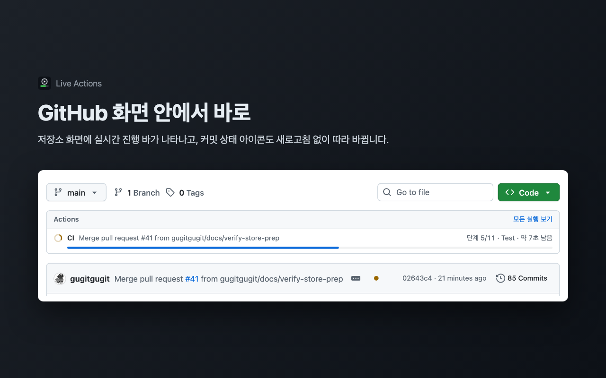

# Live Actions for GitHub

[English](README.md) · 한국어

새로고침 없이 GitHub Actions 진행 상황을 확인하세요. Live Actions는 워크플로 실행 상황을 GitHub 화면 안, 툴바, 데스크톱 알림으로 바로 보여주는 Chrome 확장 프로그램입니다.



## 기능

- **GitHub 화면 안 진행 바** – 저장소 화면, 브랜치, PR, Actions 탭에서 현재 job·step과 예상 남은 시간을 표시합니다. 새로고침하지 않아도 알아서 갱신됩니다.
- **따라 바뀌는 상태 아이콘** – 최근 커밋 옆의 ✓ / ✗ / ● 아이콘이 워크플로가 끝나는 즉시 바뀝니다.
- **툴바 배지와 팝업** – 실행 중인 run 개수, 아직 확인하지 않은 실패는 빨간 `!`로 알려 줍니다.
- **데스크톱 알림** – run이 성공하거나 실패하면 알려 주고, 클릭하면 해당 run으로 이동합니다.
- **정확한 남은 시간** – 최근 성공한 run의 job·step별 소요 시간으로 예측하며, 러너를 기다린 시간은 빼고 계산합니다.
- 한국어와 영어를 지원하며 브라우저 언어를 따릅니다.

## 설치

Chrome Web Store에 곧 공개됩니다. 그 전에는 [소스에서 직접 빌드](docs/DEVELOPMENT.md)할 수 있습니다.

## 시작하기

1. **로그인** – 설치하면 설정 화면이 열립니다(툴바 아이콘으로도 열 수 있음). *GitHub로 로그인*을 누르고 화면에 나온 코드를 github.com에 입력합니다. fine-grained 개인 액세스 토큰도 사용할 수 있습니다.
2. **GitHub에서 저장소 열기** – 별도 설정 없이 진행 바가 나타납니다.
3. **알림 받을 저장소 고르기** – 설정 화면에서 팝업·배지·알림에 표시할 저장소와, 모든 실행을 알릴지 실패만 알릴지 고릅니다.

공개 저장소는 바로 동작합니다. 비공개 저장소는 GitHub에서 Live Actions 앱에 접근 권한을 주면 됩니다. 설정 화면에 링크가 있고, 볼 수 없는 비공개 저장소를 열면 안내가 나타납니다.

## 개인정보

별도 서버가 없습니다. 토큰과 데이터는 브라우저 안에만 저장되고, GitHub하고만 통신합니다. Actions와 저장소 메타데이터 읽기 권한만 요청하며 코드를 읽거나 바꿀 수 없습니다. 자세한 내용은 [개인정보처리방침](PRIVACY.md#한국어)을 참고하세요.

## 문의

버그를 발견했거나 제안이 있으면 [이슈를 남겨 주세요](https://github.com/gugitgugit/live-actions/issues).

## 개발

```bash
npm install
npm run dev     # chrome://extensions에서 개발자 모드를 켜고 dist/ 로드
npm test
```

동작 방식, 폴더 구조, GitHub App 등록 방법은 [개발 문서](docs/DEVELOPMENT.md)에, 설계 결정과 근거는 [설계 문서](docs/DESIGN.md)에 있습니다.

## 라이선스

[MIT](LICENSE)

Live Actions는 개인 프로젝트이며 GitHub와 제휴하거나 GitHub의 보증을 받지 않았습니다.
