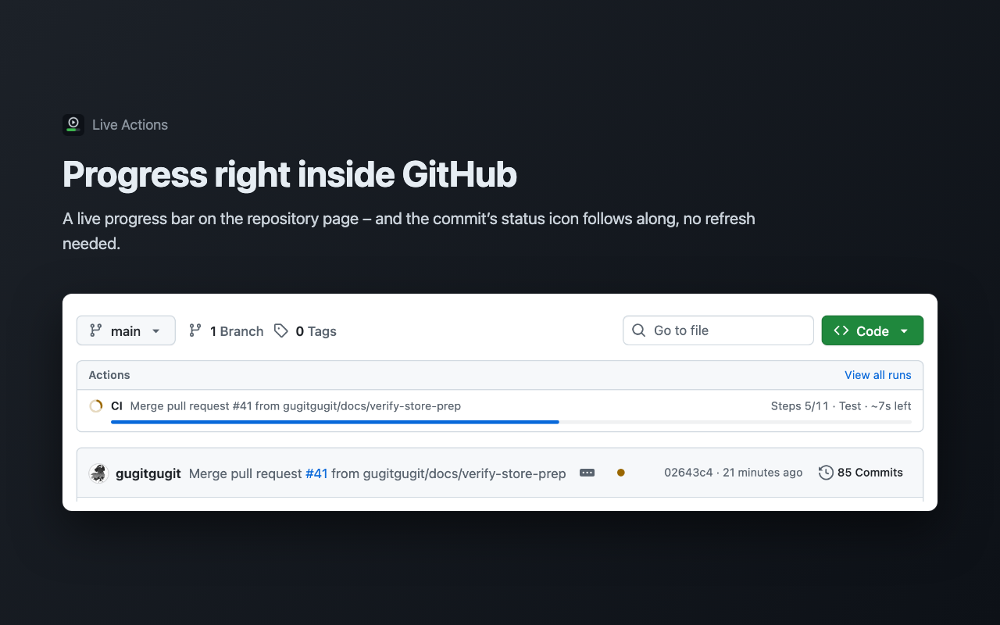

# Live Actions for GitHub

English · [한국어](README.ko.md)

See GitHub Actions progress without refreshing. Live Actions is a Chrome extension that shows your workflow runs as they happen, right inside GitHub, in the toolbar and as desktop notifications.



## Features

- **Progress bars inside GitHub** – on the repository page, branches, pull requests and the Actions tab, with the current job and step and the estimated time left. No refresh needed.
- **Status icons that keep up** – the ✓ / ✗ / ● next to the latest commit changes as soon as its workflows finish.
- **Toolbar badge and popup** – how many runs are in progress, and a red `!` for failures you have not seen yet.
- **Desktop notifications** – when a run succeeds or fails. Click to open the run.
- **Accurate time left** – estimated per job and step from recent successful runs, not counting time spent waiting for a runner.
- English and Korean, following your browser language.

## Install

Install it from the [Chrome Web Store](https://chromewebstore.google.com/detail/live-actions-for-github/fnfmpglkebgbokpmlcbadploemgilpgl).

To try changes that are not released yet, [build it from source](docs/DEVELOPMENT.md).

## Getting started

1. **Sign in** – the settings page opens after installing (or click the toolbar icon). Choose *Sign in with GitHub* and enter the code it shows on github.com. A fine-grained personal access token works too.
2. **Open a repository on GitHub** – progress bars appear on their own; nothing to set up.
3. **Pick repositories for alerts** – in the settings, choose which repositories show up in the popup, badge and notifications, and whether to be notified of every run or failures only.

Public repositories work right away. For private ones, grant the Live Actions GitHub App access to them – there is a link on the settings page, and a prompt appears when you open a private repository it cannot see.

## Privacy

There is no server: your token and data stay in your browser, and the extension talks only to GitHub. It asks for read-only access to Actions and repository metadata and cannot read or change your code. See the [privacy policy](PRIVACY.md).

## Feedback

Found a bug or have an idea? [Open an issue](https://github.com/gugitgugit/live-actions/issues).

## Development

```bash
npm install
npm run dev     # load dist/ at chrome://extensions with Developer mode on
npm test
```

How it works, the project layout and how to register your own GitHub App are in the [development guide](docs/DEVELOPMENT.md) (Korean); design decisions are in the [design document](docs/DESIGN.md) (Korean).

## License

[MIT](LICENSE)

Live Actions is an independent project and is not affiliated with or endorsed by GitHub.
