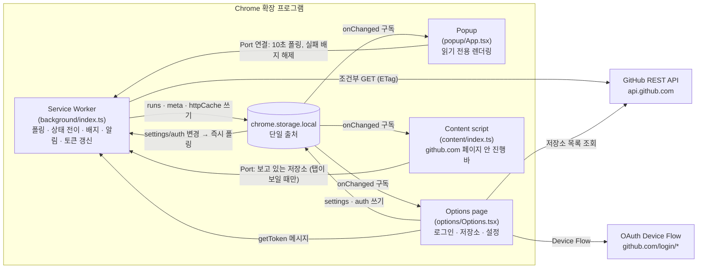
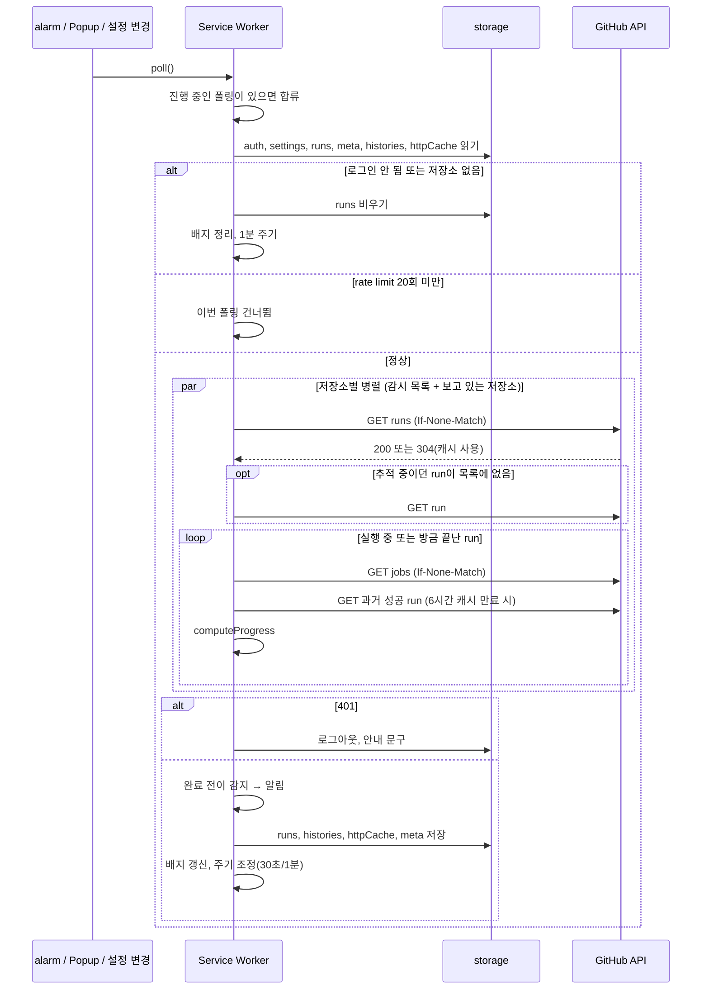

# Live Actions for GitHub 설계 문서

| 항목 | 내용 |
|---|---|
| 상태 | 기능 구현 완료, Web Store 첫 제출 준비 중 |
| 최종 수정 | 2026-10-08 |
| 대상 독자 | 이 프로젝트를 유지보수하거나 설계를 검토하는 개발자 |

이 문서는 **무엇을 만들었는지**보다 **왜 이렇게 만들었는지**를 기록합니다. 결정마다 검토한 선택지, 고른 이유, 감수한 단점, 그리고 결정을 다시 볼 조건을 적습니다. 코드와 이 문서가 다르면 코드가 맞는 것이므로, 코드를 바꿀 때 이 문서도 함께 고칩니다(→ [유지 규칙](#11-문서-유지-규칙)).

## 목차

1. [문제 정의와 범위](#1-문제-정의와-범위)
2. [제약 조건](#2-제약-조건)
3. [아키텍처 개요](#3-아키텍처-개요)
4. [결정 기록](#4-결정-기록)
5. [데이터 모델](#5-데이터-모델)
6. [폴링 사이클](#6-폴링-사이클)
7. [에러 처리 정책](#7-에러-처리-정책)
8. [테스트 전략](#8-테스트-전략)
9. [알려진 한계](#9-알려진-한계)
10. [향후 과제](#10-향후-과제)
11. [문서 유지 규칙](#11-문서-유지-규칙)
12. [변경 이력](#12-변경-이력)

---

## 1. 문제 정의와 범위

### 문제

GitHub Actions의 진행 상황을 보려면 저장소의 Actions 탭이나 PR의 Checks 탭을 열어 두고 계속 새로고침해야 합니다. 여러 저장소에서 동시에 작업하면 탭이 늘어나고, 끝났는지 확인하려고 작업 흐름이 자주 끊깁니다.

### 단일 목적 (Single purpose)

> Show the progress of the user's GitHub Actions workflow runs.

Chrome Web Store는 확장 프로그램이 하나의 명확한 목적을 갖도록 요구합니다. 이 문장을 기능 추가 여부를 판단하는 기준으로 씁니다. 이 문장으로 설명할 수 없는 기능은 넣지 않습니다.

### 목표

| # | 목표 | 성공 기준 |
|---|---|---|
| G1 | 탭을 열지 않고 실행 중인 run을 확인 | 툴바 클릭 한 번으로 진행률, 현재 job/step, 남은 시간 확인 |
| G2 | 끝난 순간을 놓치지 않음 | 완료/실패 시 데스크톱 알림, 확인하지 않은 실패는 배지로 유지 |
| G3 | 누구나 설치해서 쓸 수 있음 | Chrome Web Store 공개 배포, 별도 서버 없음 |
| G4 | 신뢰할 수 있는 최소 권한 | GitHub에 읽기 전용 권한만 요청 |
| G5 | GitHub 화면 안에서 새로고침 없이 확인 | PR·코드·Actions 화면에 진행 바가 들어가고, 완료되면 새로고침 없이 결과로 바뀜 |

### 범위 밖 (Non-goals)

| 항목 | 제외 이유 |
|---|---|
| 외부 CI/CD (Vercel, CircleCI 등) | 서비스마다 API와 인증이 달라 범위가 크게 늘어남. → [D1](#d1-대상-범위-github-actions만) |
| run 재실행·취소 같은 쓰기 작업 | 쓰기 권한이 필요해져 G4와 충돌 |
| 로그 열람 | GitHub 화면이 이미 잘 해결함. 링크로 연결하는 것으로 충분 |
| Firefox, Safari 지원 | 초기 배포 대상은 Chrome. → [D11](#d11-빌드-도구-vite--crxjs) |

---

## 2. 제약 조건

설계에 영향을 준 외부 조건입니다. 결정 기록에서 이 항목들을 `C1`처럼 참조합니다.

| # | 제약 | 내용 | 영향을 받은 결정 |
|---|---|---|---|
| C1 | **MV3 Service Worker 수명** | background는 상주하지 않음. 할 일이 없으면 약 30초 뒤 종료되고 이벤트가 오면 다시 시작됨. 전역 변수와 `setInterval`이 사라짐 | D3, D7 |
| C2 | **`chrome.alarms` 최소 주기 30초** | 주기 작업은 alarm으로 해야 하고, 30초보다 짧게 설정할 수 없음 | D3 |
| C3 | **GitHub API rate limit** | 인증된 요청은 시간당 5,000회. 조건부 요청에 `304`가 오면 차감되지 않음 | D4 |
| C4 | **GitHub의 브라우저용 push 채널 없음** | 웹훅은 공개된 HTTP 엔드포인트가 받아야 함. 브라우저가 직접 받을 수 없음 | D3 |
| C5 | **확장 프로그램 코드는 공개됨** | 배포된 패키지는 누구나 풀어볼 수 있음. 비밀값(client secret)을 넣으면 유출된 것과 같음 | D5 |
| C6 | **`github.com/login/*`는 CORS 헤더를 주지 않음** | 일반 웹페이지에서는 호출할 수 없음. 확장 프로그램은 host permission이 있으면 CORS 제약 없이 호출 가능 | D5, D10 |
| C7 | **Web Store 정책** | 단일 목적, 최소 권한, 권한별 사유 설명, 원격 코드 금지, 인증 정보를 다루면 개인정보처리방침 필수 | D6, D10, D13 |
| C8 | **Popup 수명** | Popup은 포커스를 잃으면 즉시 닫히고, 그 안의 JS 상태와 진행 중인 작업이 모두 사라짐 | D6 |

---

## 3. 아키텍처 개요



### 모듈 책임

| 모듈 | 책임 | 의존 |
|---|---|---|
| `lib/types.ts` | GitHub API 응답(사용하는 필드만)과 확장 프로그램 상태 타입 | 없음 |
| `lib/storage.ts` | 타입이 지정된 `chrome.storage.local` 래퍼, 기본값 병합, 변경 구독 | types |
| `lib/auth.ts` | Device Flow, 토큰 갱신, 갱신 실패 구분 | types, url |
| `lib/github.ts` | REST 클라이언트, ETag 캐시, rate limit 헤더 수집 | slim, types |
| `lib/slim.ts` | 응답을 쓰는 필드만 남겨 캐시 크기 줄이기 | types |
| `lib/progress.ts` | 진행률, 바 아래 글자와 시간 문구 | estimate, format, i18n |
| `lib/estimate.ts` | 과거 run의 job·step 시각으로 이력 만들기, job별 예상 종료 시각과 남은 시간 | types |
| `lib/schedule.ts` | "끝나기 직전" 판단과 다음 폴링 간격 | progress |
| `lib/page.ts` | GitHub URL → 페이지 종류 판별, 페이지에 보여줄 run 선택 | status |
| `lib/commit.ts` | 커밋의 Actions 결과 합산, GitHub 기본 상태 아이콘이 새로고침 후 보여줄 상태 예측 | status |
| `lib/status.ts` | 실행 중 판단, run 상태 → 표시 톤 | i18n |
| `lib/format.ts` | 소요 시간·상대 시간 글자, 상대 시간이 바뀌는 시각 | i18n |
| `lib/filters.ts` | Popup·배지·알림에 셀 run 판정 (감시 저장소, 내 run만) | types |
| `lib/errors.ts` | 오류 분류와 코드(`ErrorInfo`) 저장, 보여줄 때 번역, 404 뒤 조회 쉬기 | auth, github, i18n |
| `lib/url.ts` | API에서 받은 URL이 github.com 페이지인지 검사 | 없음 |
| `lib/notifications.ts` | 알림 ID 생성·해석 | url |
| `lib/messages.ts` | 컨텍스트 간 메시지·Port 타입과 헬퍼 | 없음 |
| `lib/i18n.ts` | `t()`·`tAround()`: `chrome.i18n`으로 문구를 가져오고, 없으면 번들된 영어로 대체 (D17) | `public/_locales/en` |
| `background/index.ts` | 폴링 조율, 상태 전이 감지, 배지, 알림, 토큰 갱신의 **유일한 소유자** | lib |
| `popup/`, `options/` | 화면. 상태는 storage에서 읽고, 쓰기는 설정·인증만 | lib, shared |
| `content/` | github.com 페이지에 진행 바 삽입과 상태 아이콘 동기화. React 없이 DOM API로 렌더링 (D14) | lib, shared/icons |
| `shared/` | 화면들이 함께 쓰는 hook, 아이콘 마크업, GitHub 로고 버튼, 테마 | lib |

의존 방향은 `화면 → lib`, `background → lib`이고 `lib`은 화면이나 background를 모릅니다. `lib/`은 Chrome API를 직접 부르지 않는 순수 함수 위주라 단위 테스트할 수 있습니다(8장). 예외는 `storage.ts`, `i18n.ts`, `messages.ts`의 얇은 래퍼입니다.

---

## 4. 결정 기록

각 결정은 같은 형식으로 씁니다.

- **맥락**: 왜 결정이 필요했나
- **선택지**: 검토한 대안과 장단점
- **결정**: 고른 것
- **근거**: 고른 이유. 제약(C#)과 목표(G#)를 참조
- **감수한 단점**: 이 선택으로 잃은 것
- **재검토 조건**: 어떤 상황이 되면 결정을 다시 볼지
- **변경 내력**: 결정이 바뀐 경우, 이전 결정과 바꾼 이유 (11장)

### 결정 요약

| # | 주제 | 결정 |
|---|---|---|
| D1 | 대상 범위 | GitHub Actions만 |
| D2 | 데이터 출처 | GitHub REST API |
| D3 | 갱신 방식 | `chrome.alarms` 폴링 (30초/1분) + 보는 중이면 10초 + **끝나기 직전 2.5초** |
| D4 | rate limit 대응 | ETag 조건부 요청, 쓰는 필드만 남긴 캐시(2MB 상한), 과거 이력 6시간 캐시 |
| D5 | 인증 | GitHub App + Device Flow, 대안으로 PAT |
| D6 | UI 표면 | **GitHub 페이지 안 진행 바** + Popup + Badge + Options + Notifications |
| D7 | 상태 관리 | `chrome.storage.local` 단일 출처, background가 유일한 폴링·갱신 주체 |
| D8 | 진행률과 남은 시간 | 과거 run의 job·step별 소요 시간으로 각 job의 종료 시각 예측(job 순서는 이력에서 추정), 러너 대기 시간 제외. 이력이 없으면 실행 시간 보간 + step 하한·상한 |
| D9 | 완료 감지와 알림 | 이전 상태와 비교한 전이 감지 + 5분 catch-up |
| D10 | 권한 | `storage`, `alarms`, `notifications`, `scripting` + GitHub 호스트 2개 |
| D11 | 빌드 도구 | Vite + CRXJS |
| D12 | UI 라이브러리 | React |
| D13 | 서버 | 두지 않음 |
| D14 | GitHub 페이지 안 진행 바 | content script + Shadow DOM. 저장소 메인은 버튼 줄 아래, PR은 병합 박스 위, 못 찾으면 컨테이너 맨 앞이나 떠 있는 위젯 |
| D15 | 추적 대상 확장 | 감시 목록 + 지금 보고 있는 저장소 자동 추적 (알림·배지는 감시 목록만) |
| D16 | GitHub 기본 상태 아이콘 동기화 | `<style>` 하나로 기존 아이콘을 숨기고 같은 자리에 그림, 페이지를 연 뒤 바뀐 Actions 결과만 반영 |
| D17 | 다국어 | Chrome 표준 `_locales` + `chrome.i18n`, 한국어·영어. 오류는 코드로 저장 |
| D18 | 아이콘·이름 | 이름은 Live Actions for GitHub, 아이콘은 GitHub 다크 바탕 + 실행 기호 + 진행 바. GitHub 로고는 쓰지 않음 |

---

### D1. 대상 범위: GitHub Actions만

**맥락**
CI/CD는 GitHub Actions 말고도 Vercel, Netlify, CircleCI 등에서 돌아갑니다. 처음부터 다 지원할지 정해야 했습니다.

**선택지**

| 선택지 | 장점 | 단점 |
|---|---|---|
| A. Actions만 | API 하나, 인증 하나. job/step 단위까지 상세한 데이터 | 다른 CI를 쓰는 사용자는 대상 밖 |
| B. Checks API로 GitHub에 보고되는 모든 check | 외부 CI 결과도 커밋 단위로 볼 수 있음 | check는 step·소요 시간 정보가 없어 "진행도"를 보여주기 어려움 |
| C. 서비스별 API 직접 연동 | 서비스별 상세 정보 | 서비스마다 인증·권한·정책이 달라 범위가 수 배로 늘어남 |

**결정**: A

**근거**
- 이 확장 프로그램의 핵심 가치는 "끝났나?"가 아니라 **"얼마나 남았나?"**입니다. 그러려면 job/step 상태와 시작 시각이 필요한데, 이 정보를 주는 건 Actions API뿐입니다(B 탈락).
- C는 서비스마다 OAuth 앱을 등록하고 권한 사유를 따로 설명해야 해서 G3(공개 배포)와 G4(최소 권한)를 동시에 어렵게 만듭니다.
- 단일 목적 문구를 짧고 분명하게 유지할 수 있습니다(C7).

**감수한 단점**: Vercel 배포 상태처럼 Actions 밖의 CD는 볼 수 없습니다.

**재검토 조건**: 사용자 요청이 특정 외부 서비스에 몰리면, B(Checks API)를 "완료 여부만 표시"하는 보조 기능으로 추가하는 것을 검토합니다.

---

### D2. 데이터 출처: GitHub REST API

**맥락**
run 상태를 어디서 가져올지 정해야 했습니다.

**선택지**

| 선택지 | 장점 | 단점 |
|---|---|---|
| A. REST API | 문서화되어 있고 버전이 고정됨(`X-GitHub-Api-Version`). ETag 지원 | 인증과 rate limit 관리 필요 |
| B. GraphQL API | 한 번에 여러 저장소를 묶어 조회 가능 | Actions run/job 정보는 REST에 비해 제공 범위가 좁음. ETag 기반 무료 조건부 요청을 쓸 수 없음 |
| C. GitHub 웹페이지 DOM 읽기 | 별도 인증 없이 로그인 세션 활용 | GitHub UI가 바뀌면 바로 깨짐. 해당 페이지가 열려 있어야 함. 모든 사이트 접근 권한이 필요해질 수 있음 |

**결정**: A

**근거**
- C는 GitHub가 화면을 바꿀 때마다 고장 나고, 탭이 열려 있어야만 동작해서 "탭을 열지 않고 확인"(G1)이라는 목표와 정면으로 충돌합니다.
- B는 묶음 조회가 장점이지만, 폴링 비용을 줄이는 핵심 수단인 **304 무료 응답**(C3)을 쓸 수 없습니다. 폴링이 주된 접근 방식인 이 확장 프로그램에서는 REST + ETag가 더 쌉니다(→ D4).

**사용하는 엔드포인트**

| 용도 | 엔드포인트 | 빈도 |
|---|---|---|
| 최근 run 목록 | `GET /repos/{repo}/actions/runs?per_page=20` | 폴링마다, 저장소당 1회 |
| 단일 run | `GET /repos/{repo}/actions/runs/{id}` | 추적 중인 run이 목록 첫 페이지에서 밀려났을 때만 |
| job/step | `GET /repos/{repo}/actions/runs/{id}/jobs?per_page=100` | 실행 중인 run마다 |
| 과거 소요 시간 | `GET /repos/{repo}/actions/workflows/{id}/runs?status=success&per_page=5` | 워크플로당 6시간에 1회 |
| 사용자 | `GET /user` | 로그인 시 1회 |
| 저장소 목록 | `GET /user/installations` → `/user/installations/{id}/repositories` (App), `GET /user/repos` (PAT) | 설정 화면을 열 때 |

**재검토 조건**: 감시 저장소가 수십 개로 늘어나는 사용 패턴이 흔해지면 GraphQL 묶음 조회와 비용을 다시 비교합니다.

---

### D3. 갱신 방식: 폴링

**맥락**
run 상태가 바뀐 것을 어떻게 알아챌지 정해야 했습니다. 가장 큰 제약은 C1(Service Worker 종료)과 C4(브라우저용 push 없음)입니다.

**선택지**

| 선택지 | 장점 | 단점 |
|---|---|---|
| A. `chrome.alarms` 폴링 | 서버 불필요. Service Worker가 종료돼도 alarm이 다시 깨움 | 최소 30초 지연(C2). 변화가 없어도 요청 발생 |
| B. 웹훅 + 중계 서버 + Web Push | 변화 즉시 반영 | 서버 운영 필요(D13과 충돌). 저장소마다 웹훅 설정 필요. 사용자 데이터가 서버를 거침 |
| C. Service Worker 안에서 `setInterval` | 짧은 주기 가능 | Service Worker가 종료되면 타이머도 사라짐(C1) |
| D. Offscreen document로 상주 | 짧은 주기 가능 | offscreen은 DOM 작업용이라 이런 용도는 정책상 애매함. 상주하면 리소스를 계속 사용 |

**결정**: A를 바탕으로, 누군가 보고 있거나 run이 끝나기 직전일 때만 `setTimeout` 연쇄로 더 촘촘하게 확인합니다. 매 폴링이 끝날 때 다음 간격을 다시 정합니다(`nextPollDelay`).

| 상황 | 다음 폴링 |
|---|---|
| 실행 중인 run 중 하나라도 **끝나기 직전** | 2.5초 (보는 사람이 없어도) |
| Popup이 열려 있거나 GitHub 탭이 보임 | 10초 |
| PR 화면에서 GitHub가 화면을 스스로 갱신함 | 즉시 + 3초 뒤 한 번 더 (아래 "PR 화면 신호") |
| 설정·인증 변경 | 즉시 (`storage.onChanged`) |
| 그 외 | alarm에 맡김 (실행 중 30초, 유휴 1분) |

**"끝나기 직전"의 기준** (`isFinishing`)
1. 예상 남은 시간 30초 이하. D8의 계산을 그대로 씁니다.
2. 안 끝난 job이 모두 `Post …` 또는 `Complete job` step을 실행 중. GitHub Actions가 모든 job 끝에 붙이는 정리 단계라서, 과거 이력이 없는 워크플로도 잡을 수 있습니다.
3. 평소 실행 시간을 넘긴 run은 초과 2분까지만 포함합니다. 멈춘 run이 2.5초 폴링을 끝없이 끌고 가지 않게 합니다.

**PR 화면 신호**: GitHub는 PR 화면을 자체 WebSocket으로 갱신합니다. content script가 타임라인의 마지막 커밋 링크와 병합 박스 안 제목(`h3`·`h4`)으로 화면의 **지문**(`prFingerprint`)을 만들고, 바뀌면 `page` Port로 `poke`를 보냅니다. 그 순간이 곧 GitHub가 run을 안 순간이라, run 생성부터 감지까지의 지연(최대 10초)이 사라집니다. GitHub 화면이 API보다 아주 조금 먼저 바뀔 수 있어 3초 뒤 한 번 더 확인하고, 체크 목록을 펼치고 접기만 해도 지문이 바뀔 수 있어 연속된 poke는 최소 3초 간격으로 묶습니다. GitHub 요소는 읽기만 하며, 페이지를 처음 열거나 다른 PR로 이동할 때는 기준만 잡습니다.

**근거**
- B는 실시간성이 가장 좋지만 서버 운영 비용, 저장소별 웹훅 설정 부담, 개인정보 문제를 한꺼번에 가져옵니다. "누구나 설치해서 바로 쓴다"(G3)를 만족할 수 없습니다.
- 대부분의 시간에는 촘촘할 필요가 없습니다. 지연이 실제로 문제 되는 건 **사용자가 지켜볼 때**와 **완료되는 순간**입니다. 짧은 CI(이 저장소는 약 20초)에서 10초 주기는 완료 감지를 평균 5초 늦췄고, 끝나기 직전 2.5초로 줄이면 약 1~2초가 됩니다(계산상 기대값).
- 보는 사람이 없어도 끝나기 직전에 촘촘히 확인하는 이유는 완료 알림도 같은 지연을 겪기 때문입니다. 폴링마다 하는 extension API 호출이 Service Worker의 유휴 타이머를 초기화하므로 그 짧은 구간 동안만 깨어 있습니다.
- 주기를 줄여도 비용은 작습니다. 변화 없는 폴링은 304라 한도에서 차감되지 않고(D4), 2.5초 × 요청 3종은 분당 약 72회로 GitHub 단기 한도 안입니다. API 응답의 `Cache-Control: max-age=60`은 `fetch(..., { cache: 'no-store' })`로 피합니다.
- alarm은 다시 만들면 타이머가 초기화되므로, 주기가 실제로 바뀔 때만 다시 만듭니다(`schedule()`).

**동시 실행 방지**: alarm, 짧은 주기 타이머, 설정 변경, poke가 겹쳐도 `poll()`은 진행 중인 Promise를 공유합니다. 설정이 바뀐 경우(`force`)에만 현재 폴링이 끝난 뒤 한 번 더 돕니다.

**감수한 단점**
- 보는 사람이 없을 때 30초보다 짧은 run은 실행 중인 모습을 못 볼 수 있습니다. 완료 알림은 D9의 catch-up으로 보완합니다.
- 끝나기 직전 30초 동안 요청이 4배로 늘어납니다. 실행 중인 job 목록은 step이 바뀔 때마다 200이 되어 차감됩니다.
- PR 화면 신호는 GitHub 화면 구조에 기댑니다. 신호용 요소가 바뀌면 poke가 오지 않고 10초 주기로 돌아갑니다(기능은 유지). 저장소 메인 등 GitHub가 실시간으로 갱신하지 않는 화면에는 적용되지 않습니다.

**구조상 주의점**: PR 병합 박스 위 배너(D14)는 GitHub의 실시간 갱신 영역(`js-socket-channel js-updatable-content`) 안에 형제로 들어갑니다. 설정을 켜고 끄며 같은 PR의 CI를 비교해 GitHub 갱신을 방해하지 않는 것을 확인했지만, GitHub가 이 영역의 갱신 방식을 바꾸면 영향을 받을 수 있는 위치입니다. 병합 박스가 갱신되지 않는 증상이 보이면 가장 먼저 의심하고 같은 방식(켜고 끄며 비교, 화면에 보이는 탭에서)으로 가립니다. 숨겨진 탭에서는 GitHub와 이 확장 프로그램 모두 갱신을 멈추므로 재현 실험이 무효입니다.

**재검토 조건**: GitHub가 브라우저에서 구독할 수 있는 이벤트 스트림을 공식 제공하거나, 서버를 두기로 하면 B를 검토합니다.

**변경 내력**
- 2026-10-06: 처음에는 Popup이 열려 있을 때만 `setInterval` 10초였습니다. 실사용에서 짧은 CI의 완료 반영이 늦어 적응형 주기(끝나기 직전 2.5초, GitHub 탭이 보일 때 10초)로 바꿨습니다. 보는 중 주기를 일괄 3초로 줄이는 안은 긴 CI 내내 Service Worker를 깨워 두는 비용 때문에 기각했습니다.
- 2026-10-06: PR 화면에서 CI 시작 후 배너가 늦게 뜨는 문제로 PR 화면 신호(poke)를 추가했습니다.

---

### D4. rate limit 대응: ETag 조건부 요청

**맥락**
폴링(D3)은 변화가 없어도 요청을 보냅니다. 시간당 5,000회(C3) 안에서 버텨야 합니다. 저장소 5개, 실행 중인 run 2개를 30초마다 조회하면 ETag 없이 시간당 약 840회이고, 같은 토큰을 다른 도구(gh CLI, IDE 확장 등)도 쓰므로 여유가 크지 않습니다.

**선택지**

| 선택지 | 효과 | 단점 |
|---|---|---|
| A. ETag 조건부 요청 | 변화가 없으면 `304`가 오고 **한도에서 차감되지 않음** | 응답 본문을 캐시에 저장해야 함 |
| B. 주기를 늘림 | 요청 수가 선형으로 줄어듦 | 실시간성이 떨어짐 |
| C. GraphQL로 묶음 조회 | 요청 수 감소 | 304를 쓸 수 없음(D2) |

**결정**: A + 보조 수단

- 모든 GET에 `If-None-Match`를 붙이고, `304`면 캐시된 본문을 그대로 반환합니다(`HttpCache`).
- 캐시는 storage에 저장해 Service Worker가 다시 시작돼도 유지합니다. 최신 순으로 최대 150개, **JSON 기준 2MB**까지만 남깁니다(`MAX_CACHE_BYTES`).
- 응답은 `lib/types.ts`에 정의한 필드만 남겨 캐시합니다(`lib/slim.ts`). GitHub의 run 목록은 run마다 저장소·head 커밋 정보를 통째로 담고 있어, 이 저장소의 run 20개 목록이 255KB에서 11KB로 줄었습니다. 200과 304가 같은 모양이 되도록 반환값도 줄인 것을 씁니다.
- 과거 실행 이력(D8)은 자주 바뀌지 않으므로 워크플로당 **6시간** 캐시합니다. 만료될 때 성공 run 목록 1회와 각 run의 job 목록 최대 5회를 조회합니다.
- 목록은 `per_page=20`으로 제한합니다. 추적 중인 run이 첫 페이지에서 밀려나면 그 run만 따로 조회합니다.
- 응답 헤더에서 남은 한도를 기록하고, **20회 미만**이면 리셋 시각까지 폴링을 멈춥니다. 남은 한도가 20% 아래로 떨어지면 Popup 하단에 표시합니다.

**근거**: 대부분의 폴링은 "변화 없음"이므로 304가 대부분이 되고, 실제로 차감되는 건 상태가 바뀐 순간의 요청뿐입니다. 실시간성(B)을 포기하지 않고 비용 문제를 해결할 수 있습니다. 캐시 크기를 줄이지 않으면 여러 저장소를 보다 `chrome.storage.local` 한도(10MB)를 넘을 수 있고, 넘으면 매 폴링 저장이 실패합니다. 한도 안이어도 끝나기 직전에는 2.5초마다 캐시를 통째로 다시 씁니다.

**감수한 단점**: 코드에서 새 응답 필드를 읽으려면 `lib/types.ts`와 `lib/slim.ts`를 함께 고쳐야 합니다. 타입에 없는 필드는 TypeScript가 막지만, slim 목록을 빠뜨리면 그 필드가 항상 비어 있습니다. `unlimitedStorage` 권한으로 한도를 없애는 안은 권한이 늘고 다시 쓰는 비용은 그대로라 기각했습니다.

**변경 내력**
- 2026-10-07: 처음에는 응답을 받은 그대로 최대 150개 저장했습니다. 배포 전 점검에서 캐시 크기 문제를 발견해 필드 줄이기와 2MB 상한을 추가했습니다.

---

### D5. 인증: GitHub App + Device Flow

**맥락**
private 저장소의 Actions를 보려면 사용자 토큰이 필요합니다. 공개 배포(G3), 최소 권한(G4), 서버 없음(D13), 비밀값을 넣을 수 없음(C5)을 모두 만족해야 했습니다.

이 결정은 두 축으로 나뉩니다. **어떤 종류의 앱으로 권한을 받을지**, 그리고 **어떤 흐름으로 토큰을 받을지**입니다.

#### 축 1: 앱 종류

| 선택지 | 권한 단위 | 단점 |
|---|---|---|
| OAuth App | scope 단위. private 저장소의 Actions를 보려면 `repo` scope가 필요하고, 이는 **코드 쓰기까지 포함하는 전체 권한** | G4와 충돌. 사용자 입장에서 승인하기 부담스러움 |
| **GitHub App** | 세분화된 권한. **Actions: Read-only + Metadata: Read-only**만 요청 가능. 사용자가 앱을 설치할 저장소를 고를 수 있음 | 사용자가 앱을 "설치"하는 단계가 하나 더 있음 |
| PAT만 사용 | 사용자가 직접 권한 지정 | 일반 사용자에게는 토큰 발급 과정이 어려움. 공개 배포 제품의 기본 방식으로 부적절 |

#### 축 2: 토큰 발급 흐름

| 선택지 | client secret | 서버 | 판단 |
|---|---|---|---|
| Web flow (`chrome.identity.launchWebAuthFlow`) | **필요**. GitHub 문서 확인 결과 PKCE를 써도 토큰 교환 단계에서 client_secret은 필수 | 비밀값을 숨기려면 토큰 교환용 서버가 필요 | C5, D13과 충돌 |
| **Device Flow** | **불필요**. client_id만으로 토큰 발급과 갱신 모두 가능 | 불필요 | 채택 |

**결정**: GitHub App + Device Flow를 기본으로 하고, PAT 입력을 대안으로 둡니다.

**근거**
- 읽기 전용 권한만 요청할 수 있는 건 GitHub App뿐입니다(G4). 권한 사유를 설명하기도 쉬워 심사에도 유리합니다(C7).
- 서버 없이 쓸 수 있는 흐름은 Device Flow뿐입니다(C5, D13). GitHub 문서에 따르면 Device Flow로 발급된 user token은 **client_secret 없이 갱신할 수 있습니다**. 이 사실이 확인되면서 "토큰 만료를 끄지 않고도" 서버 없이 운영할 수 있게 됐습니다.
- PAT를 대안으로 남긴 이유: 조직 정책상 서드파티 GitHub App 설치가 막힌 사용자, 그리고 개발 중 App 등록 전 테스트를 위해서입니다. `.env`에 client ID가 없으면 PAT 입력만 노출됩니다.

**토큰 수명과 갱신**
- GitHub App user token은 기본 8시간 만료, refresh token은 6개월입니다. 앱 설정에서 만료를 끌 수도 있지만, 갱신이 가능하므로 **만료를 유지**해 유출 시 피해를 줄입니다.
- 만료 5분 전부터 갱신합니다(`needsRefresh`).
- **refresh token은 한 번만 쓸 수 있습니다.** Options page와 background가 동시에 갱신하면 한쪽이 실패하고 로그아웃됩니다. 그래서 갱신은 **background만** 하고, 진행 중인 갱신 Promise를 공유합니다. Options page는 토큰이 필요하면 `getToken` 메시지로 background에 요청합니다.
- **갱신 실패는 이유로 구분합니다**(`isTransientRefreshError`). 네트워크 오류(`fetch`가 `TypeError`로 거부)와 토큰 엔드포인트의 5xx·429는 일시적이라 세션과 이전 run을 유지하고, 저장소별 오류로 표시한 뒤 다음 폴링에서 다시 갱신합니다. refresh token 만료·없음, GitHub의 거부(`bad_refresh_token` 등), 그 외 4xx만 로그아웃합니다. 잠자기에서 깨어난 노트북은 access token이 이미 만료된 상태로 네트워크가 붙기 전에 첫 폴링을 할 수 있는데, 이때 로그아웃되지 않아야 합니다. 몇 번 재시도한 뒤 로그아웃하는 안은 네트워크가 오래 끊기면 결국 로그아웃되어 기각했습니다.
- 로그아웃할 때는 이유를 `meta.lastError.detail`에 함께 저장합니다(예: `refresh: bad_refresh_token`). 화면 문구는 "다시 로그인"으로 같고, 예상치 못한 로그아웃이 생기면 저장 데이터에서 원인을 확인할 수 있습니다.

**로그인을 Options page에서 하는 이유**
Device Flow는 사용자가 github.com에서 코드를 입력하는 동안 토큰 엔드포인트를 수 초 간격으로 계속 조회해야 합니다. Popup에서 시작하면 사용자가 GitHub 탭으로 이동하는 순간 Popup이 닫히고 조회가 끊깁니다(C8). background에서 돌리면 alarm 최소 주기(C2) 때문에 30초 간격이 되어 느립니다. 사용자가 탭을 오가도 살아 있는 **Options page**가 가장 적합합니다.

**감수한 단점**
- 사용자가 "코드 복사 → GitHub에 입력 → 앱 설치"를 거쳐야 해서 일반 OAuth 버튼보다 단계가 많습니다. "코드 복사 & GitHub 열기" 버튼 하나로 묶어 부담을 줄였습니다.
- 토큰은 `chrome.storage.local`에 평문으로 저장됩니다. 확장 프로그램 저장소는 다른 확장 프로그램이나 웹페이지에서 접근할 수 없지만, 로컬 디스크에 접근할 수 있는 공격자로부터는 보호되지 않습니다. 브라우저 확장 프로그램 환경에서 서버 없이 쓸 수 있는 실용적인 상한선으로 판단했습니다.

- 갱신이 성공했는데 저장하기 전에 Service Worker가 종료되면 새 refresh token을 잃고, 다음 갱신이 `bad_refresh_token`으로 실패해 로그아웃됩니다. 매우 짧은 구간이라 드물다고 보고, 위 이유 기록으로 실제로 일어나는지 지켜봅니다.

**재검토 조건**: GitHub가 웹 플로우에서 public client(PKCE만으로 교환)를 지원하면, 한 번 클릭으로 끝나는 `launchWebAuthFlow`로 전환을 검토합니다.

**변경 내력**
- 2026-10-07: 처음에는 갱신 실패를 이유와 상관없이 세션 만료로 보고 로그아웃했습니다. 실사용 중 로그인이 풀린 일로 일시적인 실패를 구분하도록 바꿨고, Wi-Fi를 끈 채 토큰을 만료 처리해 로그인이 유지되고 네트워크가 돌아오면 갱신되는 것을 실제 설치본에서 확인했습니다.

---

### D6. UI 표면 선택

**맥락**
확장 프로그램이 사용자에게 보일 수 있는 자리는 정해져 있고, 자리마다 수명과 용도가 다릅니다.

| 표면 | 수명 | 채택 | 용도와 이유 |
|---|---|---|---|
| **GitHub 페이지 안 진행 바** (content script) | 해당 페이지가 열려 있는 동안 | ✅ | PR·저장소 코드 화면·Actions 탭에서 새로고침 없이 진행과 완료 확인(G5). 주 화면 (D14) |
| **Popup** | 열려 있는 동안만(C8) | ✅ | 감시 저장소의 진행 목록. GitHub 탭 밖에서 확인 |
| **Badge** | 영구 | ✅ | 실행 중인 개수, 확인하지 않은 실패는 빨간 `!`. 클릭하지 않아도 상태가 보임 |
| **Options page** | 탭이 열려 있는 동안 | ✅ | 로그인(D5), 알림 받을 저장소, 환경설정. 넓은 화면과 긴 수명이 필요한 작업 |
| **Notifications** | OS가 관리 | ✅ | 완료·실패 알림(G2) |
| Side panel | 열어 두는 동안 | ❌ | 화면 공간을 계속 차지함. 잠깐 확인하는 용도에는 Popup이 맞음 |
| New tab override | 새 탭마다 | ❌ | 단일 목적에서 벗어나고 사용자 반감이 큼 |

**표면별 대상 저장소**

| 표면 | 대상 저장소 | 용도 |
|---|---|---|
| GitHub 페이지 안 진행 바 | 지금 보고 있는 저장소 (등록 없이) | 그 화면(PR, 브랜치)에 해당하는 run의 진행과 결과 |
| Popup·배지·알림 | 설정의 "알림 받을 저장소" | GitHub 밖에서도 알아야 하는 run |

**배지 규칙**

| 상태 | 표시 | 색 |
|---|---|---|
| 실행 중 run 있음 | 개수 | 파랑 `#0969da` |
| 실행 중 없음 + 확인하지 않은 실패 | `!` | 빨강 `#cf222e` |
| 그 외 | 없음 | — |

Popup을 열면(Port 연결) 실패를 "확인함"으로 보고 카운터를 0으로 되돌립니다.

**설정 화면**: 위 역할 구분이 화면에서 드러나도록 구성합니다.
- 저장소 카드는 "알림 받을 저장소"이고, 고른 저장소는 Popup·배지·알림에 쓰이며 GitHub 페이지 진행 바는 고르지 않아도 보인다고 설명합니다. 체크해야 추적되는 것처럼 오해하지 않게 하기 위해서입니다.
- "공개 저장소는 바로 볼 수 있고, 비공개 저장소는 GitHub에서 접근을 허용해야 한다"는 안내와 "GitHub에서 저장소 접근 허용하기" 링크를 둡니다. 공개 저장소는 앱 설치 없이 읽힙니다(D15). 링크 문구는 실제로 여는 화면(저장소 접근 권한)과 맞췄습니다.
- 목록은 "알림 받는 중"(빼기)과 "추가할 수 있는 저장소"(검색 + 추가)로 나눕니다. 검색어가 목록에 없는 `owner/repo`면 그 저장소를 바로 추가하는 줄을 보여 줘, 앱 접근 목록에 나오지 않는 공개 저장소도 추가할 수 있습니다.
- 주된 로그인은 GitHub 스타일의 검은 "GitHub로 로그인" 버튼(설정 화면·Popup), 개인 액세스 토큰은 접힌 보조 링크입니다. 기기 코드 화면은 번호 단계로 할 일을 보여 줍니다.

**근거**: 각 표면의 수명에 맞춰 기능을 배치했습니다. 오래 걸리는 작업(로그인)은 오래 살아 있는 곳에, 잠깐 보는 정보는 Popup에, 놓치면 안 되는 정보는 Badge와 Notifications에 둡니다. GitHub 페이지 안 진행 바는 사용자가 이미 보고 있는 곳에 정보를 두어 새로고침을 없앱니다.

**변경 내력**
- 2026-10-06: MVP에서는 content script를 GitHub DOM에 의존해 깨지기 쉽다는 이유로 보류하고 Popup을 주 화면으로 뒀습니다. 실사용해 보니 핵심 요구가 GitHub 화면 안에서 새로고침 없이 완료를 보는 것이어서 채택했고(목표 G5), 깨지기 쉬운 문제는 D14의 삽입 전략으로 줄였습니다.
- 2026-10-07: 설정 화면이 무엇을 하는 곳인지 드러나지 않는다는 실사용 피드백으로 위 구성으로 바꿨습니다. 이전에는 체크박스 목록, 검색창, "이름으로 추가" 입력칸이 따로 있었고, 접근 링크 문구가 "더 많은 저장소에 앱 설치"였습니다.

---

### D7. 상태 관리: storage를 단일 출처로

**맥락**
background, Popup, Options page, content script는 서로 다른 JS 컨텍스트라 메모리를 공유하지 않습니다. 게다가 background는 언제든 종료됩니다(C1).

**선택지**

| 선택지 | 장점 | 단점 |
|---|---|---|
| A. background 메모리에 상태, 화면은 메시지로 요청 | 단순 | background가 종료되면 상태 유실. 화면을 열 때마다 요청-응답 필요 |
| **B. `chrome.storage.local`에 상태, 모두 구독** | background가 종료돼도 유지. 화면은 `onChanged`로 자동 갱신 | 쓰기마다 직렬화 비용 |
| C. `chrome.storage.session` | 메모리 기반이라 빠름 | 브라우저를 재시작하면 사라짐. 로그인이 풀림 |
| D. IndexedDB | 대용량에 적합 | 데이터가 작아서 과함. 변경 구독 기능 없음 |

**결정**: B

**쓰기 권한 분리**

| 키 | 쓰는 쪽 | 읽는 쪽 |
|---|---|---|
| `auth` | Options(로그인/로그아웃), background(갱신, 세션 만료 시 로그아웃) | Popup, Options, background |
| `settings` | Options | 모두 |
| `runs`, `commits`, `repoInfo` | **background만** | 화면, content script |
| `histories`, `httpCache` | **background만** | background |
| `meta` | background, Popup 연결 시 실패 카운터 초기화 | 모두 |

로그아웃은 `auth`만 지웁니다. background가 `onChanged`로 이를 알아채고 다음 폴링에서 그 계정으로 알게 된 것을 모두 정리합니다: run, 커밋 상태, 응답 캐시, 워크플로 이력, 저장소 정보, 저장소별 오류. 비공개 저장소 이름이 이력과 저장소 정보의 키에도 남기 때문입니다. 설정은 남깁니다. 정리 코드가 한 곳에만 있어 빠뜨릴 일이 없습니다.

**근거**
- C1 때문에 메모리에 둔 상태는 언제든 사라질 수 있으므로 A는 탈락입니다.
- run 데이터를 background만 쓰게 해서 "누가 최신 상태를 만들었는가"가 항상 분명합니다. 화면은 렌더링만 하므로 Popup을 몇 번 열고 닫아도 API 호출이 늘지 않습니다.
- `settings`나 `auth`가 바뀌면 background가 `onChanged`로 감지해 바로 다시 폴링합니다. 화면이 "다시 불러와"라는 메시지를 따로 보낼 필요가 없습니다.
- `meta` 갱신은 쓰기 직전에 다시 읽어서 병합합니다(`updateItem`). 폴링 도중 Popup이 실패 카운터를 0으로 만들었을 때, 폴링 시작 시점의 값으로 덮어쓰지 않기 위해서입니다.

**컨텍스트 간 통신**

| 방식 | 용도 |
|---|---|
| `storage.onChanged` | 상태 전파 (기본 경로) |
| `runtime.sendMessage` | `poll`(수동 새로고침), `getToken`(갱신 소유권, D5) |
| `popup` Port | Popup이 열려 있다는 신호. 10초 폴링, 실패 배지 초기화, 닫히면 정리 |
| `page` Port | content script가 지금 보이는 저장소와 커밋을 `{ type: 'view', repo, sha }`로 알림(D15, D16). PR 화면이 GitHub에 의해 갱신되면 `{ type: 'poke' }`(D3). 탭이 숨겨지면 연결을 끊음 |

메시지 핸들러와 Port는 `sender.id`가 자기 자신일 때만 응답합니다. `getToken`은 보낸 쪽의 URL(`sender.url`)이 이 확장 프로그램의 페이지(`chrome-extension://<id>/`)일 때만 토큰을 줍니다. content script도 확장 프로그램 ID로 메시지를 보낼 수 있지만, 실행 중인 github.com 주소를 보고하므로 거부됩니다. 연결이 비정상적으로 끊기면(뒤로/앞으로 가기 캐시 등) 양쪽 모두 `runtime.lastError`를 읽고 정리합니다.

**솔직한 한계**: `chrome.storage.local`은 content script에서도 읽을 수 있고, 접근 범위를 좁히는 `setAccessLevel`은 `storage.session`에만 적용됩니다. 그래서 `getToken` 제한은 심층 방어일 뿐이고, 실제 방어선은 **content script가 탈취당하지 않게 하는 것**입니다. content script는 `auth`를 읽지 않으며, 외부 데이터를 HTML로 해석하지 않습니다(D14의 XSS 정책). 페이지의 JS는 격리된 실행 환경(isolated world) 때문에 `chrome.storage`에 직접 접근할 수 없습니다.

**변경 내력**
- 2026-10-06: content script를 추가하며 `page` Port, `repoInfo` 키, `getToken` 제한을 넣었습니다. 처음 제한은 `sender.tab`이 있는 요청을 거부하는 방식이었습니다.
- 2026-10-07: 설정 화면도 탭으로 열려 `sender.tab` 제한에 걸리면서 저장소 목록을 불러오지 못하는 문제가 있어, 보낸 페이지의 URL로 판단하도록 바꿨습니다. 같은 날 로그아웃 정리를 background 한 곳으로 모았습니다.
- 2026-10-08: 로그아웃해도 워크플로 이력·저장소 정보·저장소별 오류가 남아 비공개 저장소 이름이 저장된 채였습니다. 개인정보처리방침에 "로그아웃하면 지운다"고 쓸 수 있도록 함께 지우게 했습니다.

---

### D8. 진행률과 남은 시간

**맥락**
GitHub는 run의 진행률이나 남은 시간을 주지 않습니다. job·step의 상태와 시각으로 직접 계산해야 합니다. 이 값은 사용자가 가장 직접 보는 숫자라, 실제 진행을 따라가면서도 화면에서 튀지 않아야 합니다.

**선택지**

| 방식 | 문제 |
|---|---|
| A. 전체 step 합계 대비 완료 step | 대기 중인 job은 시작 전까지 step 목록이 비어 있어 분모가 작아지고 진행률이 과대평가됨 |
| B. job별 step 완료율의 평균 | step마다 소요 시간이 크게 다름(체크아웃 2초 vs 테스트 5분)이라 시간 흐름과 안 맞음 |
| C. 과거 run 전체 소요 시간 대비 경과 시간 | 시간 흐름과 맞지만, 남은 시간이 폴링 사이에 멈췄다가 몇 초씩 뜀. run 하나를 한 덩어리로 봐서 step 길이 차이를 모름 |
| **D. 과거 run의 job·step별 소요 시간으로 각 job의 종료 시각 예측** | 과거 job 정보를 추가로 조회해야 함 |

**결정**: D를 기본으로 하고, job 이력이 없을 때만 C(+ B를 하한·상한으로)로 계산합니다 (`lib/estimate.ts`, `lib/progress.ts`).

```
끝난 job        = 실제 종료 시각
실행 중인 job   = 현재 step의 평소 종료 시각 + 남은 step들의 평소 시간 합 + 평소 마무리 시간(마지막 step 끝 → job 끝)
시작 안 한 job  = max(지금, 선행 job들의 예상 종료 + 평소 시작 지연) + 그 job의 평소 시간
남은 시간       = 가장 늦은 예상 종료 − 지금
진행률         = min(0.97, 실행 시간 / (실행 시간 + 남은 시간))
실행 시간       = 지금 − 첫 job 시작 (러너 대기 제외)
```

**과거 이력**: 최근 **성공** run 5개의 job 목록에서 job별 소요 시간, step별 소요 시간, 마무리 시간, 시작 지연의 **중앙값**을 구합니다. 실패한 run은 중간에 끊겨 짧게 잡히므로 빼고, 평균 대신 중앙값을 써서 캐시 미스 같은 이상치 하나에 흔들리지 않게 합니다. 재실행 attempt와 `skipped` job도 뺍니다(재실행에 딸려 온 job은 이전 attempt의 시각을 가져 순서와 총 시간을 왜곡함). 같은 이름의 step은 "이름 #2"처럼 번호를 붙여 구분합니다.

**job 순서(`needs`) 추정**: job 목록 API는 어떤 job이 어떤 job을 기다리는지 알려 주지 않습니다. 워크플로 파일을 읽으면 알 수 있지만 저장소 Contents 권한이 필요해 최소 권한(D10)에 어긋나고, `if:` 조건·재사용 워크플로·동적 matrix를 해석하기도 어렵습니다. 시작 안 한 job을 무시하면 앞 job이 끝나 갈 때 "곧 끝남"으로 보이다가 남은 시간이 크게 늘어납니다. 그래서 **모든 표본에서 job B가 시작되기 전에 이미 끝나 있던 job**을 B의 선행 job으로 봅니다. 나란히 도는 job(matrix 포함)은 서로 선행 관계가 없어 가장 늦게 끝나는 job이 기준이 되고, `needs` 연쇄는 예상 종료 시각이 차례로 넘어갑니다.

**세부 결정과 근거**

| 항목 | 결정 | 근거 |
|---|---|---|
| 폴링 사이의 현재 step | 마지막 조회 때 평소 시간 안에 있던 step은 **제때 끝났다고 보고** 계속 줄여 나감. 조회 때 이미 평소 시간을 넘긴 step은 실행 중이라고 보고 남은 시간을 멈춤 (`fetchedAt` 기준) | 1~2초짜리 step은 조회 간격(2.5초) 안에 끝나므로, "아직 실행 중일 수 있다"고 보면 매번 멈춤. 항상 제때 끝났다고 보면 오래 걸리는 step에서 남은 시간이 늘었다 줄었다 함. 둘을 나눠 늘어나는 보정을 step 하나당 최대 한 번으로 제한 |
| 실행 시간의 시작 | 첫 job 시작 (run 생성이 아님) | 러너 대기는 몇 초에서 몇 분까지 들쭉날쭉해, 섞이면 오래 기다린 run이 평소 속도로 돌아도 "평소보다 느림"이 됨 |
| 이력에 없는 step | 그 job은 job 전체의 평소 시간으로 계산 | step이 추가된 직후에도 job 단위로는 맞음 |
| 이력에 없는 job (안 끝난 job 중 하나라도) | run 전체를 C 방식으로 계산 | 측정한 job과 짐작한 job을 섞으면 어느 쪽이 틀렸는지 알 수 없음 |
| 상한 97% | 완료 전에는 100%를 보여 주지 않음 | 바가 꽉 찼는데 안 끝나는 상황은 신뢰를 떨어뜨림 |
| 대기 중(queued) | 줄무늬 애니메이션 + "러너를 기다리는 중…" + 대기 시간 | 0%로 보이는 것보다 대기 중임을 분명히 함 |
| 저장 위치 | 워크플로별 이력은 `histories`, 실행 중인 run에도 복사 | Popup과 페이지 배너가 매초 같은 함수(`runProgress`)로 다시 계산하려면 run 안에 있어야 함 |

**C 방식(이력 없을 때)**: 경과 시간 / 평소 실행 시간으로 보간하되, job별 step 진행도를 하한(`stepRatio`: 끝난 step 비율)과 상한(`stepCeiling`: 실행 중인 step의 끝)으로 제한합니다. 실제 run이 한 step에서 멈춰 있는데 시간만 보고 바가 차는 것을 막습니다. 남은 시간은 `max(평소 − 경과, 평소 × (1 − 진행률))`입니다.

**시간 표시** (`timeLabel`)

| 상황 | 표시 |
|---|---|
| 대기 중 | "N초째 대기 중" |
| 남은 시간이 있음 (0.5초 이상) | "약 N초 남음". 중간 step이 오래 걸려도 남은 step이 있으면 그대로 |
| 남은 시간을 다 썼고 평소 실행 시간 초과가 **30초 이내** | "마무리 중…" (숫자 없음) |
| 평소 실행 시간 초과가 30초 초과 | "N초 · 평소보다 느림" |
| 이력 없음 | 경과 시간 |

"마무리 중"은 완료를 늦게 알아채는 구간 때문입니다. GitHub는 마지막 job이 끝나고 1~6초 뒤에 run을 완료로 바꾸고, 다음 폴링까지 최대 2.5초가 더 걸립니다. 이 구간에 시계를 계속 세면 거의 모든 run이 "평소보다 느림"으로 보이고, 표시된 경과 시간도 실제 종료를 지나 계속 늘어납니다. 30초는 이 구간(최대 10초 안팎)보다 넉넉하고 D3의 "끝나기 직전" 기준과 같은 값입니다.

**바 아래 글자** (`progressSummary`): 워크플로 모양에 따라 바꿉니다. job이 1개면 "단계 4/11 · Run npm ci", 여러 job 중 1개만 실행 중이면 "작업 2/5 · 단계 3/8 · Run tests", 여러 job이 동시에 실행 중이면 "작업 2/5 · …"(어느 job의 단계인지 애매해 단계 수 생략)입니다. job이 1개인 워크플로에서 "작업 0/1"만 보이면 끝날 때까지 진행 정보가 없기 때문입니다.

**화면에서 다시 계산하는 이유**: background는 폴링 때만 저장하므로 저장된 값을 그대로 보여 주면 바가 계단식으로 움직입니다. Popup과 페이지 배너는 저장된 job 상태와 이력으로 **1초마다 같은 함수로 다시 계산**합니다. 계산 로직이 한 곳에 있어 화면마다 결과가 어긋나지 않습니다.

**확인**: 이 저장소의 실제 run 기록을 2.5초 간격 조회 조건으로 재현해 비교했습니다. C 방식은 남은 시간이 4~5초 멈춘 뒤 3~4초씩 뛰었고, D 방식은 매초 1초씩 줄며 실제와 0~2초 차이였습니다. 러너를 38초 기다린 run은 C 방식에서 실행 내내 "평소보다 느림"이었지만 D 방식에서는 정상적으로 카운트다운했습니다.

**감수한 단점**
- 6시간 캐시가 만료될 때마다 워크플로당 job 목록 요청이 최대 5회 늘어납니다(대부분 304).
- 이번 run의 job 목록에 아직 나타나지 않은 job은 계산에 넣지 않습니다. GitHub가 job을 늦게 만드는 워크플로라면 그만큼 적게 예측합니다.
- 오래 걸린 step이 조회로 드러나면 남은 시간이 늘어나 진행 바가 1~3% 물러날 수 있습니다. 표시값을 따로 붙잡아 두면 예측과 화면이 어긋나므로 그대로 둡니다.
- 우연히 모든 표본에서 앞뒤로 실행된 두 job을 선행 관계로 볼 수 있습니다. 그 경우 실제보다 길게 예측합니다.
- 평소보다 30초 이내로 느린 run도 "마무리 중"으로 보입니다.

**재검토 조건**: 순서 추정이 틀린 사례가 보고되거나 job 이름이 매번 바뀌는 워크플로가 흔하면, job 이름 정규화(괄호 안 matrix 값 제거)를 검토합니다.

**변경 내력**
- 2026-10-06: 처음에는 C 방식에 step 진행도를 하한으로만 썼습니다. 실제 run이 멈춰도 바가 시간에 따라 97%까지 차는 문제로 상한을 추가했습니다. 같은 날 바 아래 글자에 단계 수를 넣었습니다.
- 2026-10-07: 남은 시간이 멈췄다 뛰고, 러너 대기 때문에 "평소보다 느림"이 뜨는 실사용 문제로 D 방식(job·step별 예측)으로 바꿨습니다. 같은 날 끝나기 직전의 "평소보다 느림"을 "마무리 중…"으로 바꿨습니다.

---

### D9. 완료 감지와 알림

**맥락**
"완료됐다"는 사건은 API가 알려주지 않습니다. 상태 스냅샷만 받을 수 있으므로 직접 감지해야 합니다.

**결정**: 이전 폴링에서 저장한 상태(`runs`)와 이번 응답을 비교합니다.

| 경우 | 판정 |
|---|---|
| 이전에 실행 중 → 지금 완료 | 완료 전이 → 알림 |
| 이전에 추적 중이던 run이 재실행(`run_attempt` 증가) 후 완료 | 완료 전이 → 알림 |
| 이전에 없었음 + 지금 완료 + 직전 폴링이 **5분 이내** + 직전 폴링 이후에 끝남 | 폴링 사이에 시작해서 끝난 짧은 run → 알림 (catch-up) |
| 이전에 없었음 + 지금 완료 + 위 조건 불충족 | 무시 (설치 직후나 오래 꺼져 있다 켜졌을 때 과거 run 알림이 쏟아지는 것 방지) |

**근거**
- catch-up 조건의 "5분 이내"는 노트북을 덮었다 열었을 때처럼 폴링이 오래 멈춘 경우를 걸러내기 위한 것입니다. 이 조건이 없으면 다시 켜는 순간 그동안 끝난 run마다 알림이 옵니다.
- 완료된 run은 30분 동안 "Recently finished"에 남기고 최대 10개만 유지합니다. 알림을 놓쳤을 때 Popup에서 확인할 수 있게 하기 위해서입니다.

**알림 정책**

| 설정 | 알림 대상 |
|---|---|
| Every finished run (기본) | 모든 완료 |
| Failures only | `failure`, `timed_out`, `startup_failure` |
| Never | 없음 |

`cancelled`는 "실패"로 보지 않습니다. 사용자가 직접 취소하는 경우가 대부분이어서 실패 알림으로 보내면 소음이 됩니다. 실패 알림은 `priority: 2`로 보냅니다.

**알림 내용**: 제목은 "워크플로 이름 + 결과"(`CI 실패`, `Deploy passed`), 본문은 run 제목, 아래 줄은 저장소 · 브랜치 · 소요 시간입니다. 성공과 그 밖의 완료(`CI 성공`, `CI 완료`)는 GitHub 메일 알림(`Run failed: CI - main`)처럼 글로만 알리고, 확인이 필요한 결과에만 이모지를 앞에 붙입니다(❌ 실패·시작 실패, ⏱️ 시간 초과, 🚫 취소, ⚠️ 조치 필요). 모든 알림에 이모지를 붙이면 기계적으로 보이고, 모두 빼면 실패가 다른 알림 사이에서 눈에 띄지 않기 때문입니다. 제목은 워크플로 이름이 먼저 와야 알림 목록에서 어떤 알림인지 바로 구분됩니다. 결과별로 알림 아이콘을 바꾸는 안은 확장 프로그램 아이콘이 사라지고 이미지가 늘어 기각했습니다.

**알림 ID**: `run|<생성 시각>|<run URL>`입니다(`lib/notifications.ts`).
- URL을 담으면 클릭 핸들러가 별도 저장소 없이 바로 열 주소를 알 수 있고, Service Worker가 그사이 재시작돼도 동작합니다. 열기 전에 github.com 페이지인지 확인합니다(D14의 링크 검사).
- 생성 시각을 넣는 이유는 재실행(re-run) 때문입니다. run ID와 URL이 그대로라 ID가 겹치면, `chrome.notifications.create`는 새 알림을 띄우지 않고 기존 알림을 제자리에서 갱신해 다시 울리지 않을 수 있습니다.
- 같은 이유로 "Recently finished" 등 화면의 "~전"은 GitHub가 기록한 종료 시각(`updatedAt`) 기준이고, 알림·정리 순서에는 폴링이 완료를 알아챈 시각(`completedAt`)을 씁니다.

**변경 내력**
- 2026-10-06: 처음 알림 ID는 `run|<run URL>`이었습니다. 재실행 결과가 다시 울리지 않을 수 있는 문제로 생성 시각을 넣었습니다.
- 2026-10-08: 제목이 `✅ 성공 · CI`처럼 이모지로 시작했습니다. 기계적으로 보인다는 이유로 "워크플로 이름 + 결과" 문장으로 바꾸고, 이모지는 눈에 띄어야 하는 결과에만 남겼습니다.

---

### D10. 권한

**맥락**: 권한은 설치 경고 문구, 심사 기간, 사용자 신뢰에 직접 영향을 줍니다(C7, G4).

| 권한 | 필요한 이유 | 없으면 |
|---|---|---|
| `storage` | 토큰, 설정, run 상태 저장 (D7) | 동작 불가 |
| `alarms` | Service Worker가 종료돼도 주기적으로 깨우기 (D3) | 폴링 불가 |
| `notifications` | 완료·실패 알림 (D9) | G2 불가 |
| `scripting` | 설치·업데이트 직후 이미 열린 GitHub 탭에 content script를 다시 실행 | 열린 탭은 새로고침해야 갱신됨 |
| `https://api.github.com/*` | REST API 호출 (D2) | 동작 불가 |
| `https://github.com/*` | Device Flow 엔드포인트 호출(CORS 헤더가 없어 host permission 필요, C6), GitHub 페이지 안 진행 바(content script) | 로그인·페이지 안 진행 바 불가 |

**content script 범위**: `https://github.com/*` 전체에 넣고, 어느 페이지에서 그릴지는 코드에서 판별합니다(`parsePage`). 대상이 PR·코드·Actions 세 종류이고, GitHub가 새로고침 없이 페이지를 오가서(PR 목록 → PR) `/pull/*`처럼 좁게 등록하면 이동 후 content script가 들어가지 않기 때문입니다. 다른 페이지에서는 아무것도 하지 않습니다. 로그인용으로 이미 같은 host permission이 있어 설치 경고 문구는 늘지 않습니다.

**`scripting`을 쓰는 이유**: Chrome은 content script를 설치 이후에 불러온 페이지에만 넣고, 업데이트하면 열린 탭의 이전 content script는 확장 프로그램과의 연결이 끊겨 스스로 멈춥니다(`alive()`). 그대로 두면 Web Store 사용자는 자동 업데이트 때마다 열린 GitHub 탭이 멈춘 것처럼 보입니다. 그래서 `onInstalled`(설치·업데이트)에서 `https://github.com/*` 탭을 찾아 빌드된 manifest의 content script 파일(번들러가 해시를 붙이므로 `runtime.getManifest()`에서 읽음)을 `scripting.executeScript`로 실행합니다. 탭 검색의 URL 조건은 host permission으로 충분해 `tabs` 권한은 필요 없습니다. Chrome [권한 목록](https://developer.chrome.com/docs/extensions/reference/permissions-list)에서 `scripting`은 경고 문구가 없는 권한이고, [권한 경고 문서](https://developer.chrome.com/docs/extensions/develop/concepts/permission-warnings)에 따르면 업데이트 시 재승인을 받는 것은 경고가 있는 권한을 추가할 때뿐입니다. 넣을 수 있는 페이지도 host permission 범위로 제한됩니다. 이전 버전의 content script가 정리하면서 배너를 한 번 지울 수 있지만, 새 content script가 그 변경을 감지해 바로 다시 그립니다.

**의도적으로 요청하지 않은 권한**

| 권한 | 대신 쓴 방법 |
|---|---|
| `tabs` | `chrome.tabs.create`와 URL 조건 탭 검색은 host permission으로 충분 |
| `identity` | Device Flow는 일반 fetch로 충분 (D5) |
| `<all_urls>` | github.com만 필요 |
| `clipboardWrite` | 사용자 클릭 직후의 `navigator.clipboard.writeText`는 권한 없이 동작 |
| `unlimitedStorage` | 캐시 크기를 줄여 해결 (D4) |
| 저장소 Contents 읽기 (GitHub App) | job 순서는 과거 run에서 추정 (D8) |

**감수한 단점**: CRXJS는 content script를 ES 모듈로 불러오기 위해 청크 파일을 `web_accessible_resources`(github.com 한정)에 등록합니다. 그래서 github.com이 이 확장 프로그램의 설치 여부를 알아낼 수 있습니다. 담긴 것은 코드뿐이고 비밀값은 없어 허용 가능한 수준으로 판단했습니다.

**Web Store 심사용 사유**
- `https://github.com/*`: "Shows workflow progress inside GitHub pull request, code and Actions pages."
- `scripting`: "Re-runs the content script in already-open GitHub tabs right after install or update, so progress keeps updating without a page refresh."

**변경 내력**
- 2026-10-06: MVP에서는 content script를 보류해 `https://github.com/*`는 로그인용이었습니다. content script를 채택하며 같은 범위에 등록했습니다.
- 2026-10-07: 업데이트 후 열린 탭이 멈추는 문제로 `scripting`을 추가했습니다. "새로고침하세요" 안내만 띄우는 안은 권한이 그대로지만 새로고침이 여전히 사용자 몫이라 기각했습니다.

---

### D11. 빌드 도구: Vite + CRXJS

**맥락**: MV3 확장 프로그램은 manifest, Service Worker, 여러 HTML 진입점을 함께 번들해야 합니다.

| 선택지 | 장점 | 단점 |
|---|---|---|
| **Vite + CRXJS** | manifest를 TS 코드로 작성(`manifest.config.ts`)하고 `package.json` 버전을 그대로 사용. 일반 Vite 프로젝트 구조를 그대로 유지. HMR 지원 | Chrome 전용에 초점 |
| WXT | 파일 기반 진입점, 여러 브라우저 동시 빌드, 풍부한 유틸 | 프레임워크 규약(디렉터리 구조, 자동 import)을 따라야 함 |
| Plasmo | 설정이 거의 없음 | 자체 규약이 강하고 빌드 체계가 추상화되어 문제 생길 때 추적이 어려움 |
| Vite/webpack 직접 설정 | 완전한 제어 | 진입점 여러 개, manifest 경로 치환, HMR을 직접 구현해야 함 |

**결정**: Vite + CRXJS

**근거**
- 대상 브라우저가 Chrome 하나이므로(Non-goals) WXT의 가장 큰 장점인 여러 브라우저 동시 빌드가 지금은 필요 없습니다.
- CRXJS는 Vite 위의 얇은 플러그인이라, Vite를 아는 사람이면 별도 프레임워크를 배우지 않고 구조를 이해할 수 있습니다. 유지보수와 포트폴리오 설명 모두에 유리합니다.
- manifest를 코드로 관리하면 버전을 `package.json` 하나에서만 관리할 수 있고, 진입점 경로를 빌드 결과에 맞게 자동으로 바꿔 줍니다.

**재검토 조건**: Firefox나 Edge Add-ons 배포를 목표에 넣으면 WXT로 이전을 검토합니다. 핵심 로직이 `lib/`의 순수 TS로 분리되어 있어 이전 비용은 크지 않습니다.

---

### D12. UI 라이브러리: React

| 선택지 | 장점 | 단점 |
|---|---|---|
| **React** | 익숙함(muzusi-web과 같은 스택). 생태계 | 번들이 큼 (빌드 결과 약 220KB, gzip 69KB) |
| Preact | 같은 API에 번들은 수 KB | `preact/compat` 호환성 차이를 신경 써야 함 |
| Vanilla TS | 의존성 없음 | 상태에 따라 바뀌는 목록 UI(진행 바, 펼치기, 필터)를 직접 갱신하는 코드가 늘어남 |

**결정**: React

**근거**
- 확장 프로그램 리소스는 네트워크가 아니라 **로컬 디스크에서 로드**되므로, 번들 크기가 웹사이트만큼 체감 속도에 영향을 주지 않습니다.
- 화면 두 개가 storage 구독 + 1초마다 다시 계산하는 구조라서, 선언형 렌더링이 직접 DOM을 다루는 것보다 버그가 적습니다.
- 상태 관리 라이브러리는 쓰지 않습니다. storage가 이미 단일 출처이므로(D7) `useStorage` hook 하나로 충분합니다.

**재검토 조건**: Popup이 열리는 속도가 느리다는 피드백이 나오면 Vite alias로 `react` → `preact/compat`을 바꿔서 측정합니다.

---

### D13. 서버를 두지 않음

**결정**: 백엔드 서버 없이 확장 프로그램과 GitHub만으로 동작합니다.

**근거**
- 웹훅 중계(D3-B)와 OAuth 토큰 교환(D5 웹 플로우)이 서버가 필요한 대표적인 이유였는데, 각각 폴링 + ETag와 Device Flow로 대체했습니다.
- 서버가 없으면 운영 비용과 장애 지점이 없고, 사용자 데이터가 개발자를 거치지 않습니다. 개인정보처리방침이 "GitHub 외에는 아무 데도 보내지 않는다"로 단순해집니다(C7).
- 원격 코드 금지 정책(C7)에 맞춰 모든 코드는 번들에 포함하고, 런타임에 외부 스크립트를 불러오지 않습니다.


---

### D14. GitHub 페이지 안 진행 바

**맥락**
목표는 PR, 저장소 코드 화면, Actions 탭에서 새로고침 없이 진행과 완료 여부를 보는 것입니다(G5). 정할 것은 **어디에, 어떻게 끼워 넣을지**, 그리고 **GitHub가 화면을 바꿔도 버티는 방법**입니다.

**GitHub DOM 조사에서 알게 된 것** (vitejs/vite 공개 저장소, 병합 박스는 로그인한 브라우저)

| 화면 | 발견한 것 | 설계에 준 영향 |
|---|---|---|
| 공통 | `#repo-content-pjax-container` 아래에 React 앱(`react-app`). 생성된 클래스명(`OverviewContent-module__Box__PF75K` 등)은 배포마다 바뀜 | 클래스명이 아니라 ID·`data-testid`·구조로 위치를 찾음 |
| PR | 새 React UI로 예전 ID가 모두 사라졌지만 병합 박스에 `data-testid="mergebox-partial"`, 테두리 박스에 `mergebox-border-container`가 있음 | 병합 박스 기준 배치 |
| Actions 목록 | 각 행을 GitHub가 WebSocket으로 이미 실시간 갱신함. 진행률·남은 시간은 없음 | 상태가 아니라 진행률을 보탬. 행이 통째로 바뀌면 다시 붙임 |
| 공통 | Primer CSS 변수(`--fgColor-default` 등)가 문서 루트에 정의됨 | Shadow DOM 안에서도 상속되어 GitHub 테마를 따름 |

#### 삽입 위치

| 화면 | 위치 | 이유 |
|---|---|---|
| 저장소 메인, 브랜치 첫 화면(`/tree/<브랜치>`) | 버튼 줄(브랜치 선택·Go to file·Code)과 최근 커밋 박스 사이 | 시선이 머무는 자리. 두 화면은 레이아웃이 같음 |
| PR Conversation 탭 | 병합 박스(체크 목록이 있는 말풍선) 바로 위 | PR에서 CI 결과를 확인하는 곳. 따로 떨어져 있으면 같은 정보를 두 곳에서 봄 |
| 위 자리를 못 찾을 때 (PR의 다른 탭 등) | `#repo-content-pjax-container` 맨 앞 | 선택자 하나로 버팀. React 루트 바깥이라 재렌더링에 안전 |
| 그것도 없을 때 | 화면에 떠 있는 위젯 | DOM 의존 없음. 기능 유지 |
| Actions 목록 | 각 행의 run 링크(`a[href$="/actions/runs/<id>"]`) 옆에 작은 바 | run ID가 든 링크는 구조가 바뀌어도 남아 있을 가능성이 가장 높음 |

화면별 세부 요소 옆이 문맥상 가장 자연스럽지만 GitHub 개편마다 깨질 수 있습니다. 그래서 세부 위치는 **조건을 모두 만족할 때만** 쓰고, 하나라도 어긋나면 위 순서대로 물러납니다.

**React 영역 안에 넣는 조건**
- GitHub 요소는 건드리지 않고 **형제로만 삽입**합니다(`insertBefore`). React는 자기가 만든 노드의 참조로 갱신하므로 모르는 형제가 있어도 재조정이 깨지지 않습니다.
- React가 서버 렌더링 결과를 넘겨받는 중(hydration)에는 넣지 않습니다. `react-app`의 `loaded` 클래스 또는 `document.readyState === 'complete'`를 준비 완료로 봅니다(일부 화면은 `loaded`가 붙지 않음). 혹시 다시 그려지더라도 DOM 변경 감지가 배너를 다시 붙입니다.
- 저장소 메인의 위치는 **브랜치 선택 버튼(`#ref-picker-repos-header-ref-selector`)과 최근 커밋 박스의 공통 부모**로 찾고, 버튼 줄이 파일 목록보다 **위에 있을 때만** 넣습니다. 폴더 화면처럼 브랜치 버튼이 사이드바에 있는 가로 배치에서 배너가 가운데 칸이 되어 레이아웃이 깨지는 것을 막습니다.

**PR 병합 박스 정렬**: 위아래 박스(병합 박스 테두리, 댓글 입력 박스)와 폭을 맞추기 위해 테두리 박스의 **실제 화면상 왼쪽·오른쪽 끝을 재서** 배너의 좌우 여백으로 씁니다. 병합 박스의 들여쓰기는 margin·padding·절대 위치 아이콘이 겹친 구조라 CSS 값을 흉내 내면 깨지기 쉽기 때문입니다. GitHub CSS가 늦게 로드되거나 창 크기가 바뀌면 `ResizeObserver`로 다시 잽니다.

#### 화면별로 보여주는 run

| 화면 | 선택 기준 | 근거 |
|---|---|---|
| PR (`/pull/N`, 하위 탭 포함) | run의 `pull_requests[].number`에 N이 있는 run | API가 PR과 run을 직접 연결해 줌. PR 권한이 필요 없음 |
| 저장소 메인 | 기본 브랜치의 run + "다른 브랜치에서 N개 실행 중" 링크 | 방금 push한 다른 브랜치를 놓치지 않도록 개수만 표시 |
| 브랜치 첫 화면 `/tree/<브랜치>` | 그 브랜치의 run | PR 없이 push한 브랜치의 CI를 확인하러 들어오는 화면 |
| 폴더 `/tree/<브랜치>/<경로>`, 파일 `/blob/…` | 표시 안 함 | 코드를 읽는 화면이라 CI를 기다리며 보지 않음. 최근 커밋의 상태 아이콘은 D16으로 계속 갱신됨 |
| Actions 목록 | 화면에 보이는 행 중 실행 중인 run | 끝난 행은 GitHub가 이미 결과를 보여 줌 |

`/tree/feat/x`는 브랜치 `feat/x`의 첫 화면일 수도, 브랜치 `feat`의 `x` 폴더일 수도 있습니다. 알고 있는 브랜치 이름(저장된 run의 브랜치 + 기본 브랜치)과 **경로 전체가 정확히 일치할 때만** 브랜치 첫 화면으로 봅니다(`parsePage`의 `view`, `runsForPage`).

PR이나 브랜치에는 이전 push의 run이 쌓이므로 **워크플로마다 가장 최근 run만** 보여 줍니다(`latestPerWorkflow`). 실행 중인 것이 위에 옵니다. 끝난 run은 30분 동안 "통과 · 1분 20초 · 2분 전"처럼 결과로 남아, 새로고침 없이 완료를 확인할 수 있습니다. 보여 줄 run이 없으면 아무것도 그리지 않습니다.

#### 격리와 렌더링

| 결정 | 이유 |
|---|---|
| **Shadow DOM** | GitHub CSS가 우리 요소를 건드리지 않고, 우리 CSS도 밖으로 새지 않음 |
| **host 요소 방어** | 바깥 껍데기(host)는 페이지 쪽에 있어 GitHub CSS가 그대로 적용됨. 클래스에 `ap-` 접두사를 붙이고(`.inline` 같은 GitHub 유틸리티와 충돌 방지) `display: block`은 inline 스타일로 지정. Shadow DOM 안의 `:host` 규칙은 페이지 쪽 규칙보다 약함 |
| **Primer CSS 변수 + 기본값** | 라이트·다크·고대비 테마를 자동으로 따르고, 변수 이름이 바뀌어도 기본값으로 표시됨 |
| **React 대신 DOM API** | content script는 모든 GitHub 페이지에 들어가므로 가볍게 유지 (약 17KB, React를 넣으면 약 220KB) |
| **제자리 갱신** | 다시 계산할 때 DOM을 새로 만들지 않고 값만 바꿈. 새로 만들면 바의 CSS transition이 끊김 |
| **다시 그리는 시점** | 실행 중인 run이 보이고 탭이 보일 때만 1초 타이머. 그 밖에는 화면의 글자가 바뀌는 시각("N초 전"은 매초, "N분 전"은 바뀌는 순간, `timeAgoChangesIn`)과 상태 아이콘 만료(D16)에 한 번씩. 숨겨진 탭은 다시 보일 때 그림 |
| **아이콘 마크업 공유** | `shared/icons.ts`의 SVG 문자열을 Popup(React)과 content script가 같이 사용 |

#### XSS 정책

run 제목·브랜치·워크플로 이름은 **커밋한 사람이 정하는 값**이고, 이 코드는 github.com 안에서 실행됩니다.
- 외부 데이터는 모두 `textContent`로만 넣고, `innerHTML`은 코드 안의 상수(아이콘)에만 씁니다. 제목에 ``을 넣어 글자 그대로 표시되는 것을 확인했습니다.
- API에서 받은 링크(run·job의 `html_url`)는 **저장하기 전에** `githubUrl`로 검사합니다(`lib/url.ts`). `https:`이고 호스트가 정확히 `github.com`인 URL만 통과합니다(`github.com.evil.example`, `gist.github.com`, `http:` 거부). 통과하지 못하면 run은 `https://github.com/<repo>/actions/runs/<id>`로 대신하고 job 링크는 없앱니다. Device Flow 인증 페이지 주소와 알림 클릭 URL에도 같은 검사를 씁니다. 데이터가 들어오는 곳에서 한 번 거르므로 링크를 쓰는 곳이 늘어도 빠뜨리지 않습니다.

#### GitHub의 페이지 이동 처리

GitHub는 Turbo와 React 라우팅으로 새로고침 없이 페이지를 바꾸고, Actions 행처럼 일부를 스스로 다시 그립니다. 문서화되지 않은 내부 이벤트(`turbo:load` 등)를 구독하는 대신 **문서 전체(`<html>`)의 DOM 변경을 감지**하고(`MutationObserver`, `requestAnimationFrame`으로 프레임당 한 번), 렌더링을 몇 번 호출해도 결과가 같게 만들었습니다. 변경이 있을 때마다 URL이 바뀌었는지, 마운트 위치에 우리 요소가 있는지 확인해 없으면 다시 붙입니다. `<body>`만 감시하면 Turbo가 `<body>`를 통째로 교체할 때 감시가 끊깁니다. Shadow DOM 내부 변경은 감지되지 않아 자기 갱신으로 무한 반복되지 않습니다.

**그 밖의 처리**
- 확장 프로그램이 업데이트되면 기존 탭의 content script는 `chrome.*`를 쓸 수 없게 됩니다. 이를 감지하면 스스로 정리하고 멈추고, 새 content script가 다시 실행됩니다(D10).
- 대기 중(queued) run은 진행률과 남은 시간을 만들어 내지 않고 대기 시간만 표시합니다.
- 설정에 "GitHub 페이지에 진행 상황 표시" 끄기 옵션이 있습니다(기본 켜짐).

**감수한 단점**
- 세부 위치(버튼 줄 아래, 병합 박스 위)는 GitHub React 영역 안이라 구조가 바뀌면 기존 위치로 물러납니다(기능은 유지). `data-testid`는 공식적으로 보장되지 않습니다.
- 기준 요소가 모두 사라지면 PR·코드 화면은 떠 있는 위젯으로 대체되지만, Actions 목록의 행별 바는 표시되지 않습니다.
- 다른 사람의 저장소(fork)에서 올라온 PR은 API의 `pull_requests`가 비어 있어 PR 화면에 run이 연결되지 않습니다.

**재검토 조건**: GitHub가 `#repo-content-pjax-container`를 없애면 떠 있는 위젯이 기본이 되므로, 그때 새 기준 요소를 조사합니다.

**변경 내력** (모두 실사용·실제 설치본 확인에서 나옴)
- 2026-10-06: 처음에는 PR·코드 화면 모두 컨테이너 맨 앞(저장소 탭 바로 아래)에 넣었습니다. 저장소 메인은 버튼 줄 아래로, PR은 병합 박스 위로 옮겼습니다. 옮기는 과정에서 폴더 화면 레이아웃 깨짐(→ 세로 배치 검사), PR을 직접 열면 `loaded`가 없는 경우(→ `readyState` 추가), GitHub Tailwind `.inline` 클래스와 host 클래스 충돌(→ `ap-` 접두사, inline display), CSS 로드 전 측정(→ `ResizeObserver`)을 찾아 고쳤습니다. 병합 박스 정렬은 처음에 CSS 값을 복사했다가 실제 끝 위치를 재는 방식으로 바꿨습니다.
- 2026-10-06: 폴더·파일 화면에서는 배너를 표시하지 않기로 했습니다. DOM 감시 대상을 `<body>`에서 `<html>`로 바꿨습니다.
- 2026-10-07: 끝난 run의 "~초 전"이 띄엄띄엄 갱신되던 문제로 글자가 바뀌는 시각에 다시 그리고, 기준을 GitHub 종료 시각으로 바꿨습니다. 배포 전 점검에서 API 링크 검사를 추가했습니다.

---

### D15. 추적 대상: 보고 있는 저장소 자동 추적

**맥락**
GitHub 페이지 안의 바는 "지금 보고 있는 저장소"의 정보가 필요한데, 그 저장소가 감시 목록에 없으면 데이터가 없습니다.

**선택지**

| 선택지 | 장점 | 단점 |
|---|---|---|
| A. 감시 목록에 있는 저장소만 | 폴링 범위가 예측 가능 | 저장소마다 미리 등록해야 바가 보임. 처음 보는 저장소에서는 아무것도 안 나옴 |
| **B. 감시 목록 + 지금 보고 있는 저장소** | 등록 없이 바로 동작 | 탭을 여는 저장소만큼 폴링이 늘어남 |

**결정**: B

**세부 결정**

| 항목 | 결정 | 근거 |
|---|---|---|
| "보고 있다"의 기준 | 해당 저장소 페이지가 열려 있고 **탭이 화면에 보일 때**만 Port 연결 | 백그라운드 탭까지 폴링하면 탭 수만큼 비용이 늘고, Port가 Service Worker를 계속 깨워 둠 |
| 폴링 주기 | 보이는 탭이 있으면 10초 (Popup이 열려 있을 때와 같은 빠른 폴링) | 사용자가 지켜보는 중. 대부분 304라 비용이 작음(D4) |
| 알림·배지 | **감시 목록 저장소만** | 잠깐 들여다본 저장소의 run마다 알림이 오면 소음. 그 화면에서 이미 결과를 보고 있음 |
| "내 run만" 필터 | 폴링 단계가 아니라 **Popup·배지·알림 단계**에서 적용 (`isCounted`) | PR 화면에서는 다른 사람이 올린 커밋의 run도 봐야 함 |
| 기본 브랜치 | 보고 있는 저장소만 `GET /repos/{repo}`로 조회해 하루 캐시 (`repoInfo`) | 저장소 메인에 맞는 run을 고르려면 필요. 메타데이터 권한으로 충분 |
| 완료 run 보관 | 저장소당 최대 10개 | 저장소가 늘어나도 한 저장소가 다른 저장소의 기록을 밀어내지 않음 |
| 공개 저장소 | 앱 설치 없이 읽힘 | GitHub App 사용자 토큰으로도 공개 저장소의 Actions 기록을 읽을 수 있음 (앱을 설치하지 않은 `vitejs/vite`로 확인) |
| 접근 불가 저장소 (404) | 페이지에 "이 비공개 저장소를 볼 수 없어요. GitHub에서 접근을 허용하세요" 안내와 링크. **5분 동안 다시 조회하지 않음**(`isBackedOff`) | 404는 사용자가 볼 수 있지만 앱이 설치되지 않은 비공개 저장소에서만 남. 아무것도 안 보이면 원인을 알 수 없음. 404에는 ETag가 없어 304로 줄일 수 없으므로, 10초마다 다시 물으면 시간당 약 360회가 차감됨 |
| 404 뒤 다시 조회 | 5분 뒤, 또는 설정·로그인 정보가 바뀌면 바로 | 앱 설치는 드문 동작이라 최대 5분 지연은 감수. 404 시각은 `meta.repoErrors`에 저장해 Service Worker가 다시 시작돼도 이어짐. 403·네트워크 오류는 일시적일 수 있어 다음 폴링에서 다시 시도 |

**감수한 단점**
- 여러 저장소 탭을 번갈아 보면 폴링 대상이 늘어납니다. 보이는 탭은 보통 하나라서 실제 증가는 크지 않습니다.
- 앱을 비공개 저장소에 새로 설치한 직후 최대 5분 동안 접근 안내가 남습니다(설정 화면에서 저장소를 추가하면 바로 다시 확인).

**변경 내력**
- 2026-10-07: 처음에는 접근할 수 없는 저장소도 10초마다 다시 조회했습니다. 배포 전 점검에서 404가 매번 차감되는 것을 확인해 5분 동안 쉬게 했습니다.

---

### D16. GitHub 기본 상태 아이콘 동기화

**맥락**
D14의 배너를 써 보니, **GitHub가 원래 보여주는 UI**도 새로고침 없이 바뀌어야 화면이 일관된다는 요구가 생겼습니다. 대상은 저장소 메인·코드 화면의 최근 커밋 박스에 있는 상태 아이콘(✓/✗/●)입니다. 이 아이콘은 페이지를 불러올 때 정해지고, 새로고침해야 바뀝니다.

**DOM 조사 결과** (vitejs/vite)
- 아이콘: `[data-testid="latest-commit"]` 안의 `[data-testid="checks-status-badge-icon"]` 버튼, 그 안의 Octicon SVG (`octicon-check` / `octicon-x` / `octicon-dot-fill`)
- 같은 박스 안에 커밋 링크 `/commit/<40자리 SHA>`가 있음 → 아이콘이 어느 커밋의 것인지 정확히 알 수 있음
- 이 영역은 React가 관리함

#### 바꾸는 방법

| 선택지 | 장점 | 단점 |
|---|---|---|
| A. SVG를 직접 교체하거나 속성 변경 | 단순 | React가 다시 그리면 원래대로 돌아감. React가 관리하는 노드를 바꾸면 재조정(reconciliation) 중 오류가 날 수 있음 |
| B. 아이콘 옆에 우리 요소 삽입 | 우리 요소는 자유롭게 갱신 | React가 관리하는 부모에 형제를 끼워 넣어야 함. hydration 중이면 충돌 가능 |
| C. GitHub 자체 새로고침 유도 (Turbo 방문 등) | GitHub가 직접 올바른 값을 그림 | 스크롤 위치·입력 상태가 날아감. content script의 격리 환경에서는 페이지의 Turbo를 직접 부를 수 없음 |
| **D. `<head>`에 우리 `<style>` 하나: 원래 SVG를 CSS로 숨기고 `::before`에 아이콘을 그림** | **GitHub 요소를 하나도 쓰지 않음** (읽기만 함). React와 충돌할 여지가 없음. 우리 스타일만 지우면 즉시 원상복구 | 아이콘 위 툴팁이나 클릭 시 나오는 상세 팝업은 바꿀 수 없음 |

**결정**: D

**근거**: 이 영역은 GitHub 화면 중 가장 자주 다시 그려지는 React 영역이라, DOM을 쓰는 방식(A, B)은 언제든 되돌려지거나 오류를 낼 수 있습니다. D는 스타일 규칙만 추가하므로 React가 몇 번을 다시 그려도 규칙은 계속 적용됩니다. 실제 GitHub 페이지에서 시험해 동작을 확인한 뒤 채택했습니다.

**세부 사항**
- 규칙은 `[data-testid="latest-commit"]:has(a[href$="/commit/<SHA>"]) …`처럼 **그 커밋으로 한정**합니다. 브랜치를 옮겨 다른 커밋이 보이면 예전 규칙이 남아 있어도 적용되지 않습니다.
- 아이콘 모양은 GitHub와 같은 Primer Octicons(MIT)의 check / x / dot-fill 경로를 그대로 쓰고, CSS mask로 모양만 그린 뒤 색은 Primer 변수로 칠합니다. 그래서 테마를 따르고, 원래 아이콘과 구분되지 않습니다.
- SHA는 40자리 16진수인지 검사한 뒤에만 CSS에 넣습니다(CSS 주입 방지).
- GitHub가 `<head>`를 교체해 우리 `<style>`이 사라지면, 다음 갱신 때 다시 만듭니다.

#### 어떤 상태를 보여줄지

| 문제 | 원인 |
|---|---|
| 저장된 run만으로는 부족함 | `runs`에는 실행 중이거나 최근 30분 안에 끝난 run만 있음. 같은 커밋의 다른 워크플로가 예전에 실패했다면 ✓를 잘못 보여줄 수 있음 |
| Actions만으로도 부족함 | GitHub 아이콘은 Vercel·Codecov 같은 **외부 체크까지 합친 결과**인데, 이 확장 프로그램은 Actions만 알 수 있음 |

**결정 1: 보고 있는 커밋의 모든 Actions run을 조회** — content script가 박스에서 읽은 SHA를 Port로 알리면, background가 `GET /repos/{repo}/actions/runs?head_sha=<SHA>`로 그 커밋의 run을 전부 가져와 합산합니다(`commits` 키). 워크플로·이벤트마다 최신 run만 셉니다. 폴링마다 1회지만 ETag로 대부분 304입니다.

**결정 2: 페이지를 연 뒤 Actions에서 바뀐 부분만 반영** — 처음 볼 때 "GitHub 아이콘 상태"와 "Actions 합산 상태"를 기준값으로 기록합니다. 그 뒤 Actions 상태가 기준값과 달라졌을 때만 덮어씁니다. 열었을 때의 GitHub 아이콘은 이미 정확하므로, 바뀐 부분만 반영하면 새로고침한 것과 같은 결과가 됩니다.

외부 체크는 기준값으로 추론합니다(`predictBadge`).

| 열었을 때 | 의미 | 이후 처리 |
|---|---|---|
| 아이콘 ✗인데 Actions는 실패가 아님 | 외부 체크가 실패함 | 계속 ✗ 유지 (덮어쓰지 않음) |
| 아이콘 ●인데 Actions는 성공 | 외부 체크가 진행 중 | Actions가 실패하면 ✗, 아니면 최소 ● 유지 |
| 그 외 | 아이콘이 Actions를 그대로 반영 | Actions 상태를 따라감 |

예측 결과가 열었을 때의 아이콘과 같으면 덮어쓰기를 지웁니다. GitHub가 아이콘을 스스로 다시 그려 상태가 바뀌면, 그 값을 새 기준값으로 삼습니다.

GitHub의 합산 규칙과 같게, 하나라도 실패하면 다른 run이 진행 중이어도 실패로 봅니다. 취소(cancelled)만 있는 경우는 판단하지 않고 GitHub 아이콘을 그대로 둡니다.

**결정 3: 오래된 상태로는 덮어쓰지 않음** — 조회 시각(`fetchedAt`)이 **60초**보다 오래된 커밋 상태로는 덮어쓰지 않고 GitHub 원래 아이콘으로 돌아갑니다(`freshActions`). 커밋을 보여 주는 탭은 10초(끝나기 직전 2.5초)마다 폴링하므로, 60초 동안 갱신이 없으면 폴링이 멈춘 것(로그아웃, rate limit 대기, 네트워크 끊김)으로 봅니다. storage 변경이 없어도 알아채도록 만료 시각에 다시 그리고, 로그아웃하거나 폴링할 대상이 없을 때 `commits`를 비웁니다. GitHub 원래 아이콘은 낡았을 수 있지만 적어도 GitHub가 그린 사실이라, 확인할 수 없게 된 확장 프로그램의 마지막 판단보다 덜 오해를 부릅니다.

**감수한 단점**
- **외부 체크는 열었을 때 상태로 고정해 추론합니다.** 페이지를 연 뒤 외부 체크가 바뀌면 반영하지 못합니다. 예를 들어 열었을 때 외부 체크가 진행 중이었다가 끝나면, Actions가 성공해도 ●로 남습니다.
- **아이콘의 툴팁과 클릭 시 상세 팝업은 GitHub 원본 그대로**라서, 새로고침 전까지 예전 내용이 보입니다.
- **아이콘이 아직 없는 커밋**(체크가 하나도 등록되기 전에 페이지를 연 경우)은 덮어쓸 대상이 없어 바뀌지 않습니다. 이때는 D14의 배너가 진행 상황을 보여줍니다.
- 탭이 오래 숨겨졌다가 다시 보이면 다음 폴링까지 1~2초 동안 원래 아이콘이 보일 수 있습니다.
- 최근 커밋 박스 한 곳만 지원합니다. 커밋 목록과 PR 목록의 상태 아이콘은 GitHub가 자체 실시간 갱신으로 바꾸므로(실사용 중 확인) 덧씌우면 충돌 위험만 생기고, 브랜치 목록은 자주 보는 화면이 아니라서 범위에서 뺐습니다.

**재검토 조건**: GitHub가 외부 체크 결과를 Actions API처럼 조회할 수 있는 방법(Checks API 읽기 권한)을 추가로 받기로 하면, 추론 대신 실제 합산으로 바꿉니다. 단, 권한이 늘어나는 것(G4)과 맞바꾸는 결정입니다.

**변경 내력**
- 2026-10-06: 커밋 목록·PR 목록·브랜치 목록으로 확장하는 것을 다음 단계로 미뤘다가, 위 이유로 하지 않기로 했습니다.
- 2026-10-07: 배포 전 점검에서 폴링이 멈춰도 마지막 상태로 계속 덮어쓰는 문제를 찾아 결정 3을 추가했습니다.

---

### D17. 다국어(한국어·영어)

**맥락**
UI를 한국어와 영어로 제공합니다. 문구는 Popup, 설정 화면, GitHub 페이지 배너, 데스크톱 알림, 배지 툴팁, 오류 메시지, 스토어 이름·설명까지 모두 번역 파일에 있습니다.

**선택지**

| 선택지 | 장점 | 단점 |
|---|---|---|
| **A. Chrome 표준 `_locales` + `chrome.i18n`** | 브라우저 UI 언어를 Chrome이 골라 줌. **manifest의 이름·설명(Web Store 등록 정보)도 같은 파일로 번역됨**. 라이브러리 없음. content script·Service Worker에서도 동작 | 복수형 같은 문법 기능이 없음. 사용자가 확장 프로그램 안에서 언어를 따로 고를 수 없음 |
| B. i18next 같은 라이브러리 | 복수형·보간 등 기능이 풍부함. 앱 안에서 언어 전환 가능 | 번들 증가(content script는 모든 GitHub 페이지에 들어감, D14). 스토어 등록 정보는 결국 `_locales`가 따로 필요해 두 체계가 생김 |

**결정**: A

**근거**: 스토어 등록 정보까지 한 체계로 해결되는 건 A뿐입니다. 이 확장 프로그램의 문구는 짧은 UI 문장이 대부분이라 B의 기능이 거의 필요 없고, 가벼워야 하는 content script(D14)에 라이브러리를 넣을 이유가 없습니다.

**세부 결정**

| 항목 | 결정 | 근거 |
|---|---|---|
| 문구 원본 | `public/_locales/{en,ko}/messages.json` 자체 | 빌드 결과에 그대로 복사됨. 생성 스크립트를 따로 두면 원본이 둘이 됨 |
| 변수 | 이름 붙은 자리표시자 (`$COUNT$` → `"content": "$1"`) | Chrome 문서가 권장하는 방식. 언어마다 어순이 달라도 같은 인자 순서로 호출 가능 |
| 문장 안의 링크·굵은 글씨 | 자리표시자 하나를 기준으로 문장을 둘로 나눠 그 사이에 넣음 (`tAround`). 나누는 표시 문자는 사용자 정의 영역 문자(U+E000) | "Signed in as **@x**" / "**@x** 계정으로 로그인됨"처럼 어순이 달라도 문장이 위치를 정함. `chrome.i18n`이 치환값의 U+0000은 버리므로 쓸 수 없음 |
| 복수형 | 영어만 필요하므로 `…One` / `…Many` 두 키로 나눔 | `chrome.i18n`에 복수형 기능이 없음. 한국어는 두 키의 문장이 같은 형태 |
| 대체 동작 | `getMessage`가 빈 문자열을 주면(없는 키, `chrome` 없는 테스트 환경) 번들된 영어 파일로 직접 치환 | 화면에 키 이름이나 빈칸이 나오지 않게 함. 단위 테스트가 영어 기준으로 그대로 동작 |
| 타입 | 영어 파일에서 키 타입을 만들어 `t()`에 강제 (`MessageKey`) | 없는 키를 쓰면 빌드 단계에서 잡힘 |
| 오류 저장 방식 | 문장 대신 **코드**로 저장 (`{ code: 'not_found' }` 등), 보여줄 때 번역 | 저장한 문장을 비교해 화면을 정하면(접근 안내 배너 등) 번역하는 순간 비교가 깨짐. 코드면 언어와 상관없이 판단 가능 |
| 401 오류 | "로그인 만료" 코드로 통일 | 영어 내부 문구("Not signed in" 등)가 노출되지 않게 함 |
| GitHub가 준 원문 | 번역하지 않음 (예: "Bad credentials") | 원문이 오히려 검색·문의에 유용함 |

**검증**: 두 언어 파일의 키·자리표시자·인자 순서가 같은지, 빈 문구가 없는지, 한국어 `chrome.i18n`에서 문장이 맞게 나뉘는지 단위 테스트로 검사합니다(`lib/i18n.test.ts`). 실제 설치본에서 Chrome 언어를 바꿔 한국어·영어 표시를 확인했습니다. 한국어는 단어 중간에서 줄이 바뀌지 않도록 `word-break: keep-all`을 씁니다(설정 화면·Popup·배너).

**감수한 단점**: 사용자가 확장 프로그램 안에서 언어를 고를 수 없고, 브라우저 UI 언어를 따릅니다. 한국어·영어 외의 언어는 영어로 나옵니다.

**변경 내력**
- 2026-10-07: 문장 분할 표시 문자를 U+0000에서 U+E000으로 바꿨습니다. 실제 설치본에서 "계정으로 로그인됨@gugitgugit"처럼 어순이 깨졌는데, 단위 테스트가 `chrome.i18n` 없이 영어로만 돌아 잡지 못했습니다. 같은 날 한국어 줄바꿈을 단어 단위로 맞췄습니다.

---

### D18. 아이콘과 이름

**맥락**: 이 확장 프로그램은 GitHub Actions 전용이라 GitHub 화면과 어울리는 아이콘·이름이 자연스럽습니다. 기존 아이콘은 파란 바탕의 진행 링이라 GitHub 화면과 어울림이 약했습니다.

**제약**: [GitHub 브랜드 가이드](https://brand.github.com/foundations/logo)는 GitHub 로고를 **자기 제품의 아이콘이나 로고로 쓰는 것**, **다른 글자·디자인 요소와 합치는 것**, GitHub이 만들었거나 보증하는 것처럼 보이게 쓰는 것을 금지합니다(2026-10-07 원문 확인). 연동을 알리거나 GitHub로 연결하는 버튼에 쓰는 것은 허용되며, 설정 화면의 "GitHub로 로그인" 버튼이 여기에 해당합니다. Chrome Web Store도 다른 회사 상표로 공식 제품처럼 보이게 하는 것을 사칭으로 봅니다.

**선택지** (시안 비교, 16~128px를 밝은·어두운 배경에서 확인)

| 시안 | 판단 |
|---|---|
| GitHub 로고 + 진행 바 | 브랜드 가이드 금지 항목(아이콘으로 사용, 다른 요소와 결합)에 해당해 제외 |
| 상태 링 / 맥박선 / 워크플로 노드 / 진행 바만 | GitHub 색을 쓴 단독 기호. 16px에서 노드의 ✓가 사라지는 등 크기별 차이 |
| **재생 기호 + 진행 바** | Actions에서 워크플로 실행에 쓰이는 "재생" 모양으로 대상을 드러내고, 아래 진행 바로 하는 일을 보여 줌. 16px에서도 원·삼각형·바가 구분됨 |

**결정**
- 아이콘: GitHub 다크 화면의 바탕색(`#0d1117`)에 흰 재생 기호(원 + 삼각형), 아래에 GitHub 성공 색(`#3fb950`) 진행 바. 원본은 [`docs/icon.svg`](icon.svg)이고 16·32·48·128px PNG는 `scripts/render-icons.sh`가 이 SVG를 headless Chrome으로 렌더링해 만듭니다(이미지 변환 도구 의존성을 두지 않기 위해). Popup과 설정 화면의 로고도 같은 PNG를 씁니다.
- Web Store 이미지: 스토어 아이콘은 [이미지 가이드](https://developer.chrome.com/docs/webstore/images)대로 128px 안에 그림을 96px로 넣고 16px씩 여백을 둔 별도 파일(`docs/store/icon-128.png`)입니다. 툴바·확장 프로그램 목록에서는 작은 크기에서도 잘 보이도록 여백 없는 아이콘을 그대로 씁니다. 필수인 작은 프로모션 타일(440×280)도 같은 스크립트가 `docs/store/promo-tile.html`에서 만듭니다.
- 이름: **Live Actions for GitHub** (화면 안 제목은 Live Actions). 2026-10-07까지의 이름은 Actions Pulse였습니다.

**이름을 고른 과정**

| 후보 | 판단 |
|---|---|
| GitHub Actions Pulse | "GitHub Actions"는 GitHub 공식 제품 이름이라 공식 부가 기능처럼 읽힘. 브랜드 가이드의 "GitHub이 만들었거나 보증하는 것처럼 보이게 쓰지 말 것"에 걸릴 가능성이 커 제외. 브랜드 가이드에 이름만 따로 다룬 규칙은 없었음 |
| Actions Pulse (기존) | "Pulse"(맥박)는 실시간 현황을 뜻하는 비유라 기능이 바로 드러나지 않음. 검색해 보니 같은 분야에 PR의 CI 상태를 보여 주는 "PR Pulse"가 있어 혼동 우려 |
| Actions Progress / Status | 직관적이지만 흔해서 비슷한 도구 사이에서 묻힘 |
| **Live Actions for GitHub** | "실시간 + Actions"로 핵심 기능(새로고침 없는 진행 상황)이 바로 읽힘. 같은 이름의 GitHub 확장 프로그램은 찾지 못함(간단한 검색 기준). "for GitHub"는 제3자 도구임을 드러내는 흔한 형태이며 검색에도 잡힘 |

**내부 이름도 함께 변경**: 코드의 요소 ID·클래스(`live-actions-banner` 등), 패키지 이름, 배포 zip 이름, CI artifact 이름, 문서 제목. GitHub App 이름·주소와 저장소 이름은 GitHub 설정에서 바꾸며, App 주소가 바뀌면 `.env`의 `VITE_GITHUB_APP_SLUG`도 함께 바꿉니다. 저장되는 데이터의 키는 이름과 무관해 그대로입니다.

**재검토 조건**: Web Store 심사에서 이름이나 아이콘이 문제 되면 다시 검토합니다.

**변경 내력**
- 2026-10-08: 예전 파란 아이콘을 그리던 `scripts/gen-icons.mjs`가 남아 있어 SVG 렌더링 스크립트로 바꾸고, 스토어용 아이콘과 프로모션 타일을 추가했습니다.

---

## 5. 데이터 모델

모두 `chrome.storage.local`에 저장합니다. 타입 정의는 [`src/lib/types.ts`](../src/lib/types.ts), 기본값은 [`src/lib/storage.ts`](../src/lib/storage.ts)에 있습니다.

| 키 | 타입 | 내용 |
|---|---|---|
| `auth` | `AuthState \| null` | `kind`(`app`/`pat`), `accessToken`, `login`, `expiresAt`, `refreshToken`, `refreshTokenExpiresAt` |
| `settings` | `Settings` | `repos`(감시 저장소), `notify`(`all`/`failure`/`none`), `onlyMine`, `inPage`(GitHub 페이지 안 진행 바, 기본 켜짐) |
| `runs` | `Record<"owner/repo#runId", TrackedRun>` | 감시·조회 중인 저장소의 실행 중 run + 최근 30분 내 완료 run(저장소당 최대 10개). job 요약(job·step 시작 시각 포함), 계산된 진행률, 워크플로 이력(`history`), job 조회 시각(`fetchedAt`), `headSha`, `prNumbers` 포함 |
| `histories` | `Record<"owner/repo#workflowId", HistoryEntry>` | 워크플로별 과거 이력(`WorkflowHistory`: 실행 시간 중앙값, job별 소요 시간·step별 소요 시간·마무리 시간·선행 job·시작 지연), 조회 시각 (6시간 TTL, 로그아웃 시 비움) |
| `httpCache` | `Record<url, CacheEntry>` | ETag와 응답 본문 (최근 150개, 쓰는 필드만 저장하고 전체 2MB 상한, D4) |
| `repoInfo` | `Record<"owner/repo", RepoInfo>` | 보고 있는 저장소의 기본 브랜치 (하루 TTL, 로그아웃 시 비움) |
| `commits` | `Record<"owner/repo@sha", CommitInfo>` | 지금 열린 탭이 보여주는 커밋의 Actions 합산 상태 (`pending`/`success`/`failure`/없음). 탭이 닫히면 다음 폴링에서 빠짐. 로그아웃·폴링 대상 없음일 때 비움, 60초보다 오래된 값은 화면에서 쓰지 않음 (D16) |
| `meta` | `Meta` | `lastPolledAt`, `lastError`, `repoErrors`, `rateLimit`, `unseenFailures`. 오류는 문장이 아닌 코드(`ErrorInfo`)로 저장 (D17) |

**첫 공개 전 정리**: 개발 중 저장 형식이 바뀔 때마다 넣었던 이전 형식 호환 처리(문자열로 저장된 오류, job 시각이 없는 run, `history`가 없는 이력 항목, `prNumbers`가 없는 run)를 첫 공개 전에 모두 지웠습니다. 공개 버전에는 이전 버전 사용자가 없기 때문입니다. 개발용 설치본은 다시 설치하면 됩니다.

**스키마 변경 시**: `getItem`은 저장된 객체를 기본값과 병합해 반환하므로, `settings`나 `meta`에 필드를 추가해도 업데이트 직후 기본값이 채워집니다. 필드 이름을 바꾸거나 의미를 바꾸면 `onInstalled`(`reason === 'update'`)에서 변환 코드를 추가해야 합니다.

---

## 6. 폴링 사이클



---

## 7. 에러 처리 정책

원칙: **한 저장소의 문제가 전체를 멈추지 않게 하고, 일시적인 문제로 화면이 비지 않게 합니다.**

| 상황 | 처리 | 사용자에게 보이는 것 |
|---|---|---|
| 401 (토큰 만료·취소) | background가 갱신 시도 → 실패하면 로그아웃, 상태 초기화. 로그아웃 이유를 `lastError.detail`에 기록 | Popup·Options에 "다시 로그인" 안내, 배지 제거 |
| 토큰 갱신 중 네트워크 오류·GitHub 5xx·429 | 로그아웃하지 않고 다음 폴링에서 다시 갱신, 이전 run 유지 (D5 변경) | 저장소별 "네트워크 오류" 또는 HTTP 오류 |
| 갱신 토큰 만료 (6개월) | 위와 같음 | 위와 같음 |
| 특정 저장소 404 | 그 저장소만 `repoErrors`에 기록, 다른 저장소는 계속. 5분 동안 다시 조회하지 않음(설정·로그인 변경 시 즉시 재조회, D15 변경) | Popup 하단, Options의 해당 저장소 아래에 이유 표시 |
| 특정 저장소 403 | 위와 같음 | "Access denied" + GitHub 메시지 |
| 보고 있는 저장소에 앱 미설치 (404) | 위와 같음 | GitHub 페이지 안에 설치 안내와 링크 (D15) |
| GitHub 화면 구조 변경 (기준 요소 없음) | PR·코드 화면은 떠 있는 위젯으로 대체 | 화면 오른쪽 아래 위젯 (D14) |
| 모든 저장소 실패 | `lastError`에 대표 오류 기록 | Popup 하단에 오류 |
| 네트워크 오류 | 해당 저장소의 이전 상태 유지 | 마지막 갱신 시각이 멈춤 |
| rate limit 소진 임박 | 리셋 시각까지 폴링 중단 | 남은 한도 표시 |
| 추적 중이던 run 삭제 | 조용히 목록에서 제거 | — |
| Device Flow: 사용자가 거부 / 코드 만료 / 앱 설정에서 꺼짐 | 이유별 문구 | Options에 안내 |
| 연결(port)이 비정상적으로 끊김: GitHub 탭이 뒤로/앞으로 가기 캐시(back/forward cache)로 들어감, Service Worker 재시작 | 끊긴 쪽에서 `runtime.lastError`를 읽고 정리. content script는 1초 뒤 다시 연결 | 없음. 이전에는 이유를 읽지 않아 확장 프로그램 오류 화면에 "Unchecked runtime.lastError"가 쌓였음 |

---

## 8. 테스트 전략

판단 로직은 Chrome API 없는 순수 함수로 `lib/`에 두고 Vitest로 테스트합니다(126개). Chrome·GitHub에 기대는 부분은 실제 설치본과 가짜 Chrome 환경으로 확인합니다.

**단위 테스트**

| 모듈 | 개수 | 주로 검사하는 것 |
|---|---|---|
| `lib/page.ts` | 29 | URL 판별(예약 경로, gist 제외, 잘못된 % 인코딩), `/`가 들어간 브랜치, PR·브랜치별 run 선택, 워크플로별 최신 run |
| `lib/progress.ts` | 25 | 진행률(대기 중 job, 예상 초과, 이력 없음, step 상한), 바 아래 글자, 시간 문구(남은 시간·마무리 중·평소보다 느림) |
| `lib/estimate.ts` | 18 | 이력 만들기(대기 시간·재실행·skipped 제외, 선행 job 추정), 조회 사이 카운트다운, 뒤 job·나란히 도는 job, 이력에 없는 step·job |
| `lib/commit.ts` | 17 | Actions 합산 규칙, 워크플로·이벤트별 최신 run, Octicon 클래스 판별, 외부 체크 추론, 오래된 상태 무시 |
| `lib/schedule.ts` | 9 | "끝나기 직전" 판단과 다음 폴링 간격 |
| `lib/i18n.ts` | 8 | 두 언어 파일의 키·자리표시자 일치, 영어 대체, 문장 분할(한국어 `chrome.i18n` 포함) |
| `lib/slim.ts` | 5 | 응답에서 쓰는 필드만 남기기, 캐시 개수·크기 상한 |
| `lib/errors.ts`, `lib/notifications.ts` | 4, 4 | 오류 분류와 404 뒤 조회 쉬기, 알림 ID 생성·해석 |
| `lib/format.ts`, `lib/auth.ts`, `lib/url.ts` | 3, 2, 2 | "~전" 글자가 바뀌는 시각, 토큰 갱신 실패 구분, GitHub 페이지 URL 검사 |

**수동 확인**

| 방법 | 확인한 것 |
|---|---|
| 실제 설치본 (macOS Chrome, 이 저장소의 PR·main CI) | 로그인, 저장소 목록, 페이지 배너 위치(저장소 메인·브랜치 첫 화면·PR 병합 박스 위, 폴더·파일 화면 미표시), 상태 아이콘 동기화, 적응형 폴링·PR 즉시 확인, 남은 시간·마무리 중 표시, 완료 알림, 일시적 갱신 실패 시 로그인 유지, 업데이트 후 열린 탭 재실행, 로그아웃 시 이력·저장소 정보·저장소별 오류 정리, 알림 제목(워크플로 이름 + 결과, 확인이 필요한 결과만 이모지), 한국어·영어. 확인 내용은 각 결정의 기록에 있음 |
| 테스트용 번들을 실제 github.com 페이지에 가짜 Chrome API와 함께 주입 | 로그인 없이 보이는 화면의 삽입 위치, GitHub의 페이지 이동 후 교체, XSS 문자열 무해화, 다크 테마 |
| 가짜 Chrome API를 넣은 정적 빌드 | Popup·설정 화면의 상태별 렌더링 |
| 실제 run 기록 재현 | 남은 시간 예측을 2.5초 간격 조회 조건으로 비교 (D8 변경) |

### CI

[`.github/workflows/ci.yml`](../.github/workflows/ci.yml)이 `main` push와 모든 PR에서 실행됩니다. Actions 탭에서 브랜치를 골라 직접 실행할 수도 있습니다(`workflow_dispatch`).

| 단계 | 명령 | 목적 |
|---|---|---|
| Typecheck | `npm run typecheck` | 타입 오류 차단 |
| Test | `npm test` | 위 단위 테스트 |
| Build | `npx vite build` | 번들·manifest 생성이 깨지지 않았는지 확인 |
| Upload | `dist/`를 artifact로 14일 보관 | PR마다 설치해 볼 수 있는 빌드 제공 |

| 선택 | 결정 | 근거 |
|---|---|---|
| job 구성 | job 하나에 단계를 나열 | run 전체 약 20초, 그중 typecheck·test·build는 각 1초 안팎이고 가장 긴 단계는 의존성 설치(3초)와 artifact 업로드(2초). job을 나누면 job마다 러너 준비와 `npm ci`가 반복되어 오히려 느려짐 |
| Node 버전 | 24 (현재 LTS) | 배포물은 브라우저에서 돌고 Node 버전은 빌드에만 영향을 주므로 안정적인 LTS로 고정 |
| Build 명령 | `npm run build` 대신 `npx vite build` | `npm run build`는 `tsc`를 다시 실행함. 바로 앞 단계에서 이미 타입 검사를 했으므로 중복 제거 |
| 권한 | `contents: read` | 저장소를 읽기만 하므로 최소 권한(D10과 같은 원칙) |
| 동시 실행 | PR에서만 이전 실행 취소 | PR은 최신 커밋 결과만 의미가 있음. `main`은 커밋마다 결과를 남김 |
| 수동 실행 | `workflow_dispatch` 트리거 | PR을 열기 전에 브랜치를 미리 검사하는 용도. 실행은 쓰기 권한이 있는 사람만 가능. **PR 병합 조건은 채우지 못함**(아래) |

이 워크플로는 이 확장 프로그램이 **자기 자신의 run을 지켜보는 실사용 테스트 대상**이기도 합니다. 위 수동 확인은 대부분 이 저장소의 run으로 했습니다.

### main 브랜치 보호

`main`에 repository ruleset(`Protect main`)을 적용합니다.

**누구를 막는가**: 개인 계정 저장소에 push할 수 있는 사람은 소유자와 초대한 collaborator뿐이고, 공개해도 바뀌지 않습니다(외부 기여자는 fork에서 PR만 보낼 수 있음). 그래서 이 규칙의 목적은 외부인 차단이 아니라 **쓰기 권한이 있는 계정 자신의 실수 방지**입니다. 자동화 도구도 같은 계정 인증으로 push하므로 사람과 구분되지 않습니다.

**classic branch protection 대신 ruleset을 쓴 이유**

| 항목 | classic | ruleset |
|---|---|---|
| 잠깐 끄기 | 규칙을 지워야 함 | Active / Disabled 전환, 설정 유지 |
| 규칙 공개 | 관리자만 볼 수 있음 | 읽기 권한이 있으면 볼 수 있음 (기여자가 막힌 이유를 확인 가능) |
| 병합 방식 지정 | 저장소 설정으로만 | 규칙에 포함 가능 |
| 대상 | 브랜치만 | 브랜치·태그 (나중에 릴리스 태그 보호에 같은 방식 사용 가능) |

둘을 같이 걸면 모두 적용되어 어느 규칙에 막혔는지 헷갈리므로 ruleset 하나만 씁니다.

**설정과 근거**

| 규칙 | 설정 | 근거 |
|---|---|---|
| 대상 | 기본 브랜치 (`~DEFAULT_BRANCH`) | 기본 브랜치 이름이 바뀌어도 따라감 |
| Bypass list | 비움 | 관리자도 같은 규칙을 따름. 예외를 두면 실수로 하는 직접 push·강제 push를 막지 못함 |
| PR 필수 | 켬, 승인 수 0 | 브랜치 → PR → 병합 절차를 GitHub가 강제. 혼자 개발하면 자기 PR을 승인할 수 없으므로 0 |
| 병합 방식 | merge만 허용 | "Merge pull request #N" 기록 모양 유지. squash는 기록이 깔끔하지만 브랜치 커밋이 main에 남지 않아 병합 확인 방법이 달라짐 |
| CI 통과 필수 | `Typecheck · Test · Build` (출처 GitHub Actions) | 테스트가 깨진 PR의 병합 방지. 출처를 지정해 다른 앱이 같은 이름의 상태를 보내도 인정하지 않음 |
| 브랜치 최신 상태 요구 | 끔 | 동시에 열린 PR이 거의 없어, 켜면 PR마다 main을 다시 합치는 번거로움만 생김 |
| 삭제·강제 push 금지 | 켬 | 공개된 기록이 지워지거나 바뀌는 것을 막음 |
| 선형 기록 요구 | 끔 | 병합 커밋 방식과 맞지 않음 |

비공개 저장소에서도 규칙이 적용되는 것을 확인했습니다(`GET /repos/{owner}/{repo}/rules/branches/main`이 위 규칙을 반환).

**감수한 단점**: GitHub가 PR 이벤트를 놓쳐 PR CI가 실행되지 않으면(실제로 두 번 있었음) 병합이 막힙니다. 이때는 **PR을 닫았다 다시 열거나** 브랜치에 새 커밋을 push해 PR 이벤트로 CI를 다시 실행합니다. 수동 실행은 해결책이 되지 못합니다. `[skip ci]` 빈 커밋으로 PR CI가 없는 PR을 만들어 시험해 보니, 수동 실행 결과는 같은 커밋·같은 이름·같은 출처로 붙지만 PR과 연결되지 않아(`statusCheckRollup`이 비어 있음) 병합이 계속 막혔습니다.

---

## 9. 알려진 한계

| 한계 | 원인 | 완화 |
|---|---|---|
| 남은 시간은 과거 성공 run 5개 기준 추정 | GitHub가 진행률을 주지 않음 (D8) | job·step별 이력으로 예측, 이력이 없으면 실행 시간 보간. 평소보다 30초 넘게 느리면 "평소보다 느림" 표시 |
| 상태 반영까지 최대 30초~1분 지연 | C2, D3 | 보는 중이면 10초, 끝나기 직전이면 2.5초, PR 화면은 GitHub 갱신 신호로 즉시 (D3) |
| 보는 사람이 없을 때 30초보다 짧은 run은 진행 중 모습이 안 보일 수 있음 | 폴링 주기 | catch-up 알림 (D9) |
| 감시 저장소가 아주 많으면 요청 증가 | 저장소당 요청 1회 | ETag로 대부분 무료. 필요 시 GraphQL 검토 (D2) |
| 토큰 평문 저장 | 확장 프로그램 저장소의 한계 | 만료되는 토큰 + 읽기 전용 권한으로 피해 최소화 (D5) |
| 한국어·영어만 지원, 언어는 브라우저 UI 언어를 따름 | D17 | 그 외 언어는 영어로 표시 |
| 목록 첫 20개 밖에서 새로 시작된 run은 놓칠 수 있음 | `per_page=20` | 한 저장소에서 20개 이상이 동시에 생기는 경우는 드묾 |
| fork에서 온 PR은 PR 화면에 run이 연결되지 않음 | API의 `pull_requests`가 fork PR에서는 비어 있음 | 저장소 메인의 "다른 브랜치에서 실행 중"과 Actions 목록에서는 보임 |
| 페이지 안 진행 바가 GitHub 화면 구조에 의존 | 버튼 줄·병합 박스·컨테이너·run 링크 (D14) | 단계적으로 물러나고, 마지막엔 떠 있는 위젯 |
| Actions의 run 상세 페이지에는 바가 없음 | 범위 선택 (GitHub가 이미 실시간 로그를 보여줌) | — |
| 기본 상태 아이콘은 외부 체크를 열었을 때 상태로 고정해 추론 | 외부 체크를 볼 권한이 없음 (D16) | 바뀐 부분만 반영해서 오차 범위를 줄임. PR 병합 박스는 건드리지 않음 |
| 기본 상태 아이콘의 툴팁·상세 팝업은 갱신되지 않음 | GitHub 요소를 쓰지 않는 방식 (D16) | 배너에 run별 상세 표시 |
| 탭이 보이지 않으면 페이지 안 진행 바가 갱신되지 않음 | 의도한 설계 (D15) | 탭으로 돌아오면 즉시 다시 연결·갱신 |

---

## 10. 향후 과제

| 우선순위 | 항목 | 관련 결정 |
|---|---|---|
| 높음 | Web Store 제출 (등록 정보는 [`docs/store/listing.md`](store/listing.md)에 준비됨, 스크린샷과 저장소 공개가 남음) | D10, D13 |
| 중간 | 상태 전이 감지(완료 판정·catch-up)를 순수 함수로 분리하고 단위 테스트 추가 | D9, 8장 |
| 낮음 | Firefox 지원 (WXT 이전 검토) | D11 |

---

## 11. 문서 유지 규칙

- 아래 변경이 생기면 **같은 작업 안에서** 이 문서도 고칩니다.
  - 새 결정, 또는 기존 결정의 변경·철회
  - 상수 변경 (폴링 주기, 캐시 TTL, 진행률 상한, catch-up 시간 등)
  - 권한·엔드포인트·storage 스키마 변경
  - 새로 발견한 제약이나 한계
- 각 결정의 본문은 **지금 동작하는 방식**을 기준으로 씁니다. 결정을 바꾸면 본문을 새 결정으로 고치고, 이전 결정과 바꾼 이유는 그 결정 끝의 **"변경 내력"**에 한두 줄로 남깁니다. 기각한 선택지와 그 이유는 본문의 선택지 표나 근거에 남겨, 같은 고민을 반복하지 않게 합니다. 실험 과정의 세부는 커밋과 PR 기록에 둡니다.
- 상단의 **최종 수정** 날짜와 [변경 이력](#12-변경-이력)을 함께 갱신합니다. 변경 이력은 날짜별로 한 줄씩 요약합니다.

---

## 12. 변경 이력

| 날짜 | 변경 |
|---|---|
| 2026-10-05 | 최초 작성 (v0.1.0 MVP 기준 D1~D13), CI 구성과 근거 |
| 2026-10-06 | GitHub 페이지 안 진행 바(목표 G5, D14·D15)와 기본 상태 아이콘 동기화(D16) 추가, 배너 위치를 저장소 메인 버튼 줄 아래·PR 병합 박스 위로 옮기고 폴더·파일 화면 제외. 적응형 폴링과 PR 화면 신호(D3), 진행률 step 상한과 단계 수 표시(D8), 알림 ID 고유화(D9), 다국어(D17) |
| 2026-10-07 | job·step별 남은 시간 예측과 "마무리 중…"(D8), 캐시 크기 줄이기(D4), 일시적 토큰 갱신 실패 시 로그인 유지(D5), 설정 화면 정리(D6), 토큰 요청을 보낸 페이지 URL로 판단(D7), `scripting` 권한(D10), API 링크 검사·"~전" 갱신(D14), 404 저장소 5분 쉬기(D15), 오래된 상태로 아이콘 덮어쓰지 않기(D16), 한국어 문장 분할·줄바꿈(D17), 아이콘과 이름 Live Actions for GitHub(D18), CI 수동 실행과 main 브랜치 보호(8장), 첫 공개 전 코드 정리(5장) |
| 2026-10-08 | 문서를 "현재 결정 + 변경 내력" 방식으로 재구성(11장 규칙 변경). 3장 모듈 표 갱신, 8장 압축, 10장에서 끝난 항목 제거. Web Store 제출 준비: v1.0.0, 로그아웃 시 이력·저장소 정보도 정리(D7), 스토어 아이콘·프로모션 타일과 렌더링 스크립트(D18), 등록 정보 문서, 개인정보처리방침 갱신. 알림 제목을 "워크플로 이름 + 결과"로, 이모지는 성공·완료를 뺀 결과에만(D9). 로그아웃 정리와 알림 제목 실제 설치본 확인(8장) |
