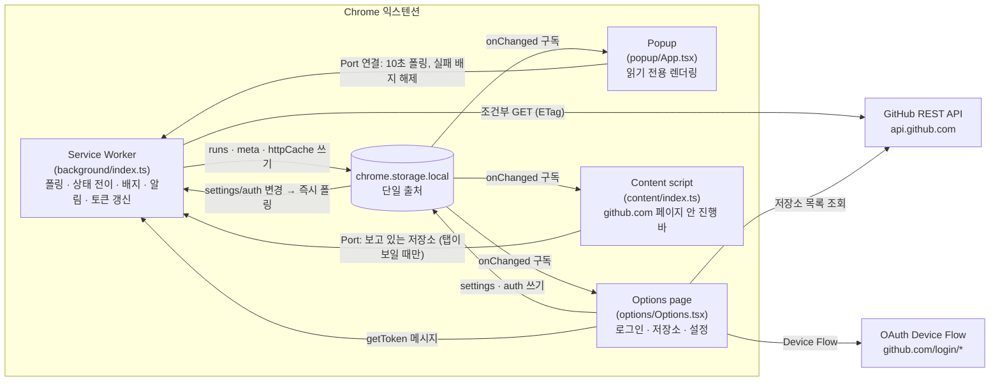
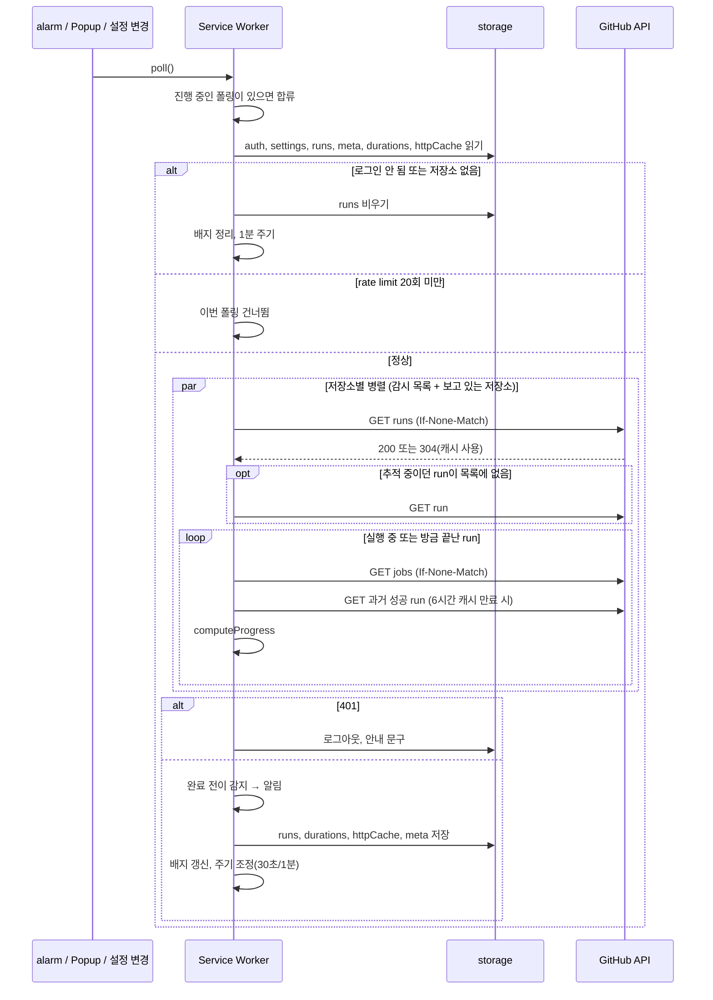

# Actions Pulse 설계 문서

| 항목 | 내용 |
|---|---|
| 상태 | MVP 구현 완료 (v0.1.0) + GitHub 페이지 내 진행 바 추가, Web Store 제출 전 |
| 최종 수정 | 2026-10-06 |
| 대상 독자 | 이 프로젝트를 유지보수하거나 설계를 검토하는 개발자 |

이 문서는 **무엇을 만들었는지**보다 **왜 이렇게 만들었는지**를 기록합니다. 결정마다 검토한 선택지, 고른 이유, 감수한 단점, 그리고 결정을 다시 볼 조건을 적습니다. 코드와 이 문서가 다르면 코드가 맞는 것이므로, 코드를 바꿀 때 이 문서도 함께 고칩니다(→ [유지 규칙](#11-문서-유지-규칙)).

## 목차

1. [문제 정의와 범위](#1-문제-정의와-범위)
2. [제약 조건](#2-제약-조건)
3. [아키텍처 개요](#3-아키텍처-개요)
4. [결정 기록](#4-결정-기록)
5. [데이터 모델](#5-데이터-모델)
6. [폴링 사이클](#6-폴링-사이클)
7. [에러 처리 정책](#7-에러-처리-정책)
8. [테스트 전략](#8-테스트-전략)
9. [알려진 한계](#9-알려진-한계)
10. [향후 과제](#10-향후-과제)
11. [문서 유지 규칙](#11-문서-유지-규칙)
12. [변경 이력](#12-변경-이력)

---

## 1. 문제 정의와 범위

### 문제

GitHub Actions의 진행 상황을 보려면 저장소의 Actions 탭이나 PR의 Checks 탭을 열어 두고 계속 새로고침해야 합니다. 여러 저장소에서 동시에 작업하면 탭이 늘어나고, 끝났는지 확인하려고 작업 흐름이 자주 끊깁니다.

### 단일 목적 (Single purpose)

> Show the progress of the user's GitHub Actions workflow runs.

Chrome Web Store는 익스텐션이 하나의 명확한 목적을 갖도록 요구합니다. 이 문장을 기능 추가 여부를 판단하는 기준으로 씁니다. 이 문장으로 설명할 수 없는 기능은 넣지 않습니다.

### 목표

| # | 목표 | 성공 기준 |
|---|---|---|
| G1 | 탭을 열지 않고 실행 중인 run을 확인 | 툴바 클릭 한 번으로 진행률, 현재 job/step, 남은 시간 확인 |
| G2 | 끝난 순간을 놓치지 않음 | 완료/실패 시 데스크톱 알림, 확인하지 않은 실패는 배지로 유지 |
| G3 | 누구나 설치해서 쓸 수 있음 | Chrome Web Store 공개 배포, 별도 서버 없음 |
| G4 | 신뢰할 수 있는 최소 권한 | GitHub에 읽기 전용 권한만 요청 |
| G5 | GitHub 화면 안에서 새로고침 없이 확인 (2026-10-06 추가) | PR·코드·Actions 화면에 진행 바가 들어가고, 완료되면 새로고침 없이 결과로 바뀜 |

### 범위 밖 (Non-goals)

| 항목 | 제외 이유 |
|---|---|
| 외부 CI/CD (Vercel, CircleCI 등) | 서비스마다 API와 인증이 달라 범위가 크게 늘어남. → [D1](#d1-대상-범위-github-actions만) |
| run 재실행·취소 같은 쓰기 작업 | 쓰기 권한이 필요해져 G4와 충돌 |
| 로그 열람 | GitHub 화면이 이미 잘 해결함. 링크로 연결하는 것으로 충분 |
| Firefox, Safari 지원 | 초기 배포 대상은 Chrome. → [D11](#d11-빌드-도구-vite--crxjs) |

---

## 2. 제약 조건

설계에 영향을 준 외부 조건입니다. 결정 기록에서 이 항목들을 `C1`처럼 참조합니다.

| # | 제약 | 내용 | 영향을 받은 결정 |
|---|---|---|---|
| C1 | **MV3 Service Worker 수명** | background는 상주하지 않음. 할 일이 없으면 약 30초 뒤 종료되고 이벤트가 오면 다시 시작됨. 전역 변수와 `setInterval`이 사라짐 | D3, D7 |
| C2 | **`chrome.alarms` 최소 주기 30초** | 주기 작업은 alarm으로 해야 하고, 30초보다 짧게 설정할 수 없음 | D3 |
| C3 | **GitHub API rate limit** | 인증된 요청은 시간당 5,000회. 조건부 요청에 `304`가 오면 차감되지 않음 | D4 |
| C4 | **GitHub의 브라우저용 push 채널 없음** | 웹훅은 공개된 HTTP 엔드포인트가 받아야 함. 브라우저가 직접 받을 수 없음 | D3 |
| C5 | **익스텐션 코드는 공개됨** | 배포된 패키지는 누구나 풀어볼 수 있음. 비밀값(client secret)을 넣으면 유출된 것과 같음 | D5 |
| C6 | **`github.com/login/*`는 CORS 헤더를 주지 않음** | 일반 웹페이지에서는 호출할 수 없음. 익스텐션은 host permission이 있으면 CORS 제약 없이 호출 가능 | D5, D10 |
| C7 | **Web Store 정책** | 단일 목적, 최소 권한, 권한별 사유 설명, 원격 코드 금지, 인증 정보를 다루면 개인정보처리방침 필수 | D6, D10, D13 |
| C8 | **Popup 수명** | Popup은 포커스를 잃으면 즉시 닫히고, 그 안의 JS 상태와 진행 중인 작업이 모두 사라짐 | D6 |

---

## 3. 아키텍처 개요



### 모듈 책임

| 모듈 | 책임 | 의존 |
|---|---|---|
| `lib/types.ts` | GitHub API 응답(사용하는 필드만)과 익스텐션 상태 타입 | 없음 |
| `lib/storage.ts` | 타입이 지정된 `chrome.storage.local` 래퍼, 기본값 병합, 변경 구독 | types |
| `lib/auth.ts` | Device Flow, 토큰 갱신, 갱신 필요 여부 판단 | types |
| `lib/github.ts` | REST 클라이언트, ETag 캐시, rate limit 헤더 수집 | types, storage(타입만) |
| `lib/progress.ts` | 진행률·예상 시간·포맷 계산 (**Chrome API 없는 순수 함수**) | types |
| `lib/page.ts` | GitHub URL → 페이지 종류 판별, 페이지에 보여줄 run 선택 (순수 함수) | progress, types |
| `lib/status.ts`, `lib/format.ts` | run 상태 → 표시 톤, 상대 시간 (순수 함수) | progress |
| `lib/filters.ts` | Popup·배지·알림에 셀 run 판정 (감시 저장소, 내 run만) | types |
| `lib/commit.ts` | 커밋의 Actions 결과 합산, GitHub 기본 상태 아이콘이 새로고침 후 보여줄 상태 예측 (순수 함수) | progress, status |
| `lib/notifications.ts` | 알림 ID 생성·해석 (순수 함수) | 없음 |
| `lib/messages.ts` | 컨텍스트 간 메시지·Port 타입과 헬퍼 | 없음 |
| `background/index.ts` | 폴링 조율, 상태 전이 감지, 배지, 알림, 토큰 갱신의 **유일한 소유자** | lib 전체 |
| `popup/`, `options/` | 화면. 상태는 storage에서 읽고, 쓰기는 설정·인증만 | lib, shared |
| `content/` | github.com 페이지에 진행 바 삽입. React 없이 DOM API로 렌더링 (D14) | lib, shared/icons |
| `shared/` | 화면들이 함께 쓰는 hook, 아이콘 마크업, 테마 | lib |

의존 방향은 `화면 → lib`, `background → lib`이고 `lib`은 화면이나 background를 모릅니다. `progress.ts`를 순수 함수로 둔 이유는 [D8](#d8-진행률-계산)과 [8장](#8-테스트-전략)에 있습니다.

---

## 4. 결정 기록

각 결정은 같은 형식으로 씁니다.

- **맥락**: 왜 결정이 필요했나
- **선택지**: 검토한 대안과 장단점
- **결정**: 고른 것
- **근거**: 고른 이유. 제약(C#)과 목표(G#)를 참조
- **감수한 단점**: 이 선택으로 잃은 것
- **재검토 조건**: 어떤 상황이 되면 결정을 다시 볼지

### 결정 요약

| # | 주제 | 결정 |
|---|---|---|
| D1 | 대상 범위 | GitHub Actions만 |
| D2 | 데이터 출처 | GitHub REST API |
| D3 | 갱신 방식 | `chrome.alarms` 폴링 (30초/1분) + Popup이 열려 있으면 10초 |
| D4 | rate limit 대응 | ETag 조건부 요청 + 소요 시간 캐시 |
| D5 | 인증 | GitHub App + Device Flow, 대안으로 PAT |
| D6 | UI 표면 | Popup + Badge + Options + Notifications + **GitHub 페이지 내 바** (2026-10-06 추가, D14) |
| D7 | 상태 관리 | `chrome.storage.local` 단일 출처, background가 유일한 폴링·갱신 주체 |
| D8 | 진행률 계산 | 과거 소요 시간 중앙값으로 보간하되 실제 step 진행도를 하한·상한으로 제한, 이력이 없으면 step 완료율 (2026-10-06 상한 추가) |
| D9 | 완료 감지와 알림 | 이전 상태와 비교한 전이 감지 + 5분 catch-up |
| D10 | 권한 | `storage`, `alarms`, `notifications` + GitHub 호스트 2개 (content script 추가 후에도 동일) |
| D11 | 빌드 도구 | Vite + CRXJS |
| D12 | UI 라이브러리 | React |
| D13 | 서버 | 두지 않음 |
| D14 | GitHub 페이지 내 진행 바 | content script + Shadow DOM, `#repo-content-pjax-container` 앞에 삽입, 못 찾으면 떠 있는 위젯 |
| D15 | 추적 대상 확장 | 감시 목록 + 지금 보고 있는 저장소 자동 추적 (알림·배지는 감시 목록만) |
| D16 | GitHub 기본 상태 아이콘 동기화 | `<style>` 하나로 기존 아이콘을 숨기고 같은 자리에 그림, 페이지를 연 뒤 바뀐 Actions 결과만 반영 |

---

### D1. 대상 범위: GitHub Actions만

**맥락**
CI/CD는 GitHub Actions 말고도 Vercel, Netlify, CircleCI 등에서 돌아갑니다. 처음부터 다 지원할지 정해야 했습니다.

**선택지**

| 선택지 | 장점 | 단점 |
|---|---|---|
| A. Actions만 | API 하나, 인증 하나. job/step 단위까지 상세한 데이터 | 다른 CI를 쓰는 사용자는 대상 밖 |
| B. Checks API로 GitHub에 보고되는 모든 check | 외부 CI 결과도 커밋 단위로 볼 수 있음 | check는 step·소요 시간 정보가 없어 "진행도"를 보여주기 어려움 |
| C. 서비스별 API 직접 연동 | 서비스별 상세 정보 | 서비스마다 인증·권한·정책이 달라 범위가 수 배로 늘어남 |

**결정**: A

**근거**
- 이 익스텐션의 핵심 가치는 "끝났나?"가 아니라 **"얼마나 남았나?"**입니다. 그러려면 job/step 상태와 시작 시각이 필요한데, 이 정보를 주는 건 Actions API뿐입니다(B 탈락).
- C는 서비스마다 OAuth 앱을 등록하고 권한 사유를 따로 설명해야 해서 G3(공개 배포)와 G4(최소 권한)를 동시에 어렵게 만듭니다.
- 단일 목적 문구를 짧고 분명하게 유지할 수 있습니다(C7).

**감수한 단점**: Vercel 배포 상태처럼 Actions 밖의 CD는 볼 수 없습니다.

**재검토 조건**: 사용자 요청이 특정 외부 서비스에 몰리면, B(Checks API)를 "완료 여부만 표시"하는 보조 기능으로 추가하는 것을 검토합니다.

---

### D2. 데이터 출처: GitHub REST API

**맥락**
run 상태를 어디서 가져올지 정해야 했습니다.

**선택지**

| 선택지 | 장점 | 단점 |
|---|---|---|
| A. REST API | 문서화되어 있고 버전이 고정됨(`X-GitHub-Api-Version`). ETag 지원 | 인증과 rate limit 관리 필요 |
| B. GraphQL API | 한 번에 여러 저장소를 묶어 조회 가능 | Actions run/job 정보는 REST에 비해 제공 범위가 좁음. ETag 기반 무료 조건부 요청을 쓸 수 없음 |
| C. GitHub 웹페이지 DOM 읽기 | 별도 인증 없이 로그인 세션 활용 | GitHub UI가 바뀌면 바로 깨짐. 해당 페이지가 열려 있어야 함. 모든 사이트 접근 권한이 필요해질 수 있음 |

**결정**: A

**근거**
- C는 GitHub가 화면을 바꿀 때마다 고장 나고, 탭이 열려 있어야만 동작해서 "탭을 열지 않고 확인"(G1)이라는 목표와 정면으로 충돌합니다.
- B는 묶음 조회가 장점이지만, 폴링 비용을 줄이는 핵심 수단인 **304 무료 응답**(C3)을 쓸 수 없습니다. 폴링이 주된 접근 방식인 이 익스텐션에서는 REST + ETag가 더 쌉니다(→ D4).

**사용하는 엔드포인트**

| 용도 | 엔드포인트 | 빈도 |
|---|---|---|
| 최근 run 목록 | `GET /repos/{repo}/actions/runs?per_page=20` | 폴링마다, 저장소당 1회 |
| 단일 run | `GET /repos/{repo}/actions/runs/{id}` | 추적 중인 run이 목록 첫 페이지에서 밀려났을 때만 |
| job/step | `GET /repos/{repo}/actions/runs/{id}/jobs?per_page=100` | 실행 중인 run마다 |
| 과거 소요 시간 | `GET /repos/{repo}/actions/workflows/{id}/runs?status=success&per_page=5` | 워크플로당 6시간에 1회 |
| 사용자 | `GET /user` | 로그인 시 1회 |
| 저장소 목록 | `GET /user/installations` → `/user/installations/{id}/repositories` (App), `GET /user/repos` (PAT) | 설정 화면을 열 때 |

**재검토 조건**: 감시 저장소가 수십 개로 늘어나는 사용 패턴이 흔해지면 GraphQL 묶음 조회와 비용을 다시 비교합니다.

---

### D3. 갱신 방식: 폴링

**맥락**
run 상태가 바뀐 것을 어떻게 알아챌지 정해야 했습니다. 가장 큰 제약은 C1(Service Worker 종료)과 C4(브라우저용 push 없음)입니다.

**선택지**

| 선택지 | 장점 | 단점 |
|---|---|---|
| A. `chrome.alarms` 폴링 | 서버 불필요. Service Worker가 종료돼도 alarm이 다시 깨움 | 최소 30초 지연(C2). 변화가 없어도 요청 발생 |
| B. 웹훅 + 중계 서버 + Web Push | 변화 즉시 반영 | 서버 운영 필요(D13과 충돌). 저장소마다 웹훅 설정 필요. 사용자 데이터가 서버를 거침 |
| C. Service Worker 안에서 `setInterval` | 짧은 주기 가능 | Service Worker가 종료되면 타이머도 사라짐(C1). 동작이 불안정 |
| D. Offscreen document로 상주 | 짧은 주기 가능 | offscreen은 DOM 작업용이라 이런 용도는 정책상 애매함. 상주하면 리소스를 계속 사용 |

**결정**: A를 기본으로 하고, Popup이 열려 있을 때만 더 짧은 주기를 씁니다.

| 상황 | 주기 | 구현 |
|---|---|---|
| 실행 중인 run 없음 | 1분 | `chrome.alarms` (`IDLE_PERIOD_MIN`) |
| 실행 중인 run 있음 | 30초 | `chrome.alarms` (`ACTIVE_PERIOD_MIN`, C2의 최소값) |
| Popup이 열려 있음 | 10초 | Port가 연결된 동안만 `setInterval` (`POPUP_POLL_MS`) |
| 설정·인증 변경 | 즉시 | `storage.onChanged` |

**근거**
- B는 실시간성이 가장 좋지만 서버 운영 비용, 저장소별 웹훅 설정 부담, 개인정보 문제를 한꺼번에 가져옵니다. "누구나 설치해서 바로 쓴다"(G3)를 만족할 수 없습니다.
- CI run은 보통 수 분 단위라서 30초 지연은 체감상 문제가 작습니다. 사용자가 **지켜보고 있을 때**(Popup이 열린 상태)만 10초로 줄이면 체감 지연과 요청 비용을 함께 잡을 수 있습니다.
- Popup이 열려 있는 동안 `setInterval`을 써도 되는 이유: Port가 연결돼 있고 주기마다 extension API(storage)를 호출하므로 Service Worker가 그동안 종료되지 않습니다. Popup이 닫히면 `onDisconnect`에서 타이머를 정리합니다.
- alarm은 다시 만들면 타이머가 초기화되므로, 주기가 실제로 바뀔 때만 다시 만듭니다(`schedule()`). 매 폴링마다 다시 만들면 다음 폴링이 계속 뒤로 밀립니다.

**동시 실행 방지**
alarm, Popup 타이머, 설정 변경이 겹쳐 폴링이 동시에 여러 번 돌 수 있습니다. `poll()`은 진행 중인 Promise를 공유하고, 설정이 바뀐 경우(`force`)에만 현재 폴링이 끝난 뒤 한 번 더 돕니다. Popup 타이머처럼 단순 반복 호출은 진행 중인 폴링에 합쳐져서 요청이 두 배로 늘지 않습니다.

**감수한 단점**: 30초보다 짧은 run은 실행 중인 모습을 못 볼 수 있습니다. 완료 알림은 D9의 catch-up으로 보완합니다.

**재검토 조건**: GitHub가 브라우저에서 구독할 수 있는 이벤트 스트림을 공식 제공하거나, 팀 단위 유료 기능으로 서버를 두기로 하면 B를 검토합니다.

---

### D4. rate limit 대응: ETag 조건부 요청

**맥락**
폴링(D3)은 변화가 없어도 요청을 보냅니다. 시간당 5,000회(C3) 안에서 버텨야 합니다.

**비용 추정 (ETag가 없다고 가정)**

저장소 5개, 실행 중인 run 2개, 30초 주기:
- 목록: 5 × 120회/시간 = 600
- job: 2 × 120회/시간 = 240
- 합계 약 **840회/시간**. Popup을 10분 열어 두면 10초 주기로 약 420회가 더해집니다.

혼자 쓰면 견딜 만하지만, 같은 토큰으로 다른 도구(gh CLI, IDE 확장 등)도 API를 쓰므로 여유가 크지 않습니다.

**선택지**

| 선택지 | 효과 | 단점 |
|---|---|---|
| A. ETag 조건부 요청 | 변화가 없으면 `304`가 오고 **한도에서 차감되지 않음** | 응답 본문을 캐시에 저장해야 함 |
| B. 주기를 늘림 | 요청 수가 선형으로 줄어듦 | 실시간성이 떨어짐 |
| C. GraphQL로 묶음 조회 | 요청 수 감소 | 304를 쓸 수 없음(D2) |

**결정**: A + 보조 수단

- 모든 GET에 `If-None-Match`를 붙이고, `304`면 캐시된 본문을 그대로 반환합니다(`HttpCache`).
- 캐시는 storage에 저장해서 Service Worker가 다시 시작돼도 유지되고, 최근 150개 항목만 남깁니다.
- 과거 소요 시간(D8)은 자주 바뀌지 않으므로 워크플로당 **6시간** 캐시합니다.
- 목록은 `per_page=20`으로 제한합니다. 추적 중인 run이 첫 페이지에서 밀려나면 그 run만 따로 조회합니다.
- 응답 헤더에서 남은 한도를 기록하고, **20회 미만**이면 리셋 시각까지 폴링을 멈춥니다. 남은 한도가 20% 아래로 떨어지면 Popup 하단에 표시합니다.

**근거**: 대부분의 폴링은 "변화 없음"이므로 304가 대부분이 되고, 실제로 차감되는 건 상태가 바뀐 순간의 요청뿐입니다. 실시간성(B)을 포기하지 않고 비용 문제를 해결할 수 있습니다.

**감수한 단점**: 캐시 본문이 storage에 쌓입니다(최대 150개 항목으로 제한).

---

### D5. 인증: GitHub App + Device Flow

**맥락**
private 저장소의 Actions를 보려면 사용자 토큰이 필요합니다. 공개 배포(G3), 최소 권한(G4), 서버 없음(D13), 비밀값을 넣을 수 없음(C5)을 모두 만족해야 했습니다.

이 결정은 두 축으로 나뉩니다. **어떤 종류의 앱으로 권한을 받을지**, 그리고 **어떤 흐름으로 토큰을 받을지**입니다.

#### 축 1: 앱 종류

| 선택지 | 권한 단위 | 단점 |
|---|---|---|
| OAuth App | scope 단위. private 저장소의 Actions를 보려면 `repo` scope가 필요하고, 이는 **코드 쓰기까지 포함하는 전체 권한** | G4와 충돌. 사용자 입장에서 승인하기 부담스러움 |
| **GitHub App** | 세분화된 권한. **Actions: Read-only + Metadata: Read-only**만 요청 가능. 사용자가 앱을 설치할 저장소를 고를 수 있음 | 사용자가 앱을 "설치"하는 단계가 하나 더 있음 |
| PAT만 사용 | 사용자가 직접 권한 지정 | 일반 사용자에게는 토큰 발급 과정이 어려움. 공개 배포 제품의 기본 방식으로 부적절 |

#### 축 2: 토큰 발급 흐름

| 선택지 | client secret | 서버 | 판단 |
|---|---|---|---|
| Web flow (`chrome.identity.launchWebAuthFlow`) | **필요**. GitHub 문서 확인 결과 PKCE를 써도 토큰 교환 단계에서 client_secret은 필수 | 비밀값을 숨기려면 토큰 교환용 서버가 필요 | C5, D13과 충돌 |
| **Device Flow** | **불필요**. client_id만으로 토큰 발급과 갱신 모두 가능 | 불필요 | 채택 |

**결정**: GitHub App + Device Flow를 기본으로 하고, PAT 입력을 대안으로 둡니다.

**근거**
- 읽기 전용 권한만 요청할 수 있는 건 GitHub App뿐입니다(G4). 권한 사유를 설명하기도 쉬워 심사에도 유리합니다(C7).
- 서버 없이 쓸 수 있는 흐름은 Device Flow뿐입니다(C5, D13). GitHub 문서에 따르면 Device Flow로 발급된 user token은 **client_secret 없이 갱신할 수 있습니다**. 이 사실이 확인되면서 "토큰 만료를 끄지 않고도" 서버 없이 운영할 수 있게 됐습니다.
- PAT를 대안으로 남긴 이유: 조직 정책상 서드파티 GitHub App 설치가 막힌 사용자, 그리고 개발 중 App 등록 전 테스트를 위해서입니다. `.env`에 client ID가 없으면 PAT 입력만 노출됩니다.

**토큰 수명과 갱신**
- GitHub App user token은 기본 8시간 만료, refresh token은 6개월입니다. 앱 설정에서 만료를 끌 수도 있지만, 갱신이 가능하므로 **만료를 유지**해 유출 시 피해를 줄입니다.
- 만료 5분 전부터 갱신합니다(`needsRefresh`).
- **refresh token은 한 번만 쓸 수 있습니다.** Options page와 background가 동시에 갱신하면 한쪽이 실패하고 로그아웃됩니다. 그래서 갱신은 **background만** 하고, 진행 중인 갱신 Promise를 공유합니다. Options page는 토큰이 필요하면 `getToken` 메시지로 background에 요청합니다.

**로그인을 Options page에서 하는 이유**
Device Flow는 사용자가 github.com에서 코드를 입력하는 동안 토큰 엔드포인트를 수 초 간격으로 계속 조회해야 합니다. Popup에서 시작하면 사용자가 GitHub 탭으로 이동하는 순간 Popup이 닫히고 조회가 끊깁니다(C8). background에서 돌리면 alarm 최소 주기(C2) 때문에 30초 간격이 되어 느립니다. 사용자가 탭을 오가도 살아 있는 **Options page**가 가장 적합합니다.

**감수한 단점**
- 사용자가 "코드 복사 → GitHub에 입력 → 앱 설치"를 거쳐야 해서 일반 OAuth 버튼보다 단계가 많습니다. "코드 복사 & GitHub 열기" 버튼 하나로 묶어 부담을 줄였습니다.
- 토큰은 `chrome.storage.local`에 평문으로 저장됩니다. 익스텐션 저장소는 다른 익스텐션이나 웹페이지에서 접근할 수 없지만, 로컬 디스크에 접근할 수 있는 공격자로부터는 보호되지 않습니다. 브라우저 익스텐션 환경에서 서버 없이 쓸 수 있는 실용적인 상한선으로 판단했습니다.

**재검토 조건**: GitHub가 웹 플로우에서 public client(PKCE만으로 교환)를 지원하면, 한 번 클릭으로 끝나는 `launchWebAuthFlow`로 전환을 검토합니다.

---

### D6. UI 표면 선택

**맥락**
익스텐션이 사용자에게 보일 수 있는 자리는 정해져 있고, 자리마다 수명과 용도가 다릅니다.

| 표면 | 수명 | 채택 | 용도와 이유 |
|---|---|---|---|
| **Popup** | 열려 있는 동안만(C8) | ✅ | 진행 목록. G1을 직접 해결하는 주 화면 |
| **Badge** | 영구 | ✅ | 실행 중인 개수, 확인하지 않은 실패는 빨간 `!`. 클릭하지 않아도 상태가 보임 |
| **Options page** | 탭이 열려 있는 동안 | ✅ | 로그인(D5), 저장소 선택, 알림 설정. 넓은 화면과 긴 수명이 필요한 작업 |
| **Notifications** | OS가 관리 | ✅ | 완료·실패 알림(G2) |
| Content script | 해당 페이지가 열려 있는 동안 | ⏸ 보류 | PR 페이지에 진행 바 삽입. GitHub DOM에 의존해 깨지기 쉬움(D2-C와 같은 문제). 부가 기능으로 나중에 검토 |
| Side panel | 열어 두는 동안 | ❌ | 화면 공간을 계속 차지함. 잠깐 확인하는 용도에는 Popup이 맞음 |
| New tab override | 새 탭마다 | ❌ | 단일 목적에서 벗어나고 사용자 반감이 큼 |

**배지 규칙**

| 상태 | 표시 | 색 |
|---|---|---|
| 실행 중 run 있음 | 개수 | 파랑 `#0969da` |
| 실행 중 없음 + 확인하지 않은 실패 | `!` | 빨강 `#cf222e` |
| 그 외 | 없음 | — |

Popup을 열면(Port 연결) 실패를 "확인함"으로 보고 카운터를 0으로 되돌립니다.

**근거**: 각 표면의 수명에 맞춰 기능을 배치했습니다. 오래 걸리는 작업(로그인)은 오래 살아 있는 곳에, 잠깐 보는 정보는 Popup에, 놓치면 안 되는 정보는 Badge와 Notifications에 둡니다.

> **변경됨 (2026-10-06): Content script 채택**
>
> MVP를 실사용해 본 뒤, 사용자가 원래 원한 것은 툴바 Popup이 아니라 **GitHub 화면 안에서 새로고침 없이 CI/CD 완료 여부를 보는 것**이었음이 분명해졌습니다(목표 G5 추가). 보류 이유였던 "GitHub DOM에 의존해 깨지기 쉬움"은 사라진 게 아니라, D14의 삽입 전략(안정적인 컨테이너 하나만 사용, GitHub 요소를 수정하지 않음, 못 찾으면 떠 있는 위젯)으로 위험을 줄였습니다.
>
> 기존 Popup·배지·알림은 유지합니다. GitHub 탭 밖에 있을 때도 완료를 알 수 있고, 추가 비용이 거의 없기 때문입니다. 역할은 이렇게 나뉩니다.
>
> | 표면 | 대상 저장소 | 용도 |
> |---|---|---|
> | GitHub 페이지 내 바 | 지금 보고 있는 저장소 | 그 화면(PR, 브랜치)에 해당하는 run의 진행과 결과 |
> | Popup·배지·알림 | 설정의 감시 목록 | GitHub 밖에서도 알아야 하는 run |

---

### D7. 상태 관리: storage를 단일 출처로

**맥락**
background, Popup, Options page는 서로 다른 JS 컨텍스트라 메모리를 공유하지 않습니다. 게다가 background는 언제든 종료됩니다(C1).

**선택지**

| 선택지 | 장점 | 단점 |
|---|---|---|
| A. background 메모리에 상태, 화면은 메시지로 요청 | 단순 | background가 종료되면 상태 유실. 화면을 열 때마다 요청-응답 필요 |
| **B. `chrome.storage.local`에 상태, 모두 구독** | background가 종료돼도 유지. 화면은 `onChanged`로 자동 갱신 | 쓰기마다 직렬화 비용 |
| C. `chrome.storage.session` | 메모리 기반이라 빠름 | 브라우저를 재시작하면 사라짐. 로그인이 풀림 |
| D. IndexedDB | 대용량에 적합 | 데이터가 작아서 과함. 변경 구독 기능 없음 |

**결정**: B

**쓰기 권한 분리**

| 키 | 쓰는 쪽 | 읽는 쪽 |
|---|---|---|
| `auth` | Options(로그인/로그아웃), background(갱신, 401 시 로그아웃) | 모두 |
| `settings` | Options | 모두 |
| `runs`, `durations`, `httpCache` | **background만** | Popup |
| `meta` | background, Popup 연결 시 실패 카운터 초기화 | 모두 |

**근거**
- C1 때문에 메모리에 둔 상태는 언제든 사라질 수 있으므로 A는 탈락입니다.
- run 데이터를 background만 쓰게 해서 "누가 최신 상태를 만들었는가"가 항상 분명합니다. 화면은 렌더링만 하므로 Popup을 몇 번 열고 닫아도 API 호출이 늘지 않습니다.
- `settings`나 `auth`가 바뀌면 background가 `onChanged`로 감지해 바로 다시 폴링합니다. 화면이 "다시 불러와"라는 메시지를 따로 보낼 필요가 없습니다.
- `meta` 갱신은 쓰기 직전에 다시 읽어서 병합합니다(`updateItem`). 폴링 도중 Popup이 실패 카운터를 0으로 만들었을 때, 폴링 시작 시점의 값으로 덮어쓰지 않기 위해서입니다.

**컨텍스트 간 통신**

| 방식 | 용도 |
|---|---|
| `storage.onChanged` | 상태 전파 (기본 경로) |
| `runtime.sendMessage` | `poll`(수동 새로고침), `getToken`(갱신 소유권, D5) |
| `runtime.connect` (Port) | Popup이 열려 있다는 신호. 10초 폴링 시작, 실패 배지 초기화, 닫히면 정리 |

메시지 핸들러는 `sender.id`가 자기 자신일 때만 응답합니다.

> **변경됨 (2026-10-06): content script 추가에 따른 보강**
>
> | 추가 | 내용 |
> |---|---|
> | `page` Port | content script가 연결하고, 지금 보이는 저장소를 `{ type: 'view', repo }`로 알림. 탭이 숨겨지면 연결을 끊음. background는 연결된 Port들의 저장소 집합을 폴링 대상에 더함(D15) |
> | `repoInfo` 키 | 보고 있는 저장소의 기본 브랜치. background만 씀, content script가 읽음 |
> | `getToken` 제한 | content script도 확장 프로그램 ID로 메시지를 보낼 수 있으므로, `sender.tab`이 있는 요청(=웹페이지 안에서 온 요청)에는 토큰을 주지 않음 |
>
> **솔직한 한계**: `chrome.storage.local`은 content script에서도 읽을 수 있고, 접근 범위를 좁히는 `setAccessLevel`은 `storage.session`에만 적용됩니다. 그래서 `getToken` 제한은 심층 방어일 뿐이고, 실제 방어선은 **content script가 탈취당하지 않게 하는 것**입니다. content script는 `auth`를 읽지 않으며, 외부 데이터를 HTML로 해석하지 않습니다(D14의 XSS 정책). 페이지의 JS는 격리된 실행 환경(isolated world) 때문에 `chrome.storage`에 직접 접근할 수 없습니다.

---

### D8. 진행률 계산

**맥락**
GitHub는 run의 "진행률"을 주지 않습니다. job/step 상태와 시각으로 직접 계산해야 합니다.

**선택지**

| 방식 | 문제 |
|---|---|
| A. 전체 step 합계 대비 완료 step | 대기 중인 job은 시작 전까지 step 목록이 비어 있음. 그래서 분모가 작아져 진행률이 **과대평가**됨 |
| B. job별 완료율의 평균 | A의 문제는 해결. 하지만 step마다 소요 시간이 크게 다름(체크아웃 2초 vs 테스트 5분)이라 시간 흐름과 안 맞음 |
| C. 과거 소요 시간 대비 경과 시간 | 시간 흐름과 가장 잘 맞음. 하지만 이력이 없으면 계산 불가. 캐시 미스 등으로 평소보다 느려질 수 있음 |

**결정**: C를 기본으로, B를 하한선과 대체 수단으로 씁니다.

```
byTime    = 경과 시간 / 예상 소요 시간       (이력이 있을 때)
byStep    = job별 완료율의 평균              (완료된 job = 1, step 없는 job = 0)
진행률     = min(0.97, max(byTime, byStep))  (실행 중)
진행률     = 1                               (완료)
```

**세부 결정과 근거**

| 항목 | 결정 | 근거 |
|---|---|---|
| 예상 소요 시간 | 최근 **성공** run 5개의 **중앙값** | 실패한 run은 중간에 끊겨 짧게 잡히므로 제외. 평균은 캐시 미스 같은 이상치 하나에 크게 흔들리지만 중앙값은 그렇지 않음 |
| 하한선 `max(byTime, byStep)` | step이 이미 많이 진행됐는데 시간 기준으로 낮게 보이는 경우 방지 | 사용자 눈에는 "단계는 거의 끝났는데 바가 덜 찼다"가 더 이상해 보임 |
| 상한 97% | 완료 전에는 100%를 보여주지 않음 | 바가 꽉 찼는데 안 끝나는 상황은 신뢰를 떨어뜨림 |
| 예상 초과 시 | "slower than usual" 표시 | 남은 시간 대신 현재 상태를 솔직하게 알림 |
| 대기 중(queued) | 줄무늬 애니메이션 + "Waiting for a runner…" | 진행률 0%로 보이는 것보다 "대기 중"임을 분명히 함 |

**Popup에서 다시 계산하는 이유**
background는 최대 30초마다 갱신하므로, 저장된 진행률을 그대로 보여주면 바가 계단식으로 움직입니다. Popup은 저장된 job 상태와 예상 시간을 받아 **1초마다 같은 함수(`computeProgress`)로 다시 계산**합니다. 계산 로직이 한 곳에 있어서 background와 Popup의 결과가 어긋나지 않습니다.

**감수한 단점**: 워크플로가 크게 바뀐 직후(job 추가 등)에는 과거 중앙값이 맞지 않습니다. 6시간 캐시가 만료되면 자연스럽게 반영됩니다.

> **변경됨 (2026-10-06): 실제 step 진행도를 상한으로도 사용**
>
> **문제**: 위 방식은 step 진행도를 하한으로만 썼습니다. 그래서 실제 run이 한 step에서 멈춰 있어도 바는 시간에 따라 계속 차서 97%까지 갔습니다. 실사용 검증 중 "바가 실제 진행을 따라가는 건지, 정해진 시간에 맞춰 차는 건지" 구분할 수 없다는 피드백이 나왔고, 실제로 이 레포의 20초짜리 CI에서는 step 데이터가 두 번 정도만 갱신되어 바의 움직임이 대부분 시간 추정이었습니다.
>
> **선택지**
>
> | 방식 | 장점 | 단점 |
> |---|---|---|
> | A. 현행 유지 (하한만) | 가장 부드럽게 움직임 | 실제로 멈춰도 바는 계속 참. 신뢰도 문제 |
> | B. step 기준만 사용 | 항상 실제 데이터 | step마다 길이가 달라 바가 크게 튀고, 긴 step 동안 멈춰 보임 |
> | **C. step 진행도를 하한과 상한으로, 그 사이는 시간으로 보간** | 실제 진행에서 크게 벗어나지 않으면서 step 사이는 부드럽게 움직임 | 상한에 닿으면 멈춰 보임 (아래 감수한 단점) |
>
> **결정**: C
>
> ```
> 하한 = job별 완료 step 비율의 평균                        (stepRatio)
> 상한 = job별 "실행 중인 step의 끝" 비율의 평균             (stepCeiling)
>        완료 job = 1, 시작 안 한 job = 0,
>        실행 중이지만 step 목록이 아직 없는 job = 1 (판단 근거가 없어 제한하지 않음)
> 진행률 = min(0.97, clamp(경과 시간 / 예상 소요 시간, 하한, 상한))
> ```
>
> 예: step 10개 중 3개가 끝나고 4번째가 실행 중이면 바는 30%~40% 사이에서만 움직입니다. 시간상으로는 90%여도 40%에서 멈춥니다.
>
> **남은 시간도 같은 기준으로**: 바가 상한에 막혀 있는데 남은 시간을 시계로만 계산하면 "바는 40%인데 2초 남음"처럼 어긋납니다. 그래서 `남은 시간 = max(예상 − 경과, 예상 × (1 − 진행률))`로, 남은 작업 비율만큼 평소 시간이 더 걸린다고 봅니다. 평소 시간을 넘긴 경우는 기존처럼 남은 시간 대신 "slower than usual"을 표시합니다.
>
> **감수한 단점**
> - **상한에서 멈춤**: Popup은 1초마다 다시 계산하지만 step 데이터는 폴링 때만(Popup이 열려 있으면 10초) 바뀝니다. 실제로는 다음 step으로 넘어갔어도 다음 폴링까지 바가 상한에서 잠시 멈출 수 있습니다. "실제보다 앞서 보이는 것"보다 "잠깐 늦게 보이는 것"이 신뢰를 덜 해친다고 판단했습니다.
> - **의존 job이 있는 워크플로**: `needs:`로 이어진 뒤 job이 아직 시작되지 않았으면 그 job의 상한이 0이라, 앞 job이 시간의 대부분을 차지해도 바가 50%(job 2개 기준)에서 멈춥니다. job별 과거 소요 시간이 있으면 가중치를 줄 수 있지만 API 비용이 job 수만큼 늘어납니다(위 재검토 조건과 같은 사안).
>
> **재검토 조건**: 상한에서 멈춰 보인다는 피드백이 많으면, 진행 중일 때 Popup 폴링 주기를 줄이거나 job별 소요 시간 가중치를 도입합니다.

**재검토 조건**: job별 과거 소요 시간까지 수집하면 정확도를 높일 수 있지만 API 비용이 job 수만큼 늘어납니다. 정확도 불만이 나오면 검토합니다.

---

### D9. 완료 감지와 알림

**맥락**
"완료됐다"는 사건은 API가 알려주지 않습니다. 상태 스냅샷만 받을 수 있으므로 직접 감지해야 합니다.

**결정**: 이전 폴링에서 저장한 상태(`runs`)와 이번 응답을 비교합니다.

| 경우 | 판정 |
|---|---|
| 이전에 실행 중 → 지금 완료 | 완료 전이 → 알림 |
| 이전에 추적 중이던 run이 재실행(`run_attempt` 증가) 후 완료 | 완료 전이 → 알림 |
| 이전에 없었음 + 지금 완료 + 직전 폴링이 **5분 이내** + 직전 폴링 이후에 끝남 | 폴링 사이에 시작해서 끝난 짧은 run → 알림 (catch-up) |
| 이전에 없었음 + 지금 완료 + 위 조건 불충족 | 무시 (설치 직후나 오래 꺼져 있다 켜졌을 때 과거 run 알림이 쏟아지는 것 방지) |

**근거**
- catch-up 조건의 "5분 이내"는 노트북을 덮었다 열었을 때처럼 폴링이 오래 멈춘 경우를 걸러내기 위한 것입니다. 이 조건이 없으면 다시 켜는 순간 그동안 끝난 run마다 알림이 옵니다.
- 완료된 run은 30분 동안 "Recently finished"에 남기고 최대 10개만 유지합니다. 알림을 놓쳤을 때 Popup에서 확인할 수 있게 하기 위해서입니다.

**알림 정책**

| 설정 | 알림 대상 |
|---|---|
| Every finished run (기본) | 모든 완료 |
| Failures only | `failure`, `timed_out`, `startup_failure` |
| Never | 없음 |

`cancelled`는 "실패"로 보지 않습니다. 사용자가 직접 취소하는 경우가 대부분이어서 실패 알림으로 보내면 소음이 됩니다. 실패 알림은 `priority: 2`로 보냅니다.

**알림 ID에 URL을 담는 이유**: 알림 ID를 `run|<run URL>`로 만들면 클릭 핸들러가 별도 저장소 없이 바로 URL을 알 수 있습니다. Service Worker가 그사이 재시작돼도 동작합니다. 열기 전에 `https://github.com/`로 시작하는지 확인합니다.

> **변경됨 (2026-10-06)**: 알림 ID를 `run|<생성 시각>|<run URL>`로 바꿨습니다([`lib/notifications.ts`](../src/lib/notifications.ts)).
> - **이유**: 같은 run을 다시 실행(re-run)하면 run ID와 URL이 그대로라서 알림 ID가 겹칩니다. `chrome.notifications.create`는 이미 있는 ID를 받으면 새 알림을 띄우지 않고 기존 알림을 제자리에서 갱신하므로, 이전 알림이 알림 센터에 남아 있으면 재실행 결과가 다시 울리지 않을 수 있습니다.
> - **발견 경위**: 실제 GitHub App으로 re-run을 반복하며 수동 검증하던 중, 알림이 오지 않는 시도가 있었습니다. 그 시도의 직접 원인은 macOS 알림 설정이 반영되기 전이었을 가능성이 더 높아 확정하지 못했지만, ID가 겹치는 문제 자체는 실제로 존재하므로 수정했습니다.
> - URL을 ID에 담는 원래 장점(별도 저장소 없이 클릭 처리, Service Worker 재시작에도 동작)은 그대로 유지합니다. ID 생성·해석은 순수 함수로 분리해 단위 테스트를 붙였습니다.

---

### D10. 권한

**맥락**: 권한은 설치 경고 문구, 심사 기간, 사용자 신뢰에 직접 영향을 줍니다(C7, G4).

| 권한 | 필요한 이유 | 없으면 |
|---|---|---|
| `storage` | 토큰, 설정, run 상태 저장 (D7) | 동작 불가 |
| `alarms` | Service Worker가 종료돼도 주기적으로 깨우기 (D3) | 폴링 불가 |
| `notifications` | 완료·실패 알림 (D9) | G2 불가 |
| `https://api.github.com/*` | REST API 호출 (D2) | 동작 불가 |
| `https://github.com/*` | Device Flow 엔드포인트 호출. 이 엔드포인트는 CORS 헤더가 없어서(C6) host permission이 있어야 호출 가능 | 로그인 불가 |

**의도적으로 요청하지 않은 권한**

| 권한 | 대신 쓴 방법 |
|---|---|
| `tabs` | `chrome.tabs.create`는 권한 없이 쓸 수 있음. 탭 URL을 읽을 일이 없음 |
| `identity` | Device Flow는 일반 fetch로 충분 (D5) |
| `<all_urls>`, content script | content script는 보류 (D6). 도입할 때도 `https://github.com/*/pull/*`처럼 좁은 범위로 제한 |
| `clipboardWrite` | 사용자 클릭 직후의 `navigator.clipboard.writeText`는 권한 없이 동작 |

> **변경됨 (2026-10-06): content script 추가**
>
> - `content_scripts`를 `https://github.com/*`에 등록했습니다. 로그인용으로 이미 `https://github.com/*` host permission이 있어서 **설치 경고 문구는 늘지 않습니다**. 위 표에서 "도입할 때도 `/pull/*`처럼 좁게"라고 적었지만, 대상이 PR·코드·Actions 세 종류이고 GitHub가 새로고침 없이 페이지를 오가기 때문에(PR 목록 → PR로 이동할 때 content script가 새로 주입되지 않음) 좁은 matches로는 이동 후 바가 나타나지 않습니다. 그래서 github.com 전체에 넣고, 어느 페이지에서 그릴지는 코드에서 판별합니다(`parsePage`). 다른 페이지에서는 아무것도 하지 않습니다.
> - CRXJS는 content script를 ES 모듈로 불러오기 위해 청크 파일을 `web_accessible_resources`(github.com 한정)에 등록합니다. 그 결과 github.com이 이 익스텐션의 설치 여부를 알아낼 수 있습니다. 담긴 것은 코드뿐이고 비밀값은 없어 허용 가능한 수준으로 판단했습니다.
> - Web Store 심사용 사유: "Shows workflow progress inside GitHub pull request, code and Actions pages." 

---

### D11. 빌드 도구: Vite + CRXJS

**맥락**: MV3 익스텐션은 manifest, Service Worker, 여러 HTML 진입점을 함께 번들해야 합니다.

| 선택지 | 장점 | 단점 |
|---|---|---|
| **Vite + CRXJS** | manifest를 TS 코드로 작성(`manifest.config.ts`)하고 `package.json` 버전을 그대로 사용. 일반 Vite 프로젝트 구조를 그대로 유지. HMR 지원 | Chrome 전용에 초점 |
| WXT | 파일 기반 진입점, 여러 브라우저 동시 빌드, 풍부한 유틸 | 프레임워크 규약(디렉터리 구조, 자동 import)을 따라야 함 |
| Plasmo | 설정이 거의 없음 | 자체 규약이 강하고 빌드 체계가 추상화되어 문제 생길 때 추적이 어려움 |
| Vite/webpack 직접 설정 | 완전한 제어 | 진입점 여러 개, manifest 경로 치환, HMR을 직접 구현해야 함 |

**결정**: Vite + CRXJS

**근거**
- 대상 브라우저가 Chrome 하나이므로(Non-goals) WXT의 가장 큰 장점인 여러 브라우저 동시 빌드가 지금은 필요 없습니다.
- CRXJS는 Vite 위의 얇은 플러그인이라, Vite를 아는 사람이면 별도 프레임워크를 배우지 않고 구조를 이해할 수 있습니다. 유지보수와 포트폴리오 설명 모두에 유리합니다.
- manifest를 코드로 관리하면 버전을 `package.json` 하나에서만 관리할 수 있고, 진입점 경로를 빌드 결과에 맞게 자동으로 바꿔 줍니다.

**재검토 조건**: Firefox나 Edge Add-ons 배포를 목표에 넣으면 WXT로 이전을 검토합니다. 핵심 로직이 `lib/`의 순수 TS로 분리되어 있어 이전 비용은 크지 않습니다.

---

### D12. UI 라이브러리: React

| 선택지 | 장점 | 단점 |
|---|---|---|
| **React** | 익숙함(muzusi-web과 같은 스택). 생태계 | 번들이 큼 (빌드 결과 약 220KB, gzip 69KB) |
| Preact | 같은 API에 번들은 수 KB | `preact/compat` 호환성 차이를 신경 써야 함 |
| Vanilla TS | 의존성 없음 | 상태에 따라 바뀌는 목록 UI(진행 바, 펼치기, 필터)를 직접 갱신하는 코드가 늘어남 |

**결정**: React

**근거**
- 익스텐션 리소스는 네트워크가 아니라 **로컬 디스크에서 로드**되므로, 번들 크기가 웹사이트만큼 체감 속도에 영향을 주지 않습니다.
- 화면 두 개가 storage 구독 + 1초마다 다시 계산하는 구조라서, 선언형 렌더링이 직접 DOM을 다루는 것보다 버그가 적습니다.
- 상태 관리 라이브러리는 쓰지 않습니다. storage가 이미 단일 출처이므로(D7) `useStorage` hook 하나로 충분합니다.

**재검토 조건**: Popup이 열리는 속도가 느리다는 피드백이 나오면 Vite alias로 `react` → `preact/compat`을 바꿔서 측정합니다.

---

### D13. 서버를 두지 않음

**결정**: 백엔드 서버 없이 익스텐션과 GitHub만으로 동작합니다.

**근거**
- 웹훅 중계(D3-B)와 OAuth 토큰 교환(D5 웹 플로우)이 서버가 필요한 대표적인 이유였는데, 각각 폴링 + ETag와 Device Flow로 대체했습니다.
- 서버가 없으면 운영 비용과 장애 지점이 없고, 사용자 데이터가 개발자를 거치지 않습니다. 개인정보처리방침이 "GitHub 외에는 아무 데도 보내지 않는다"로 단순해집니다(C7).
- 원격 코드 금지 정책(C7)에 맞춰 모든 코드는 번들에 포함하고, 런타임에 외부 스크립트를 불러오지 않습니다.


---

### D14. GitHub 페이지 내 진행 바 (2026-10-06 추가)

**맥락**
사용자는 PR, 저장소 코드 화면, Actions 탭에서 새로고침 없이 진행과 완료 여부를 보고 싶어 했습니다(G5). 여기서 정할 것은 **어디에, 어떻게 끼워 넣을지**, 그리고 **GitHub가 화면을 바꿔도 버티는 방법**이었습니다.

**실제 GitHub DOM 조사 결과 (2026-10-06, vitejs/vite 공개 저장소)**

| 화면 | 발견한 것 | 설계에 준 영향 |
|---|---|---|
| 저장소 메인 | `#repo-content-pjax-container` 아래에 React 앱(`react-app`) | React 루트 **바깥 형제 위치**에 넣으면 React가 다시 그려도 지워지지 않음 |
| PR | 새 React UI로 바뀌어 예전 ID(`#partial-discussion-header`, merge box 등)가 **모두 사라짐**. 같은 컨테이너는 존재 | PR 내부 요소에 기대지 않고 같은 컨테이너를 사용 |
| Actions 목록 | 각 행이 `js-socket-channel js-updatable-content` → **GitHub가 WebSocket으로 행 상태를 이미 실시간 갱신**. 진행률·남은 시간은 없음 | 상태 아이콘이 아니라 진행률을 보탬. GitHub가 행을 통째로 바꾸면 우리 요소도 사라지므로 다시 붙이는 처리가 필요 |
| 공통 | Primer CSS 변수(`--fgColor-default` 등)가 문서 루트에 정의됨 | Shadow DOM 안에서도 상속되므로 GitHub 테마를 그대로 따름 |

#### 삽입 위치

| 선택지 | 장점 | 단점 |
|---|---|---|
| A. 화면별 세부 요소 옆 (PR merge box, 최근 커밋 박스 등) | 문맥상 가장 자연스러움 | 조사 결과 PR은 이미 ID가 사라짐. 화면마다 다른 선택자를 유지해야 해서 GitHub 개편마다 깨짐 |
| **B. 공통 컨테이너 하나(`#repo-content-pjax-container`)의 맨 앞** | 선택자 하나로 PR·코드 화면 모두 해결. React 루트 바깥이라 재렌더링에 안전 | PR 내부(merge box 근처)가 아니라 저장소 탭 바로 아래에 위치 |
| C. 항상 떠 있는 위젯 | DOM 의존 없음 | 내용을 가림. "GitHub UI 안에 넣고 싶다"는 요구와 다름 |

**결정**: PR·코드 화면은 B, 컨테이너를 못 찾으면 C로 대체합니다. Actions 목록은 각 행의 run 링크(`a[href$="/actions/runs/<id>"]`)를 기준으로 그 행 안에 작은 바를 붙입니다. run ID가 들어간 링크는 화면 구조가 바뀌어도 남아 있을 가능성이 가장 높은 요소이기 때문입니다.

**근거**: 깨지기 쉬운 지점을 **선택자 2개**(컨테이너, run 링크)로 줄였고, 둘 다 없어져도 떠 있는 위젯으로 기능은 유지됩니다. 실제로 PR 화면의 옛 선택자가 이미 사라진 것을 확인한 만큼, 화면별 세부 위치(A)는 유지 비용이 너무 큽니다.

> **변경됨 (2026-10-06): 저장소 메인은 버튼 줄과 파일 목록 사이로 이동**
>
> **요청**: 저장소 메인에서는 탭 바로 아래보다, `main`·Branches·Tags·Go to file·Code 버튼 줄과 최근 커밋 박스 사이가 더 잘 보인다는 피드백.
>
> **새 위험**: 이 자리는 GitHub **React 영역 안쪽**입니다. 처음에 B(React 바깥)를 택한 이유가 이 위험을 피하기 위해서였으므로, 그대로 옮기지 않고 아래 조건을 붙였습니다.
>
> | 조건 | 이유 |
> |---|---|
> | GitHub 요소는 건드리지 않고 **형제 요소로만 삽입** (`insertBefore`) | React는 자기가 만든 노드의 참조로 갱신하므로, 모르는 형제가 있어도 재조정이 깨지지 않음. GitHub 요소 자체를 수정하는 것보다 훨씬 안전함 |
> | `react-app`에 `loaded` 클래스가 생긴 뒤에만 삽입 | 서버 렌더링 결과를 React가 넘겨받는 중(hydration)에 모르는 노드가 끼면 React가 그 영역을 버리고 다시 그림 |
> | 위치는 생성된 클래스명이 아니라 **브랜치 선택 버튼(`#ref-picker-repos-header-ref-selector`)과 최근 커밋 박스의 공통 부모**로 찾음 | `OverviewContent-module__Box__PF75K` 같은 클래스는 GitHub가 배포할 때마다 바뀜 |
> | **저장소 메인(`ref === null`)에서만** 사용 | 실제 검증 중 폴더 화면(`/tree/…`)에서는 브랜치 버튼이 왼쪽 사이드바에 있어, 공통 부모가 화면 전체의 가로 배치 요소로 잡히고 배너가 가운데 칸이 되어 **레이아웃이 깨지는 것을 발견**함 |
> | 버튼 줄이 파일 목록보다 **위에 있을 때만** 삽입 (세로 배치 검사) | GitHub가 메인 화면을 가로 배치로 바꿔도 같은 방식으로 깨지지 않게 하는 안전장치 |
>
> 조건을 하나라도 만족하지 못하면 기존 위치(컨테이너 맨 앞)로, 그것도 없으면 떠 있는 위젯으로 돌아갑니다. 새 위치에서는 GitHub의 파일 목록 칸이 폭과 여백을 정해 주므로, 배너 자체의 최대 폭과 좌우 여백은 끄고 아래쪽에만 16px을 둡니다(GitHub 박스 사이 간격과 같음).
>
> **감수한 단점**: React 영역 안쪽이라 GitHub가 이 부분 구조를 바꾸면 배너가 기존 위치로 돌아갈 수 있습니다(기능은 유지). 폴더·파일 화면과 PR 화면은 아직 기존 위치입니다.

#### 화면별로 보여주는 run

| 화면 | 선택 기준 | 근거 |
|---|---|---|
| PR (`/pull/N`, 하위 탭 포함) | run의 `pull_requests[].number`에 N이 있는 run | API가 PR과 run을 직접 연결해 줌. PR 권한을 추가로 받지 않아도 됨 (2026-10-06 API로 확인) |
| 저장소 메인 | 기본 브랜치의 run + "다른 브랜치에서 N개 실행 중" 링크 | 메인 화면은 기본 브랜치를 보여주므로. 방금 push한 다른 브랜치를 놓치지 않도록 개수만 표시 |
| `/tree/…`, `/blob/…` | 경로 앞부분과 일치하는 가장 긴 브랜치 이름 | 브랜치 이름에 `/`가 들어갈 수 있어서 `feat/x/src/a.ts`만으로는 경계를 알 수 없음 |
| Actions 목록 | 화면에 보이는 행 중 실행 중인 run | 끝난 행은 GitHub가 이미 결과를 보여줌 |

PR이나 브랜치에는 이전 push의 run이 쌓이므로, **워크플로마다 가장 최근 run만** 보여줍니다(`latestPerWorkflow`). 실행 중인 것이 위에 옵니다. 끝난 run은 30분 동안 "Passed in 1m 20s · 2m ago"처럼 결과로 남아서, 새로고침 없이 완료를 확인할 수 있습니다. 보여줄 run이 없으면 아무것도 그리지 않습니다(GitHub 화면을 어지럽히지 않음).

#### 격리와 렌더링

| 결정 | 이유 |
|---|---|
| **Shadow DOM** | GitHub CSS가 우리 요소를 건드리지 않고, 우리 CSS도 밖으로 새지 않음 |
| **Primer CSS 변수 + 기본값** | Shadow DOM 경계를 넘어 상속되므로 라이트·다크·고대비 테마를 자동으로 따름. 변수 이름이 바뀌어도 기본값으로 표시됨 |
| **React 대신 DOM API** | content script는 모든 GitHub 페이지에 주입되므로 가볍게 유지 (빌드 결과 12.5KB, gzip 5KB. React를 넣으면 약 220KB). 그리는 요소가 작아 선언형 렌더링의 이득이 작음 |
| **제자리 갱신** | 1초마다 다시 계산할 때 DOM을 새로 만들지 않고 값만 바꿈. 새로 만들면 바의 CSS transition이 끊김 |
| **아이콘 마크업 공유** | `shared/icons.ts`의 SVG 문자열을 Popup(React)과 content script가 같이 사용 |

#### XSS 정책

run 제목·브랜치·워크플로 이름은 **커밋한 사람이 정하는 값**이고, 이 코드는 github.com 안에서 실행됩니다. 그래서 외부 데이터는 모두 `textContent`로만 넣고, `innerHTML`은 코드 안의 상수(아이콘)에만 씁니다. 수동 검증 때 ``을 제목으로 넣어 글자 그대로 표시되는 것을 확인했습니다.

#### GitHub의 페이지 이동 처리

GitHub는 Turbo와 React 라우팅으로 새로고침 없이 페이지를 바꾸고, Actions 행처럼 일부를 스스로 다시 그립니다.

| 선택지 | 단점 |
|---|---|
| 특정 이벤트 구독 (`turbo:load` 등) | GitHub 내부 이벤트라 문서화되어 있지 않고 화면마다 다름 (Turbo 화면과 React 화면이 섞여 있음) |
| **DOM 변경 감지 (`MutationObserver`) + 멱등 렌더링** | DOM 변경이 잦으면 호출이 많아짐 → `requestAnimationFrame`으로 프레임당 한 번으로 묶음 |

변경이 감지될 때마다 URL이 바뀌었는지 확인하고, 마운트 위치에 우리 요소가 있는지 확인해 없으면 다시 붙입니다. 렌더링은 몇 번 호출해도 결과가 같게 만들었습니다. Shadow DOM 내부 변경은 이 observer에 잡히지 않으므로 자기 자신의 갱신으로 무한 반복되지 않습니다.

> **변경됨 (2026-10-06)**: 감시 대상을 `<body>`에서 **문서 전체(`<html>`)**로 바꿨습니다. GitHub가 Turbo로 페이지 전체를 이동하면 `<body>` 요소 자체를 교체하는데, 그러면 예전 `<body>`를 보던 observer는 더 이상 아무것도 감지하지 못합니다. D16 작업 중 코드를 검토하다 발견했습니다. 검증 때는 GitHub가 프레임 단위 이동을 써서 드러나지 않았습니다.

**그 밖의 처리**
- 확장 프로그램을 업데이트·새로고침하면 기존 탭의 content script는 `chrome.*`를 쓸 수 없는 고아 상태가 됩니다. 이를 감지하면 스스로 정리하고 멈춥니다.
- 1초 갱신 타이머는 실행 중인 run이 보이고 탭이 보일 때만 돕니다.
- 대기 중(queued) run은 진행률과 남은 시간을 만들어 내지 않고 "Waiting for a runner… · queued 27s"만 표시합니다. 아무것도 시작하지 않았는데 퍼센트를 보여주면 지어낸 값이 되기 때문입니다(Popup도 같이 수정).
- 설정에 "Show progress on GitHub pages" 끄기 옵션을 둡니다(기본 켜짐).

**감수한 단점**
- 바가 PR의 merge box 근처가 아니라 저장소 탭 바로 아래에 있습니다. 위치의 자연스러움보다 깨지지 않는 쪽을 택했습니다.
- 선택자 두 개는 여전히 GitHub에 의존합니다. 둘 다 사라지면 PR·코드 화면은 떠 있는 위젯으로 대체되지만, Actions 목록의 행별 바는 표시되지 않습니다.
- 다른 사람의 저장소(fork)에서 올라온 PR은 API의 `pull_requests`가 비어 있어 PR 화면에 run이 연결되지 않습니다.

**재검토 조건**: GitHub가 `#repo-content-pjax-container`를 없애면 떠 있는 위젯이 기본이 되므로, 그때 새 기준 요소를 조사합니다. 사용자가 PR 내부 위치를 강하게 원하면 PR 화면만 별도 선택자를 시도하고 실패 시 B로 돌아가는 방식을 검토합니다.

---

### D15. 추적 대상: 보고 있는 저장소 자동 추적 (2026-10-06 추가)

**맥락**
지금까지는 설정에서 고른 저장소만 폴링했습니다. GitHub 페이지 안의 바는 "지금 보고 있는 저장소"의 정보가 필요한데, 그 저장소가 감시 목록에 없으면 데이터가 없습니다.

**선택지**

| 선택지 | 장점 | 단점 |
|---|---|---|
| A. 감시 목록에 있는 저장소만 | 폴링 범위가 예측 가능 | 저장소마다 미리 등록해야 바가 보임. 처음 보는 저장소에서는 아무것도 안 나옴 |
| **B. 감시 목록 + 지금 보고 있는 저장소** | 등록 없이 바로 동작 | 탭을 여는 저장소만큼 폴링이 늘어남 |

**결정**: B (사용자 선택)

**세부 결정**

| 항목 | 결정 | 근거 |
|---|---|---|
| "보고 있다"의 기준 | 해당 저장소 페이지가 열려 있고 **탭이 화면에 보일 때**만 Port 연결 | 백그라운드 탭까지 폴링하면 탭 수만큼 비용이 늘고, Port가 Service Worker를 계속 깨워 둠 |
| 폴링 주기 | 보이는 탭이 있으면 10초 (Popup이 열려 있을 때와 같은 빠른 폴링) | 사용자가 지켜보는 중. 대부분 304라 비용이 작음(D4) |
| 알림·배지 | **감시 목록 저장소만** | 잠깐 들여다본 저장소의 run마다 알림이 오면 소음. 그 화면에서 이미 결과를 보고 있음 |
| "내 run만" 필터 | 폴링 단계가 아니라 **Popup·배지·알림 단계**에서 적용 (`isCounted`) | PR 화면에서는 다른 사람이 올린 커밋의 run도 봐야 함 |
| 기본 브랜치 | 보고 있는 저장소만 `GET /repos/{repo}`로 조회해 하루 캐시 (`repoInfo`) | 저장소 메인에 맞는 run을 고르려면 필요. 메타데이터 권한으로 충분 |
| 완료 run 보관 | 저장소당 최대 10개 (기존: 전체 10개) | 저장소가 늘어나면 한 저장소가 다른 저장소의 기록을 밀어낼 수 있음 |
| 접근 불가 저장소 | 404면 페이지에 "앱을 이 저장소에 설치하세요" 안내와 설치 링크 | GitHub App은 설치된 저장소만 볼 수 있음. 아무것도 안 보이면 원인을 알 수 없음 |

**감수한 단점**: 여러 저장소 탭을 번갈아 보면 폴링 대상이 늘어납니다. 보이는 탭은 보통 하나라서 실제 증가는 크지 않습니다.

---

### D16. GitHub 기본 상태 아이콘 동기화 (2026-10-06 추가)

**맥락**
D14의 배너를 써 본 뒤, 사용자가 **GitHub가 원래 보여주는 UI**도 새로고침 없이 바뀌기를 원했습니다. 대상은 저장소 메인·코드 화면의 최근 커밋 박스에 있는 상태 아이콘(✓/✗/●)입니다. 이 아이콘은 페이지를 불러올 때 정해지고, 새로고침해야 바뀝니다.

**DOM 조사 결과 (2026-10-06, vitejs/vite)**
- 아이콘: `[data-testid="latest-commit"]` 안의 `[data-testid="checks-status-badge-icon"]` 버튼, 그 안의 Octicon SVG (`octicon-check` / `octicon-x` / `octicon-dot-fill`)
- 같은 박스 안에 커밋 링크 `/commit/<40자리 SHA>`가 있음 → 아이콘이 어느 커밋의 것인지 정확히 알 수 있음
- 이 영역은 React가 관리함

#### 바꾸는 방법

| 선택지 | 장점 | 단점 |
|---|---|---|
| A. SVG를 직접 교체하거나 속성 변경 | 단순 | React가 다시 그리면 원래대로 돌아감. React가 관리하는 노드를 바꾸면 재조정(reconciliation) 중 오류가 날 수 있음 |
| B. 아이콘 옆에 우리 요소 삽입 | 우리 요소는 자유롭게 갱신 | React가 관리하는 부모에 형제를 끼워 넣어야 함. hydration 중이면 충돌 가능 |
| C. GitHub 자체 새로고침 유도 (Turbo 방문 등) | GitHub가 직접 올바른 값을 그림 | 스크롤 위치·입력 상태가 날아감. content script의 격리 환경에서는 페이지의 Turbo를 직접 부를 수 없음 |
| **D. `<head>`에 우리 `<style>` 하나: 원래 SVG를 CSS로 숨기고 `::before`에 아이콘을 그림** | **GitHub 요소를 하나도 쓰지 않음** (읽기만 함). React와 충돌할 여지가 없음. 우리 스타일만 지우면 즉시 원상복구 | 아이콘 위 툴팁이나 클릭 시 나오는 상세 팝업은 바꿀 수 없음 |

**결정**: D

**근거**: 이 영역은 GitHub 화면 중 가장 자주 다시 그려지는 React 영역이라, DOM을 쓰는 방식(A, B)은 언제든 되돌려지거나 오류를 낼 수 있습니다. D는 스타일 규칙만 추가하므로 React가 몇 번을 다시 그려도 규칙은 계속 적용됩니다. 실제 GitHub 페이지에서 시험해 동작을 확인한 뒤 채택했습니다.

**세부 사항**
- 규칙은 `[data-testid="latest-commit"]:has(a[href$="/commit/<SHA>"]) …`처럼 **그 커밋으로 한정**합니다. 브랜치를 옮겨 다른 커밋이 보이면 예전 규칙이 남아 있어도 적용되지 않습니다.
- 아이콘 모양은 GitHub와 같은 Primer Octicons(MIT)의 check / x / dot-fill 경로를 그대로 쓰고, CSS mask로 모양만 그린 뒤 색은 Primer 변수로 칠합니다. 그래서 테마를 따르고, 원래 아이콘과 구분되지 않습니다.
- SHA는 40자리 16진수인지 검사한 뒤에만 CSS에 넣습니다(CSS 주입 방지).
- GitHub가 `<head>`를 교체해 우리 `<style>`이 사라지면, 다음 갱신 때 다시 만듭니다.

#### 어떤 상태를 보여줄지

| 문제 | 원인 |
|---|---|
| 저장된 run만으로는 부족함 | `runs`에는 실행 중이거나 최근 30분 안에 끝난 run만 있음. 같은 커밋의 다른 워크플로가 예전에 실패했다면 ✓를 잘못 보여줄 수 있음 |
| Actions만으로도 부족함 | GitHub 아이콘은 Vercel·Codecov 같은 **외부 체크까지 합친 결과**인데, 이 확장 프로그램은 Actions만 알 수 있음 |

**결정 1: 보고 있는 커밋의 모든 Actions run을 조회** — content script가 박스에서 읽은 SHA를 Port로 알리면, background가 `GET /repos/{repo}/actions/runs?head_sha=<SHA>`로 그 커밋의 run을 전부 가져와 합산합니다(`commits` 키). 워크플로·이벤트마다 최신 run만 셉니다. 폴링마다 1회지만 ETag로 대부분 304입니다.

**결정 2: 페이지를 연 뒤 Actions에서 바뀐 부분만 반영** — 처음 볼 때 "GitHub 아이콘 상태"와 "Actions 합산 상태"를 기준값으로 기록합니다. 그 뒤 Actions 상태가 기준값과 달라졌을 때만 덮어씁니다. 열었을 때의 GitHub 아이콘은 이미 정확하므로, 바뀐 부분만 반영하면 새로고침한 것과 같은 결과가 됩니다.

외부 체크는 기준값으로 추론합니다(`predictBadge`).

| 열었을 때 | 의미 | 이후 처리 |
|---|---|---|
| 아이콘 ✗인데 Actions는 실패가 아님 | 외부 체크가 실패함 | 계속 ✗ 유지 (덮어쓰지 않음) |
| 아이콘 ●인데 Actions는 성공 | 외부 체크가 진행 중 | Actions가 실패하면 ✗, 아니면 최소 ● 유지 |
| 그 외 | 아이콘이 Actions를 그대로 반영 | Actions 상태를 따라감 |

예측 결과가 열었을 때의 아이콘과 같으면 덮어쓰기를 지웁니다. GitHub가 아이콘을 스스로 다시 그려 상태가 바뀌면, 그 값을 새 기준값으로 삼습니다.

GitHub의 합산 규칙과 같게, 하나라도 실패하면 다른 run이 진행 중이어도 실패로 봅니다. 취소(cancelled)만 있는 경우는 판단하지 않고 GitHub 아이콘을 그대로 둡니다.

**감수한 단점**
- **외부 체크는 열었을 때 상태로 고정해 추론합니다.** 페이지를 연 뒤 외부 체크가 바뀌면 반영하지 못합니다. 예를 들어 열었을 때 외부 체크가 진행 중이었다가 끝나면, Actions가 성공해도 ●로 남습니다.
- **아이콘의 툴팁과 클릭 시 상세 팝업은 GitHub 원본 그대로**라서, 새로고침 전까지 예전 내용이 보입니다.
- **아이콘이 아직 없는 커밋**(체크가 하나도 등록되기 전에 페이지를 연 경우)은 덮어쓸 대상이 없어 바뀌지 않습니다. 이때는 D14의 배너가 진행 상황을 보여줍니다.
- 지금은 최근 커밋 박스 한 곳만 지원합니다. 커밋 목록, PR 목록, 브랜치 목록의 상태 아이콘은 화면마다 구조를 따로 조사해야 해서 다음 단계로 미뤘습니다.

**재검토 조건**: GitHub가 외부 체크 결과를 Actions API처럼 조회할 수 있는 방법(Checks API 읽기 권한)을 추가로 받기로 하면, 추론 대신 실제 합산으로 바꿉니다. 단, 권한이 늘어나는 것(G4)과 맞바꾸는 결정입니다.

---

## 5. 데이터 모델

모두 `chrome.storage.local`에 저장합니다. 타입 정의는 [`src/lib/types.ts`](../src/lib/types.ts), 기본값은 [`src/lib/storage.ts`](../src/lib/storage.ts)에 있습니다.

| 키 | 타입 | 내용 |
|---|---|---|
| `auth` | `AuthState \| null` | `kind`(`app`/`pat`), `accessToken`, `login`, `expiresAt`, `refreshToken`, `refreshTokenExpiresAt` |
| `settings` | `Settings` | `repos`(감시 저장소), `notify`(`all`/`failure`/`none`), `onlyMine`, `inPage`(페이지 내 바, 기본 켜짐) |
| `runs` | `Record<"owner/repo#runId", TrackedRun>` | 감시·조회 중인 저장소의 실행 중 run + 최근 30분 내 완료 run(저장소당 최대 10개). job 요약, 계산된 진행률, `headSha`, `prNumbers` 포함 |
| `durations` | `Record<"owner/repo#workflowId", DurationStat>` | 워크플로별 소요 시간 중앙값, 조회 시각 (6시간 TTL) |
| `httpCache` | `Record<url, CacheEntry>` | ETag와 응답 본문 (최근 150개) |
| `repoInfo` | `Record<"owner/repo", RepoInfo>` | 보고 있는 저장소의 기본 브랜치 (하루 TTL) |
| `commits` | `Record<"owner/repo@sha", CommitInfo>` | 지금 열린 탭이 보여주는 커밋의 Actions 합산 상태 (`pending`/`success`/`failure`/없음). 탭이 닫히면 다음 폴링에서 빠짐 (D16) |
| `meta` | `Meta` | `lastPolledAt`, `lastError`, `repoErrors`, `rateLimit`, `unseenFailures` |

**스키마 변경 시**: `getItem`은 저장된 객체를 기본값과 병합해 반환하므로, `settings`나 `meta`에 필드를 추가해도 업데이트 직후 기본값이 채워집니다. 필드 이름을 바꾸거나 의미를 바꾸면 `onInstalled`(`reason === 'update'`)에서 변환 코드를 추가해야 합니다.

---

## 6. 폴링 사이클



---

## 7. 에러 처리 정책

원칙: **한 저장소의 문제가 전체를 멈추지 않게 하고, 일시적인 문제로 화면이 비지 않게 합니다.**

| 상황 | 처리 | 사용자에게 보이는 것 |
|---|---|---|
| 401 (토큰 만료·취소) | background가 갱신 시도 → 실패하면 로그아웃, 상태 초기화 | Popup·Options에 "다시 로그인" 안내, 배지 제거 |
| 갱신 토큰 만료 (6개월) | 위와 같음 | 위와 같음 |
| 특정 저장소 404 | 그 저장소만 `repoErrors`에 기록, 다른 저장소는 계속 | Popup 하단, Options의 해당 저장소 아래에 이유 표시 |
| 특정 저장소 403 | 위와 같음 | "Access denied" + GitHub 메시지 |
| 보고 있는 저장소에 앱 미설치 (404) | 위와 같음 | GitHub 페이지 안에 설치 안내와 링크 (D15) |
| GitHub 화면 구조 변경 (기준 요소 없음) | PR·코드 화면은 떠 있는 위젯으로 대체 | 화면 오른쪽 아래 위젯 (D14) |
| 모든 저장소 실패 | `lastError`에 대표 오류 기록 | Popup 하단에 오류 |
| 네트워크 오류 | 해당 저장소의 이전 상태 유지 | 마지막 갱신 시각이 멈춤 |
| rate limit 소진 임박 | 리셋 시각까지 폴링 중단 | 남은 한도 표시 |
| 추적 중이던 run 삭제 | 조용히 목록에서 제거 | — |
| Device Flow: 사용자가 거부 / 코드 만료 / 앱 설정에서 꺼짐 | 이유별 문구 | Options에 안내 |

---

## 8. 테스트 전략

| 대상 | 방법 | 이유 |
|---|---|---|
| `lib/progress.ts` | Vitest 단위 테스트 (19개) | 순수 함수라 Chrome 없이 테스트 가능. 진행률은 사용자가 가장 직접 보는 값이고 경계 조건(대기 중 job, 예상 초과, 이력 없음, 실행 중인 step 상한)이 많음 |
| UI 렌더링 | Chrome API를 대체하는 mock을 넣은 정적 빌드를 브라우저에서 확인 | 실제 계정 없이 레이아웃·상태별 화면 확인 |
| `lib/page.ts` | Vitest 단위 테스트 (25개) | URL 판별(예약 경로, run 상세, gist 제외), `/`가 들어간 브랜치 경로, PR·브랜치별 run 선택, 워크플로별 최신 run, 저장 형식이 바뀌기 전 데이터 |
| `lib/commit.ts` | Vitest 단위 테스트 (15개) | Actions 합산 규칙, 워크플로·이벤트별 최신 run, Octicon 클래스 판별(`octicon-x-circle` 오인식 버그를 테스트가 잡음), 외부 체크 추론 시나리오 |
| content script | 테스트용 번들(IIFE)을 만들어 **실제 github.com 페이지**에 mock과 함께 주입 (2026-10-06, vitejs/vite) | 저장소 메인·PR·Actions 목록 삽입 위치, Turbo 이동 시 교체, GitHub가 요소를 지웠을 때 재삽입, XSS 문자열 무해화, 다크 테마를 확인. 같은 날 사용자가 실제 설치본에서 배너 표시를 확인 |
| 저장소 메인 새 위치 (D14 변경) | 같은 방식으로 주입 | 버튼 줄과 최근 커밋 박스 사이 삽입, 파일 목록 칸 폭에 맞춤, React 라우팅으로 폴더 이동 후에도 유지. 이 과정에서 폴더 화면 레이아웃 깨짐을 발견해 저장소 메인 한정 + 세로 배치 검사로 수정하고, 검사가 폴더 화면에서 걸러지는 것을 확인. 2026-10-06 사용자가 실제 설치본에서 의도한 위치에 표시되는 것을 확인 |
| 기본 상태 아이콘 (D16) | 같은 방식으로 주입. 마침 vite에 새 커밋이 올라와 **실제로 실행 중(●)인 아이콘**으로 확인 | 기준값과 같을 때 그대로 둠, 성공 시 ✓, 실패 시 ✗, 원래 상태로 돌아가면 덮어쓰기 해제, GitHub가 스스로 다시 그리면 기준값 재설정. 붙여 넣는 코드를 줄이려고 배너 렌더링을 뺀 번들로 시험함. 2026-10-06 사용자가 실제 설치본에서 아이콘이 새로고침 없이 바뀌는 것을 확인 |
| `lib/notifications.ts` | Vitest 단위 테스트 (4개) | 알림 ID 생성·해석. re-run 시 ID가 겹치지 않는지, GitHub 외 URL을 거부하는지 확인 |
| background 폴링·인증 | 실제 GitHub App으로 수동 확인 (**일부 완료**: 2026-10-06 Device Flow 로그인, 저장소 목록, re-run 완료 알림 확인) | Chrome API와 GitHub 응답에 강하게 의존 |

`progress.ts`를 Chrome API에서 분리한 것은 테스트를 위한 설계 결정입니다. 같은 이유로 판단 로직을 background에서 `lib/`로 더 옮길수록 테스트 범위가 넓어집니다(→ 향후 과제).

### CI

[`.github/workflows/ci.yml`](../.github/workflows/ci.yml)이 `main` push와 모든 PR에서 실행됩니다.

| 단계 | 명령 | 목적 |
|---|---|---|
| Typecheck | `npm run typecheck` | 타입 오류 차단 |
| Test | `npm test` | 위 단위 테스트 |
| Build | `npx vite build` | 번들·manifest 생성이 깨지지 않았는지 확인 |
| Upload | `dist/`를 artifact로 14일 보관 | PR마다 설치해 볼 수 있는 빌드 제공 |

| 선택 | 결정 | 근거 |
|---|---|---|
| job 구성 | job 하나에 단계를 나열 | 첫 실행 기준 run 전체 약 20초, 그중 typecheck·test·build는 각 1초 안팎이고 가장 긴 단계는 의존성 설치(3초)와 artifact 업로드(2초). job을 나누면 job마다 러너 준비와 `npm ci`가 반복되어 오히려 느려짐 |
| Node 버전 | 24 (현재 LTS) | 로컬 개발은 Node 26이지만 26은 아직 LTS가 아님. 배포물은 브라우저에서 돌기 때문에 Node 버전은 빌드에만 영향을 주므로 안정적인 LTS로 고정 |
| Build 명령 | `npm run build` 대신 `npx vite build` | `npm run build`는 `tsc`를 다시 실행함. 바로 앞 단계에서 이미 타입 검사를 했으므로 중복 제거 |
| 권한 | `contents: read` | 저장소를 읽기만 하므로 최소 권한(D10과 같은 원칙) |
| 동시 실행 | PR에서만 이전 실행 취소 | PR은 최신 커밋 결과만 의미가 있음. `main`은 커밋마다 결과를 남김 |

이 워크플로는 Actions Pulse로 **자기 자신의 run을 지켜보는 실사용 테스트 대상**이기도 합니다. GitHub App을 등록하면 이 레포의 run으로 폴링·진행률·알림을 검증합니다(→ 10장 첫 항목).

---

## 9. 알려진 한계

| 한계 | 원인 | 완화 |
|---|---|---|
| 상태 반영까지 최대 30초~1분 지연 | C2, D3 | Popup이 열려 있으면 10초 |
| 30초보다 짧은 run은 진행 중 모습이 안 보일 수 있음 | 폴링 주기 | catch-up 알림 (D9) |
| 감시 저장소가 아주 많으면 요청 증가 | 저장소당 요청 1회 | ETag로 대부분 무료. 필요 시 GraphQL 검토 (D2) |
| 토큰 평문 저장 | 익스텐션 저장소의 한계 | 만료되는 토큰 + 읽기 전용 권한으로 피해 최소화 (D5) |
| UI가 영어만 지원 | 초기 범위 | `_locales/ko` 추가 예정 |
| 목록 첫 20개 밖에서 새로 시작된 run은 놓칠 수 있음 | `per_page=20` | 한 저장소에서 20개 이상이 동시에 생기는 경우는 드묾 |
| fork에서 온 PR은 PR 화면에 run이 연결되지 않음 | API의 `pull_requests`가 fork PR에서는 비어 있음 | 저장소 메인의 "다른 브랜치에서 실행 중"과 Actions 목록에서는 보임 |
| 페이지 내 바가 GitHub 화면 구조에 의존 | 기준 요소 2개 (D14) | 떠 있는 위젯으로 대체 |
| Actions의 run 상세 페이지에는 바가 없음 | 범위 선택 (GitHub가 이미 실시간 로그를 보여줌) | — |
| 기본 상태 아이콘은 외부 체크를 열었을 때 상태로 고정해 추론 | 외부 체크를 볼 권한이 없음 (D16) | 바뀐 부분만 반영해서 오차 범위를 줄임 |
| 기본 상태 아이콘의 툴팁·상세 팝업은 갱신되지 않음 | GitHub 요소를 쓰지 않는 방식 (D16) | 배너에 run별 상세 표시 |
| 탭이 보이지 않으면 페이지 내 바가 갱신되지 않음 | 의도한 설계 (D15) | 탭으로 돌아오면 즉시 다시 연결·갱신 |

---

## 10. 향후 과제

| 우선순위 | 항목 | 관련 결정 |
|---|---|---|
| 높음 | 실제 GitHub App 등록 후 로그인·폴링·알림 수동 검증 | D5, D3, D9 |
| 높음 | Web Store 제출 자료 (스크린샷, 개인정보처리방침 게시) | D13 |
| 중간 | 한국어 로케일 (`_locales/ko`, `chrome.i18n`) | — |
| 중간 | 전이 감지 로직을 순수 함수로 분리하고 단위 테스트 추가 | D9, 8장 |
| ~~낮음~~ 완료 | ~~PR 페이지 content script (진행 바 삽입)~~ → 2026-10-06 PR·코드·Actions 화면으로 구현 | D14 |
| ~~높음~~ 완료 | ~~실제 설치본으로 페이지 내 바 확인~~ → 2026-10-06 사용자 확인 | D14, D15 |
| ~~높음~~ 완료 | ~~실제 설치본으로 기본 상태 아이콘 동기화 확인~~ → 2026-10-06 사용자 확인 | D16 |
| 중간 | 커밋 목록·PR 목록·브랜치 목록의 상태 아이콘 동기화 | D16 |
| 낮음 | Firefox 지원 (WXT 이전 검토) | D11 |

---

## 11. 문서 유지 규칙

- 아래 변경이 생기면 **같은 작업 안에서** 이 문서도 고칩니다.
  - 새 결정, 또는 기존 결정의 변경·철회
  - 상수 변경 (폴링 주기, 캐시 TTL, 진행률 상한, catch-up 시간 등)
  - 권한·엔드포인트·storage 스키마 변경
  - 새로 발견한 제약이나 한계
- 결정을 바꿀 때는 기존 내용을 지우지 말고 **"변경됨 (날짜): 새 결정과 이유"**를 덧붙입니다. 왜 바꿨는지가 남아야 같은 고민을 반복하지 않습니다.
- 상단의 **최종 수정** 날짜와 [변경 이력](#12-변경-이력)을 함께 갱신합니다.

---

## 12. 변경 이력

| 날짜 | 변경 |
|---|---|
| 2026-10-05 | 최초 작성. v0.1.0 MVP 기준 D1~D13 기록 |
| 2026-10-05 | 8장에 CI 구성과 선택 근거 추가 |
| 2026-10-05 | 8장 CI 소요 시간 추정치(1분 안팎)를 첫 실행 실측값(약 20초)으로 교체 |
| 2026-10-06 | D9 알림 ID를 알림마다 고유하게 변경(re-run 시 ID 충돌), 8장에 notifications 테스트와 수동 검증 진행 상황 추가 |
| 2026-10-06 | D8 진행률에 step 상한 추가(실행 중인 step의 끝을 넘지 않음), 남은 시간 계산 변경, 8장 테스트 수 갱신 |
| 2026-10-06 | GitHub 페이지 내 진행 바: 목표 G5, D14·D15 추가, D6·D7·D10 변경 기록, 3장 구조도·모듈 표, 5·7·8·9·10장 갱신 |
| 2026-10-06 | GitHub 기본 상태 아이콘 동기화: D16 추가, D14에 observer 감시 대상 변경 기록, 3·5·8·9·10장 갱신 |
| 2026-10-06 | D14 변경: 저장소 메인의 배너를 버튼 줄과 파일 목록 사이로 이동 (React 영역 안쪽 삽입 조건, 폴더 화면 레이아웃 버그와 대응), 8장 검증 기록 |
| 2026-10-06 | 8·10장: 저장소 메인 새 위치와 기본 상태 아이콘 동기화를 실제 설치본에서 확인한 기록 추가 |
